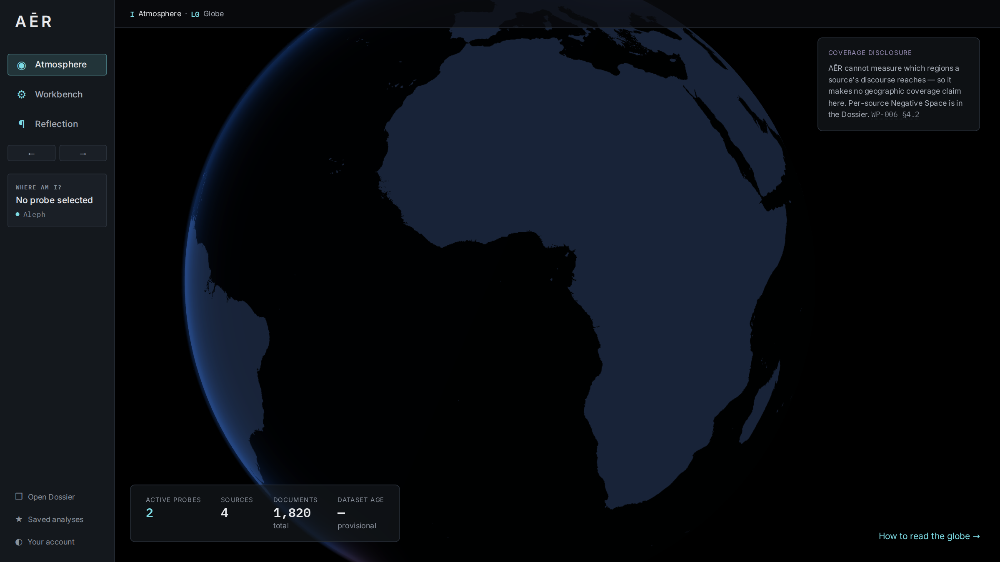
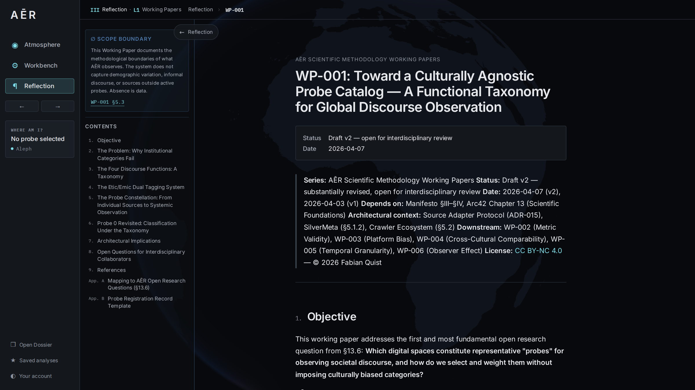
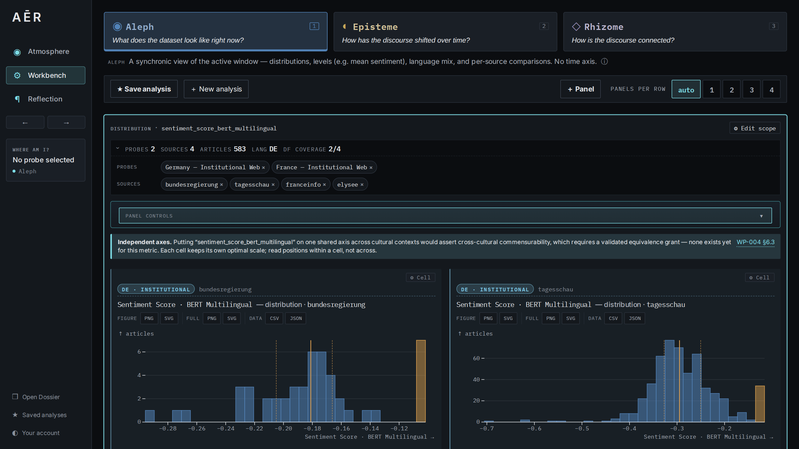
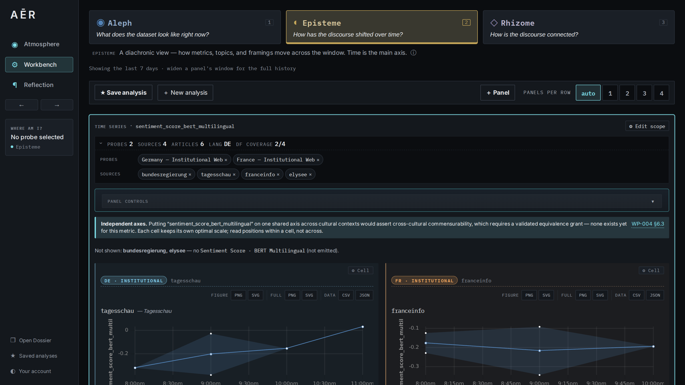
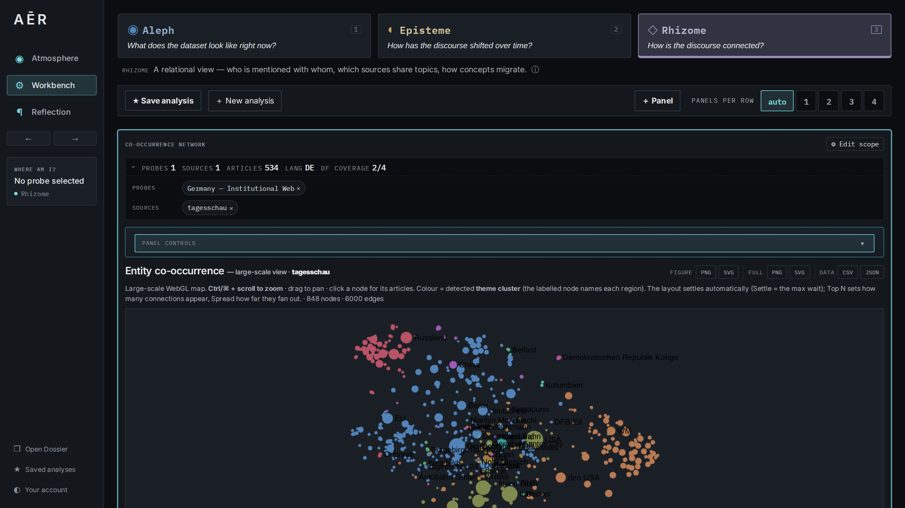
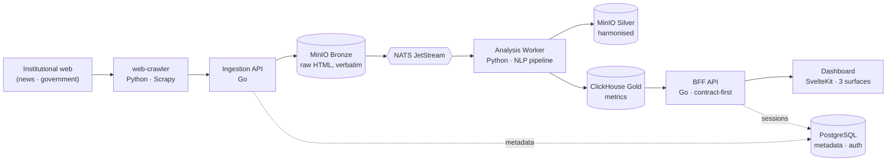

# AĒR — Societal Discourse Macroscope

> *ἀήρ (aḗr)* — the lower atmosphere, the surrounding climate.

**AĒR is an atmospheric sensor for human discourse.** It observes large-scale
patterns in the global digital conversation — the hopes, fears, conflicts, and
aspirations of a connected civilization — the way an orbital sensor reads
atmospheric currents rather than individual fates. It is an instrument of
curiosity, built for understanding, **not** a surveillance tool for individuals.

> [!IMPORTANT]
> **This is an engineering proof-of-concept, not a validated scientific instrument.**
> AĒR's pipeline is production-grade — secure, resilient, observable — but its
> **metrics are provisional**. The lexicons, models, and thresholds are engineering
> defaults, **not** yet peer-validated. Numbers shown anywhere in the system carry a
> visible *provisional / unvalidated* status until interdisciplinary validation work
> (the [Working Papers](#for-researchers)) is done. Read every output as *"what the
> current instrument measures"*, never as established social-scientific fact.

---

## What AĒR is

AĒR watches **discourse**, not people. It samples a small number of deliberately
chosen observation points — *probes* — and turns their public output into
transparent, reproducible, auditable metrics. Three commitments shape everything:

- **Collective anonymity by design.** The architecture enforces a one-way flow from
  raw text to aggregate metrics. There is no reverse path from a metric back to an
  individual. No behavioural profiles, no social graphs, no device fingerprints —
  *by construction, not by policy* ([Manifesto §VI](docs/arc42/00_manifesto.md),
  [WP-006](docs/methodology/en/)).
- **Reflexive honesty.** What AĒR *cannot* see is a first-class surface, not a
  footnote. Coverage gaps, structurally-absent metadata, and cross-cultural
  incomparability are *disclosed*, never silently coerced into a zero.
- **Ockham's Razor.** Deterministic, simple, fully traceable. No black boxes where a
  transparent method will do.

The name encodes the analytical frame (the three **Pillars**): **A**leph (the
synchronic whole — *the weather now*), **E**pisteme (the diachronic record — *the
climate over time*), **R**hizome (the relational currents *between* contexts).

---

## Screenshots

Three surfaces ([ADR-033](docs/arc42/09_architecture_decisions.md)): **Atmosphère** (the globe), the **Workbench** (the analytical surface), and **Reflexion** (the methodology).

| Atmosphère — the globe | Reflexion — the methodology |
| :---: | :---: |
|  |  |
| Active probes on a live day/night globe. | Working Papers, primers, open questions. |

The **Workbench** holds the three analytical Pillars ([ADR-035](docs/arc42/09_architecture_decisions.md)):

| Aleph — *the weather now* | Episteme — *the climate over time* | Rhizome — *the currents between* |
| :---: | :---: | :---: |
|  |  |  |
| Synchronic — distributions *now*. | Diachronic — metrics over time. | Relational — entity co-occurrence network. |

---

## Architecture

A polyglot **Medallion** pipeline (Bronze → Silver → Gold). Data flows strictly
left-to-right through deterministic, independently testable stages. **No service
talks to another over direct HTTP** — all coordination is mediated by object
storage (MinIO) and a message broker (NATS JetStream).



| Stage | Tech | Role |
| :--- | :--- | :--- |
| **web-crawler** | Python (Scrapy) | One configurable binary; fetches article HTML, polite by default. New source = one YAML entry, no code. |
| **Ingestion API** | Go | Source-agnostic receiver; writes raw HTML verbatim to Bronze; logs metadata to PostgreSQL. |
| **Analysis Worker** | Python | Harmonises Bronze → Silver, runs the extractor pipeline → Gold; malformed input is quarantined, never crashes the pipeline. |
| **BFF API** | Go | The only internet-facing backend. Contract-first REST (OpenAPI), ClickHouse-backed, session-authenticated. |
| **Dashboard** | SvelteKit (static) | Three surfaces — **Atmosphère** (globe), **Workbench** (the Pillars), **Reflexion** (methodology) — plus a global **Dossier** probe catalogue. |

Full architecture: **[Arc42 documentation](docs/arc42/)** (13 chapters + manifesto +
[ADRs](docs/arc42/09_architecture_decisions.md)). The complete docs portal renders at
`http://localhost:8000` when the stack is running.

---

## For Researchers

AĒR is methodologically agnostic on purpose — the *lens configuration* is an
open interdisciplinary question, not a settled one.

- **The Probe Principle.** Rather than total data aggregation, AĒR samples
  *strategic probes* — observation points that proxy different societal realities.
  Today: **Probe 0** (German institutional web — `bundesregierung.de`,
  `tagesschau.de`) and **Probe 1** (French institutional web — `elysee.fr`,
  `franceinfo`). Selection and interpretation are the core scientific challenge,
  documented per probe under [`docs/probes/`](docs/probes/).
- **The Working Papers (WP-001…006, EN + DE).** The methodological *why* — a
  functional probe taxonomy, metric validity, platform bias, cross-cultural
  comparability, temporal granularity, and the observer effect / research ethics.
  See [`docs/methodology/`](docs/methodology/).
- **Provisional metrics, disclosed as such.** Sentiment, NER, language detection,
  topic modelling and the rest are *provisional* engineering defaults. Every metric
  exposes its provenance (algorithm, tier, known limitations, validation status);
  unvalidated metrics are visibly marked everywhere they appear.
- **Negative space.** *What AĒR does not see* is a first-class surface (the digital
  divide, structurally-absent metadata, silent edits, k-anonymity floors,
  cross-cultural incomparability). Absence is disclosed, never rendered as zero.
- **Ethics.** Observational and phenomenological only. Individual surveillance,
  micro-targeting, profiling, and manipulation are prohibited uses, codified in the
  [license](LICENSE.md) (§3, Responsible Use). See the
  [Manifesto](docs/arc42/00_manifesto.md).

**We are seeking interdisciplinary collaboration** (computational social science,
digital anthropology, global studies) to validate and contextualise the instrument.

---

## For Developers

A Docker-Compose stack; the [Makefile](Makefile) is the primary interface. The
services build and run in containers — `make up` compiles them on first run.

**To run the stack you need:** Docker (with the Compose plugin), GNU Make, and
**Go 1.26.4+** (the `make create-admin` helper runs on the host). Everything else
runs in containers.

```bash
git clone <repository-url> && cd aer
cp .env.example .env       # set every REPLACE-ME secret (API keys, DB passwords)
make up                    # start the full stack (Docker: infra + services + dashboard)
make create-admin          # bootstrap the first admin login (the app is auth-gated)
make crawl                 # ingest data — crawls both probes (Probe 0 DE + Probe 1 FR)
```

The dashboard is served behind Traefik at `https://localhost/` (self-signed TLS in
dev); the docs portal is at `http://localhost:8000`.

**Contributing?** One command prepares the whole dev environment:

```bash
make setup
```

`make setup` wires the git hooks (`core.hooksPath` → pre-commit lint + pre-push
scoped tests), installs the pinned host tooling (golangci-lint, oapi-codegen,
govulncheck, pip-audit), creates the `services/analysis-worker/.venv`, and installs
the dashboard's pnpm deps. It needs **Go**, **Python 3** and (for the dashboard)
**Node 22 + pnpm via Corepack** on the host — the frontend step is skipped if Node
is absent. Running the **full Python test suite** locally additionally needs the
worker's heavy ML deps (`services/analysis-worker/.venv/bin/pip install -r
services/analysis-worker/requirements-dev.txt` — multi-GB torch/transformers/spaCy;
Docker and CI run them for you, so this is optional). For frontend-only work see
[`services/dashboard/README.md`](services/dashboard/README.md).

| Layer | Technology |
| :--- | :--- |
| Ingestion / BFF API | Go 1.26.4 |
| Analysis Worker · web-crawler | Python 3.14 |
| Dashboard | TypeScript · Svelte 5 · SvelteKit (static adapter) |
| Object storage · broker | MinIO · NATS JetStream |
| Databases | PostgreSQL (metadata + auth) · ClickHouse (analytics) |
| Proxy · observability | Traefik (TLS) · OpenTelemetry → Tempo / Prometheus / Grafana |

**Common targets:** `make up` · `down` · `logs` · `test` · `lint` · `audit` ·
`codegen` · `crawl` · `docs-build`. Run `make` (or `make help`) for the full list.

**Where to look next:**
- **[Operations Playbook](docs/operations/operations_playbook.md)** — *what to type*: commands, schemas, debugging for every component.
- **[API contract](services/bff-api/api/openapi.yaml)** — the BFF OpenAPI SSoT (server stubs are generated, never hand-edited).
- **[Extending guides](docs/extending/)** — add a [source](docs/extending/add-a-source.md), [probe](docs/extending/add-a-probe.md), [language](docs/extending/add-a-language.md), [source type](docs/extending/add-a-source-type.md), or [extractor](docs/extending/add-an-extractor.md).
- **[Developer Quickstart](docs/operations/developer_quickstart.md)** — the two local dev loops.
- **[ROADMAP](ROADMAP.md)** — implementation phases and open work.

**Security posture (brief):** zero-trust networking (only Traefik, the BFF, and the
docs server expose ports); the whole app is session-gated (invite-only, opaque
server-side sessions — [ADR-040](docs/arc42/09_architecture_decisions.md)); every
image is digest-pinned and non-root; secrets are validated at boot. CI runs lint,
Testcontainers integration tests, and a Trivy / govulncheck / pip-audit security pass
on every push.

---

## Deployment

> **Placeholder.** Production deployment (the `compose.prod.yaml` overlay, Traefik +
> Let's Encrypt, secrets management, backup/restore, and the first-deploy runbook) is
> hardened and documented in **Iteration 13** of the [ROADMAP](ROADMAP.md). This
> section will carry the real install / run-in-prod instructions once that lands.

---

## License

See [`LICENSE.md`](LICENSE.md). AĒR carries **Responsible Use Restrictions** (§3):
it must never be used for individual surveillance, micro-targeting, political
manipulation, or commercial profiling.
