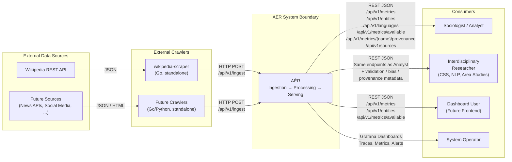
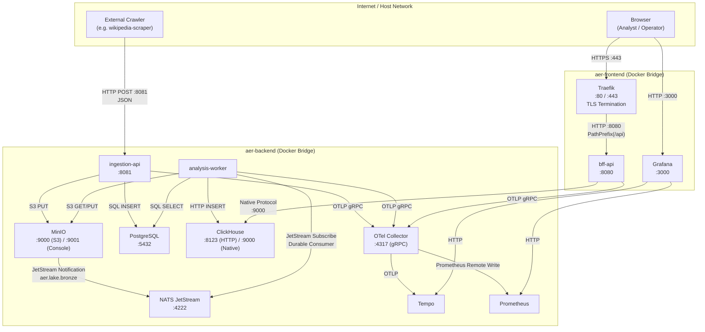

# 3. System Scope and Context

This chapter defines the boundary of the AĒR system: what belongs to it, what lies outside, and how external actors interact with it. The system boundary is identical to what is defined and orchestrated by the `compose.yaml` at the repository root.

## 3.1 Business Context

The business context describes AĒR from the perspective of its users and the data sources it consumes. AĒR itself is a black box here — the focus is on *who* communicates with the system and *why*.



| Actor | Role | Interface to AĒR |
| :--- | :--- | :--- |
| **External Crawlers** | Standalone programs (under `crawlers/`) that fetch raw data from public APIs and deliver it to AĒR. They are deliberately external to the system — following a "Dumb Pipes, Smart Endpoints" pattern. The long-term vision is hundreds of specialized crawlers feeding the pipeline. | `POST /api/v1/ingest` on the Ingestion API (`:8081`). JSON payload containing `source_id` and an array of `documents`, each with a `key` and raw `data` blob. |
| **External Data Source APIs** | Public APIs (e.g., Wikipedia REST API) that provide the raw discourse data. AĒR never accesses these directly — crawlers act as adapters that translate source-specific formats into the generic AĒR ingestion contract. | No direct interface. Accessed exclusively by crawlers. |
| **Sociologist / Analyst** | Domain experts who consume aggregated metrics to study societal discourse patterns. They need transparent, deterministic data and the ability to drill down to the original raw source (Progressive Disclosure). | `GET /api/v1/metrics`, `GET /api/v1/entities`, `GET /api/v1/languages`, `GET /api/v1/metrics/available`, `GET /api/v1/metrics/{metricName}/provenance`, `GET /api/v1/sources` on the BFF API (`:8080`, authenticated via API key). Future: a dedicated frontend dashboard. |
| **Interdisciplinary Researcher** | Researchers from CSS, NLP, comparative methodology, area studies, STS, and information design who consume AĒR not only as a data source but as an *instrument whose methodology is itself under study*. They populate the scientific infrastructure tables (`source_classifications`, `metric_validity`, `metric_equivalence`) through the workflows documented in the Scientific Methodology Working Paper series (WP-001–WP-006, see Chapter 13, §13.5 and §13.7). They audit metric provenance, bias documentation, and the validation status of every displayed number. | Read access via the same BFF endpoints as the Analyst, with particular reliance on `GET /api/v1/metrics/{metricName}/provenance` (WP-006 Principle 1) and `GET /api/v1/sources` (WP-006 Principle 3). Write access — registration of classifications, validity entries, equivalence records — happens out-of-band via the workflows described in the [Scientific Operations Guide](../operations/scientific_operations_guide.md) (Phase 71). |
| **Dashboard User** | End users who interact with visualizations of the aggregated "weather map" of societal discourse. | Same as Analyst — the BFF API serves both roles. Currently no dedicated frontend exists (Phase 4 in the roadmap). |
| **System Operator** | Responsible for monitoring system health, pipeline throughput, DLQ overflow, and trace analysis. | Grafana (`:3000`) with pre-provisioned dashboards, Prometheus alerting rules, and Tempo trace exploration. Additionally: NATS Monitor (`:8222`), MinIO Console (`:9001`), ClickHouse Playground (`:8123/play`). |

## 3.2 Technical Context

The technical context zooms in on the protocols, ports, and network boundaries used for all communication channels. AĒR's Docker network segmentation (`aer-frontend` / `aer-backend`) enforces that only the BFF API and Grafana are reachable from the public network.



### 3.2.1 External Interfaces (Crossing the System Boundary)

These are the only interfaces through which data enters or leaves the AĒR system.

| Channel | Direction | Protocol | Authentication | Description |
| :--- | :--- | :--- | :--- | :--- |
| Ingestion API | **Inbound** | HTTP/JSON | None (internal network only) | `POST /api/v1/ingest` — Crawlers submit raw documents. The endpoint is on port `8081` and is only accessible on `aer-backend`, not exposed through Traefik. |
| BFF API | **Outbound** | HTTPS/JSON (via Traefik) | API Key (`X-API-Key` or `Bearer`) | `GET /api/v1/metrics?startDate=...&endDate=...&source=...&metricName=...&normalization=(raw\|zscore)&resolution=(5min\|hourly\|daily\|weekly\|monthly)` — aggregated time-series with optional z-score normalization (Phase 65, WP-004, gated by `metric_baselines` and `metric_equivalence`) and multi-resolution bucketing (Phase 66, WP-005). `GET /api/v1/entities?startDate=...&endDate=...&source=...&label=...&limit=...` — aggregated named entities. `GET /api/v1/languages?startDate=...&endDate=...&source=...&language=...&limit=...` — aggregated language detections. `GET /api/v1/metrics/available?startDate=...&endDate=...` — dynamic metric discovery with `validationStatus`, `eticConstruct`, `equivalenceLevel`, `minMeaningfulResolution` fields (Phases 63, 65, 66). `GET /api/v1/metrics/{metricName}/provenance` — methodological provenance per metric (Phase 67, WP-006 Principle 1). `GET /api/v1/sources` — canonical source list with `documentationUrl` fields (Phase 67, WP-006 Principle 3). TLS is terminated by Traefik. Health probes (`/healthz`, `/readyz`) are unauthenticated. |
| Grafana | **Outbound** | HTTP | Username/Password | Port `3000` — Operators access dashboards, traces, and alerts. Credentials are configured via `GF_SECURITY_ADMIN_USER` / `GF_SECURITY_ADMIN_PASSWORD` in the `.env` file. |
| Admin UIs | **Outbound** | HTTP | Credentials from `.env` | MinIO Console (`:9001`), ClickHouse Playground (`:8123/play`), NATS Monitor (`:8222`) — for development and operational debugging. Not exposed through Traefik. |

### 3.2.2 Internal Communication (Within the System Boundary)

No microservice communicates with another via direct, synchronous HTTP calls. All inter-service communication is mediated through shared storage and the NATS message broker.

| From | To | Protocol | Purpose |
| :--- | :--- | :--- | :--- |
| `ingestion-api` | MinIO | S3 (HTTP) | Upload raw JSON documents to the `bronze` bucket. |
| `ingestion-api` | PostgreSQL | PostgreSQL wire protocol | Log metadata (`source_id`, `job_id`, `bronze_object_key`, `trace_id`). Document status lifecycle: `pending` → `uploaded`. |
| MinIO | NATS JetStream | Internal notification | Automatic `PUT` event on the `bronze` bucket publishes to subject `aer.lake.bronze`. Configured via `MINIO_NOTIFY_NATS_*` environment variables. |
| `analysis-worker` | NATS JetStream | NATS client protocol | Durable subscription to `aer.lake.bronze`. Manual `msg.ack()` after successful processing. At-least-once delivery semantics. |
| `analysis-worker` | MinIO | S3 (HTTP) | `GET` raw data from `bronze`, `PUT` harmonized data to `silver`, `PUT` malformed data to `bronze-quarantine`. |
| `analysis-worker` | PostgreSQL | PostgreSQL wire protocol | Idempotency lookups: check if a `bronze_object_key` has already been processed before re-processing a redelivered NATS event. |
| `analysis-worker` | ClickHouse | HTTP interface (`:8123`) | `INSERT` extracted time-series metrics into `aer_gold.metrics`. Uses deterministic timestamps from MinIO event metadata. |
| `bff-api` | ClickHouse | Native protocol (`:9000`) | `SELECT` aggregated metrics with 5-minute downsampling and hard row limits to prevent OOM. |
| All services | OTel Collector | gRPC (`:4317`) | Emit OpenTelemetry traces and metrics. Trace context is propagated across NATS message headers, enabling end-to-end trace correlation from Ingestion through Analysis to the BFF response. |

### 3.2.3 Ingestion Contract

The ingestion API defines a source-agnostic contract. Every crawler — regardless of the upstream data source — must translate its data into this format before submitting it:

```json
{
  "source_id": 1,
  "documents": [
    {
      "key": "wikipedia/article-slug/2026-03-28.json",
      "data": {
        "source": "wikipedia",
        "title": "Example Article",
        "raw_text": "The full unstructured text content...",
        "url": "https://en.wikipedia.org/wiki/Example",
        "timestamp": "2026-03-28T12:00:00Z"
      }
    }
  ]
}
```

The `key` determines the MinIO object path within the `bronze` bucket. The `data` field is stored as-is (write-once, immutable). The `source_id` references a registered source in the PostgreSQL `sources` table. This contract decouples AĒR from any specific upstream data format — the crawlers are the adapters.