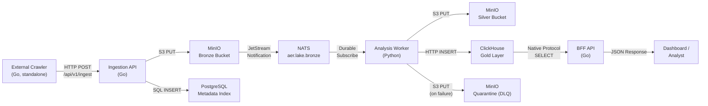

# 4. Solution Strategy

To achieve the goals defined in Chapter 1 — specifically scientific integrity through transparency (Ockham's Razor) and strict modularity — AĒR utilizes a polyglot microservice architecture.

The fundamental strategy relies on the strict separation of data collection, data storage, and data analysis. No microservice communicates with another via direct, synchronous HTTP calls. All inter-service coordination is mediated exclusively through shared storage (MinIO) and the NATS JetStream message broker.

## 4.1 Technology Decisions

| Technology | Domain | Justification (Why?) |
| :--- | :--- | :--- |
| **Go (Golang)** | Ingestion Layer, BFF & Crawlers | Go offers outstanding concurrency (Goroutines). It is ideal for high-throughput HTTP services (Ingestion API, BFF) and for writing lightweight, standalone crawlers that efficiently fetch data from external APIs. |
| **Python** | Analysis & Processing Layer | Python possesses the most robust ecosystem for deterministic data science and linguistics (e.g., spaCy, NLTK). It is deliberately chosen to implement transparent statistical models instead of opaque black-box LLMs. |
| **ClickHouse** | Analytics Database (OLAP) | A column-oriented database providing extreme read performance for aggregated time-series data — mandatory for a high-performance "weather map" dashboard. |
| **MinIO (S3)** | Object Storage (Data Lake) | Highly scalable storage for unstructured, raw JSON/Text dumps. Acts as both the data lake and the event publisher (triggers NATS notifications on bucket writes). |
| **NATS (JetStream)** | Event Broker | An ultra-lightweight, high-performance messaging system. Replaces synchronous polling to enable real-time, asynchronous triggering between Go ingestion and Python analysis workers while ensuring data persistence via durable consumers and at-least-once delivery. |
| **PostgreSQL** | Relational Database (Metadata Index) | Storage of system metadata: source registry, ingestion job tracking, document lifecycle states, and OpenTelemetry trace IDs for Progressive Disclosure drill-downs. |
| **Traefik** | Reverse Proxy & TLS Termination | Automatic HTTPS via ACME/Let's Encrypt. Routes external traffic to the BFF API via Docker labels. Eliminates TLS handling from application code. See ADR-012. |
| **Docker** | Containerization | Isolation of all services. Ensures that local development (via WSL2/Ubuntu) and production environments are identical. `compose.yaml` is the SSoT for the entire stack. |
| **OpenTelemetry (OTel)** | Observability | Vendor-agnostic standard for distributed tracing and metrics. Used to track data flow continuously from Go to Python across the NATS boundary via header-propagated trace context. |
| **Grafana LGTM Stack** | Monitoring UI | Tempo (Traces), Prometheus (Metrics with alerting rules), and Grafana (Dashboards) form the central command center for system health and pipeline observability. |

## 4.2 Architecture Patterns (The Data Pipeline)

AĒR adapts a simplified version of the **Medallion Architecture** (Bronze, Silver, Gold) to ensure raw data is never tampered with.

The pipeline follows four sequential stages:

1. **Ingestion (Go):** External crawlers fetch data from public APIs and submit it via `POST /api/v1/ingest` to the Ingestion API. The API stores the raw JSON verbatim in the MinIO `bronze` bucket (write-once, immutable) and logs metadata (source, object key, trace ID, job status) in PostgreSQL. No content modification occurs at this stage.

2. **Harmonization (Python):** MinIO automatically publishes a JetStream notification to NATS (`aer.lake.bronze`) whenever a new object is written to the Bronze bucket. The Python analysis worker, subscribed as a durable consumer, picks up the event, downloads the raw file, and validates it against the Silver Contract (Pydantic). If validation succeeds, the cleaned data is uploaded to the `silver` bucket. If validation fails, the document is routed to the `bronze-quarantine` bucket (Dead Letter Queue).

3. **Deterministic Analysis (Python):** Within the same processing step, the worker extracts numerical metrics (e.g., word counts, N-gram frequencies) from the harmonized data using deterministic timestamps from the MinIO event metadata. These metrics are inserted into ClickHouse (`aer_gold.metrics`) as time-series data points.

4. **Backend-for-Frontend (Go):** The frontend communicates exclusively with a Go BFF API that queries pre-calculated aggregations from ClickHouse with 5-minute downsampling and hard row limits to prevent OOM. The BFF is the only service exposed to the internet (via Traefik), protected by API-key authentication.

## 4.3 Cross-cutting Solutions

**Contract-First API Design (BFF only):** The BFF API's interface is defined in modular OpenAPI 3.0 YAML files (`services/bff-api/api/openapi.yaml`) before any implementation. Go server stubs and types are generated via `oapi-codegen`. The CI pipeline enforces sync between spec and code. This pattern applies exclusively to the BFF → Frontend boundary. Go and Python services do not communicate via OpenAPI — they are decoupled through NATS events and the Pydantic Silver Contract.

**Progressive Disclosure (UI/UX):** The dashboard displays aggregated trends from the Gold Layer. When an analyst drills down into a specific data point, the system resolves the original raw document by querying the PostgreSQL Metadata Index for the corresponding `trace_id` and `bronze_object_key`, enabling transparent access to the unaltered source data in MinIO.

**Idempotency:** NATS JetStream guarantees at-least-once delivery, meaning the same event may be delivered multiple times. The analysis worker prevents duplicate processing via PostgreSQL status checks (`processed` / `quarantined`) and deterministic ClickHouse inserts (timestamps from event metadata, never from the system clock).

**Self-Healing Infrastructure:** All Go services use context-aware exponential backoff (`cenkalti/backoff/v5`) for database and object storage connections. Services tolerate infrastructure starting in any order and recover automatically from transient network failures without manual intervention (see ADR-006).

**Network Segmentation:** The Docker stack is split into `aer-frontend` (Traefik, BFF, Grafana) and `aer-backend` (databases, NATS, workers, observability). Only the BFF and Grafana bridge both networks, minimizing the blast radius of a frontend compromise (see ADR-008).