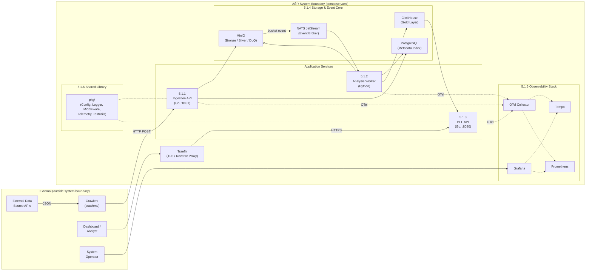

# 5. Building Block View

This chapter decomposes the AĒR system into its logical building blocks at the highest abstraction level (Level 1). The system follows a strict pipeline architecture with data flowing from left to right. There are no direct, synchronous HTTP dependencies between the three application services — all inter-service communication is mediated through shared storage (MinIO) and the NATS JetStream message broker.

## 5.1 Whitebox AĒR Overall System (Level 1)

### 5.1.1 Ingestion API (Go)

**Responsibility:** Acts as the HTTP receiver for raw data submitted by external crawlers. It is source-agnostic — it accepts a generic JSON contract and stores the payload verbatim without inspecting or modifying its content.

**Implementation:** A Go microservice (`services/ingestion-api/`) built with `chi` router. On startup, the service runs `golang-migrate` against PostgreSQL to apply any pending schema migrations from `infra/postgres/migrations/` before the HTTP server begins accepting traffic (see ADR-014). Protected by an API-key middleware (`pkg/middleware/apikey.go`) on all routes except `/healthz` and `/readyz` — the key is configured via `INGESTION_API_KEY`. On each `POST /api/v1/ingest`, it creates an ingestion job with `pending` status in PostgreSQL, uploads each document as a raw JSON object to the MinIO `bronze` bucket, updates the document status to `uploaded`, and records the OpenTelemetry `trace_id` for end-to-end traceability. If any document fails, the job status is set to `completed_with_errors` or `failed`. Provides `/healthz` (liveness), `/readyz` (readiness, checks PostgreSQL + MinIO), and `GET /api/v1/sources?name=<name>` (dynamic source resolution for crawlers) endpoints.

**Key interfaces:** PostgreSQL (SQL INSERT/UPDATE, `golang-migrate` on startup), MinIO (S3 PUT), OTel Collector (gRPC traces).

### 5.1.2 Analysis Worker (Python)

**Responsibility:** Source-agnostic data harmonization, schema validation, metric extraction, and Dead Letter Queue management. This is the core processing engine of the Medallion Architecture.

**Implementation:** A Python service (`services/analysis-worker/`) using `asyncio` with a configurable pool of worker tasks (`WORKER_COUNT`). Subscribes to NATS JetStream as a durable consumer on subject `aer.lake.bronze` with manual acknowledgement. For each event, the worker performs an idempotency check via PostgreSQL, downloads the raw document from Bronze, resolves the appropriate **Source Adapter** via an `AdapterRegistry` (keyed by `source_type`, defaulting to `"legacy"` for pre-Phase 39 data), and delegates harmonization to the adapter. The adapter maps source-specific raw data to the two-tier Silver schema: **`SilverCore`** (universal minimum contract: `document_id`, `source`, `source_type`, `raw_text`, `cleaned_text`, `language`, `timestamp`, `url`, `schema_version`, `word_count`) and an optional **`SilverMeta`** (source-specific context, explicitly unstable). The processor validates the `SilverCore` contract, uploads the `SilverEnvelope` (core + meta) to the Silver bucket, then executes the **Extractor Pipeline** — an ordered list of `MetricExtractor` instances (see §8.10) that each produce `GoldMetric` results from the validated `SilverCore`. All metrics from all extractors are batch-inserted into ClickHouse in a single round-trip. Since worker tasks are dispatched to threads via `asyncio.to_thread`, ClickHouse access uses a `ClickHousePool` — a thread-safe pool of `clickhouse_connect` clients backed by `queue.Queue`, sized to `WORKER_COUNT`. Each thread checks out a dedicated client, preventing concurrent-query errors on the same session. A failing extractor is logged and skipped; other extractors' results are still inserted (partial extraction is acceptable — no DLQ routing for extractor failures). Extractors that produce both metrics and entities (e.g., `NamedEntityExtractor`) implement the `EntityExtractor` sub-protocol with a single-pass `extract_all()` method; extractors that produce both metrics and structured language detections (e.g., `LanguageDetectionExtractor`) implement the `LanguageDetectionPersistExtractor` sub-protocol (Phase 45) with the same single-pass pattern. The processor dispatches via `isinstance()` — no `hasattr()` polymorphism. All extractors must be stateless between documents — no mutable instance-level caching. The architecture also defines a `CorpusExtractor` protocol for future batch-level analysis (TF-IDF, LDA, co-occurrence networks) that operates on accumulated Silver data across time windows rather than individual documents. Documents with unknown `source_type` (no registered adapter) or that fail validation are routed to the `bronze-quarantine` bucket (DLQ). Both the adapter registry and the extractor pipeline are assembled in `main.py` via dependency injection. Exposes Prometheus business metrics on `:8001/metrics`. See ADR-015 for the schema evolution strategy. **UTC enforcement:** `SilverCore` enforces timezone-awareness on the `timestamp` field via a Pydantic `field_validator` — naive datetimes are rejected at the Silver contract level with a `ValidationError`. This is the primary enforcement point; individual extractors that depend on UTC semantics (e.g., `TemporalDistributionExtractor`) implement an additional defense-in-depth guard that logs a warning and returns an empty list for any non-UTC timestamp that bypasses the contract check.

**Bias Context Propagation (Phase 64):** `SilverMeta` subclasses may include a `BiasContext` field documenting the structural biases of the source platform (WP-003). Fields: `platform_type`, `access_method`, `visibility_mechanism`, `moderation_context`, `engagement_data_available`, `account_metadata_available`. For RSS sources, these are static values reflecting the absence of algorithmic amplification and engagement data. The bias profile is written to the Silver bucket as part of `SilverEnvelope.meta` and documented in `docs/methodology/probe0_bias_profile.md`. Authenticity extractors (bot detection, coordination detection) are deferred to phases introducing social media adapters (see R-12).

**Discourse Context Propagation (Phase 62):** `SilverMeta` subclasses (currently `RssMeta`) may include a `DiscourseContext` field populated from the `source_classifications` PostgreSQL table during harmonization. The `DiscourseContext` carries the source's `primary_function`, `secondary_function`, and `emic_designation` from the Functional Probe Taxonomy (WP-001). After extraction, the processor writes the `primary_function` as `discourse_function` into `aer_gold.metrics` and `aer_gold.entities`, enabling aggregation by discourse function. If no classification exists for a source, `discourse_context` is `None` and `discourse_function` defaults to an empty string — the pipeline does not fail.

**Key interfaces:** NATS JetStream (subscribe + ack/nak), MinIO (S3 GET/PUT), PostgreSQL (SQL SELECT/UPDATE for idempotency, SELECT for source classifications), ClickHouse (HTTP INSERT), Prometheus (metrics exposition), OTel Collector (gRPC traces).

### 5.1.3 BFF API / Serving Layer (Go)

**Responsibility:** Provides a contract-first, authenticated REST API to the frontend. Decouples consumers from direct database queries and protects the analytical layer from uncontrolled access.

**Implementation:** A Go microservice (`services/bff-api/`) with server stubs and types auto-generated from a modular OpenAPI 3.0 specification via `oapi-codegen` (`make codegen`). Provides three data endpoints:

- `GET /api/v1/metrics` — Aggregated time-series data with downsampling and hard row limits to prevent OOM. **Requires `startDate`/`endDate`** (breaking change in Phase 47 — no implicit 24-hour fallback). Supports optional `source` and `metricName` query parameters to filter by data source and metric dimension. Supports optional `normalization` parameter (`raw` | `zscore`, default `raw`) — when `zscore`, returns `(value - baseline_mean) / baseline_std` by joining with `metric_baselines` via `language_detections` (Phase 65). **Validation gate:** `zscore` requires `metricName` and returns HTTP 400 if (a) no baseline exists for the requested metric/source pair, or (b) no entry in `metric_equivalence` confirms at least deviation-level equivalence. Supports optional `resolution` parameter (`5min` | `hourly` | `daily` | `weekly` | `monthly`, default `5min`, Phase 66) — selects the ClickHouse bucketing function (`toStartOfFiveMinute` / `toStartOfHour` / `toStartOfDay` / `toStartOfWeek` / `toStartOfMonth`) at query time. Wider buckets relax the per-request row cap proportionally (`hourly` ×12, `daily` ×288, `weekly` ×2016, `monthly` ×8640) so that long ranges remain queryable without exhausting the OOM guard. The default `5min` is preserved for backward compatibility. Response includes `{timestamp, value, source, metricName}` per data point (extended in Phase 43).
- `GET /api/v1/entities` — Aggregated named entities from the NER pipeline. Requires `startDate`/`endDate`, supports optional `source`, `label`, and `limit` (1–1000, default 100) filters. `limit` is validated in the handler layer (returns 400 on out-of-range values). Response includes `{entityText, entityLabel, count, sources}` per entity (added in Phase 43).
- `GET /api/v1/metrics/available` — Dynamic discovery of metric names present in the Gold layer within the queried time range. **Requires `startDate`/`endDate`** (added Phase 47 — previously returned all-time metric names). Returns a JSON array of `{metricName, validationStatus, eticConstruct, equivalenceLevel, minMeaningfulResolution}` objects (Phase 63 added `validationStatus`; Phase 65 added `eticConstruct` and `equivalenceLevel` from the metric equivalence registry — both `null` when no equivalence entry exists; Phase 66 added `minMeaningfulResolution` from the static BFF config map seeded by Probe 0 publication-rate heuristics — `null` when no heuristic has been recorded for the metric).
- `GET /api/v1/languages` — Aggregated language detection results from the language detection pipeline. Requires `startDate`/`endDate`, supports optional `source`, `language`, and `limit` (1–1000, default 100) filters. `limit` is validated in the handler layer (returns 400 on out-of-range values). Response includes `{detectedLanguage, count, avgConfidence, sources}` per detected language. Only rank-1 (top candidate) detections are included in the aggregation (added in Phase 45).

Protected by an API-key middleware on all routes except health probes. Exposed to the internet through Traefik via Docker labels (`PathPrefix(/api)`). Provides `/api/v1/healthz` (liveness) and `/api/v1/readyz` (readiness, checks ClickHouse) endpoints.

**Key interfaces:** ClickHouse (native protocol SELECT on `aer_gold.metrics`, `aer_gold.entities`, and `aer_gold.language_detections`), Traefik (HTTP routing via labels), OTel Collector (gRPC traces).

### 5.1.4 Storage & Event Core

This block comprises the stateful infrastructure that all application services depend on. No application service creates these resources — they are provisioned by dedicated init containers (see Chapter 8.4).

**MinIO (Object Storage):** The Data Lake. Holds raw data (`bronze`, 90-day ILM), harmonized data (`silver`, 365-day ILM), and quarantined data (`bronze-quarantine`, 30-day ILM). Also acts as the event publisher: every `PUT` to the `bronze` bucket triggers a JetStream notification on subject `aer.lake.bronze` via native MinIO-NATS integration (`MINIO_NOTIFY_NATS_*` environment variables).

**NATS JetStream (Event Broker):** The asynchronous backbone. The JetStream stream `AER_LAKE` (subject filter `aer.lake.>`, file-backed storage) is created at startup by the `nats-init` container (`natsio/nats-box`). MinIO depends on `nats-init` completing successfully before starting, ensuring the stream exists before any events are published.

**PostgreSQL (Metadata Index):** The relational memory. Schema is managed via versioned SQL migrations in `infra/postgres/migrations/` executed by `golang-migrate` on `ingestion-api` startup (see ADR-014). Tables: `sources` (registered data sources with dynamic name-based lookup), `ingestion_jobs` (job lifecycle tracking), `documents` (per-document status with unique `bronze_object_key`, `trace_id`, and lifecycle states: `pending` → `uploaded` → `processed` / `quarantined`), and `source_classifications` (etic/emic discourse function classifications per source, Phase 62 — composite PK `(source_id, classification_date)` enabling temporal tracking of functional transitions). Enables Progressive Disclosure by linking Gold metrics back to Bronze raw data via trace IDs.

**ClickHouse (OLAP — Gold Layer):** The high-performance analytical database. Schema is managed via versioned SQL migrations in `infra/clickhouse/migrations/`, executed by the `clickhouse-init` container on startup via `infra/clickhouse/migrate.sh` (see ADR-014). Applied versions are tracked in `aer_gold.schema_migrations`. The `aer_gold.metrics` table uses a `MergeTree` engine, ordered by `timestamp`, with a 365-day TTL. Columns: `timestamp`, `value`, `source` (data source identifier), `metric_name` (e.g., `word_count`, `sentiment_score`, `language_confidence`, `publication_hour`, `publication_weekday`, `entity_count`, `lexicon_version`), `article_id` (nullable, links back to the specific document), and `discourse_function` (Phase 62, the source's primary discourse function from the Functional Probe Taxonomy — enables aggregation by discourse function). Stores derived numerical time-series metrics inserted by the analysis worker and queried by the BFF API. The `aer_gold.entities` table (Phase 42, Migration 003) stores raw Named Entity Recognition spans: `timestamp`, `source`, `article_id`, `entity_text`, `entity_label` (PER, ORG, LOC, MISC), `start_char`, `end_char`. Uses `MergeTree` engine ordered by `(timestamp, source)` with a 365-day TTL. Entity linking is not implemented — raw spans only. The `aer_gold.language_detections` table (Phase 45, Migration 004) stores per-document language detection results: `timestamp`, `source`, `article_id`, `detected_language` (ISO 639-1 code), `confidence` (0.0–1.0), `rank` (candidate position, 1 = most likely). Uses `MergeTree` engine ordered by `(timestamp, source)` with a 365-day TTL. Storing ranked candidates preserves the full output of `detect_langs()` for downstream analysis. The `aer_gold.metric_baselines` table (Phase 65, Migration 007) stores per-(metric, source, language) baseline statistics for z-score normalization: `metric_name`, `source`, `language`, `baseline_value` (mean), `baseline_std` (standard deviation), `window_start`, `window_end`, `n_documents`, `compute_date`. Uses `ReplacingMergeTree(compute_date)` ordered by `(metric_name, source, language)`. Populated offline by `scripts/compute_baselines.py`. The `aer_gold.metric_equivalence` table (Phase 65, Migration 008) maps etic constructs to concrete metrics with cross-cultural equivalence levels: `etic_construct`, `metric_name`, `language`, `source_type`, `equivalence_level` (`temporal`, `deviation`, `absolute`), `validated_by`, `validation_date`, `confidence`. Uses `ReplacingMergeTree(validation_date)` ordered by `(etic_construct, metric_name, language)`. Initially empty — populated when interdisciplinary validation studies establish equivalence.

### 5.1.5 Observability Stack

A dedicated telemetry pipeline providing end-to-end visibility across the entire system.

**OTel Collector:** Central telemetry gateway. Receives OTLP traces and metrics from all three application services via gRPC (`:4317`). Exports traces to Tempo and metrics to Prometheus. Configuration: `infra/observability/otel-collector.yaml`.

**Grafana Tempo:** Distributed trace backend. Stores and indexes traces for querying via Grafana. Trace data is persisted to a named Docker volume (`tempo_data`) mounted at `/var/tempo`, with a configurable block retention (72h development, 720h production). Trace context is propagated across the NATS message boundary via headers, creating unified spans from ingestion through processing to serving.

**Prometheus:** Metrics aggregation and alerting engine. Scrapes the OTel Collector (`:8889`) and the analysis worker (`:8001`) every 5 seconds. Evaluates alerting rules (`alert.rules.yml`) for worker downtime, DLQ overflow, and processing latency.

**Grafana:** Unified visualization dashboard. Pre-provisioned datasources (Tempo, Prometheus) and dashboards are loaded automatically from `infra/observability/` at container startup. Bridges both `aer-frontend` and `aer-backend` networks.

### 5.1.6 Shared Library (`pkg/`)

A central Go module providing cross-cutting functionality imported by all Go services via `go.work`.

**`pkg/config/`** — Configuration loading via `viper` (environment variables with `.env` fallback).
**`pkg/logger/`** — Structured logging via `slog` with `tint` (colored dev output, JSON in production).
**`pkg/middleware/`** — Shared HTTP middleware. `APIKeyAuth` validates API keys via `X-API-Key` or `Authorization: Bearer` headers (used by both BFF and Ingestion API).
**`pkg/telemetry/`** — OpenTelemetry tracer initialization (OTLP gRPC exporter, configurable endpoint).
**`pkg/testutils/`** — SSoT compose parser (`GetImageFromCompose`) for Testcontainers image tag resolution.

### 5.1.7 External Crawlers

**Responsibility:** Fetch data from public APIs and translate it into the generic AĒR Ingestion Contract before submitting it to the Ingestion API.

**Implementation:** Standalone Go programs under `crawlers/`. Each crawler is a self-contained binary with its own `go.mod`. Crawlers are deliberately external to the AĒR system boundary — they follow the "Dumb Pipes, Smart Endpoints" pattern (see ADR-010). They communicate with AĒR exclusively via `HTTP POST /api/v1/ingest` and are not orchestrated by `compose.yaml`.

The **RSS Crawler** (`crawlers/rss-crawler/`) is AĒR's primary data source, configured via `feeds.yaml`. It parses RSS/Atom feeds using `gofeed`, translates items to the Ingestion Contract with `source_type: "rss"`, and maintains a local JSON state file for dedup across runs. Each feed's `source_id` is resolved dynamically via `GET /api/v1/sources?name=<name>`. See Chapter 13, §13.8 for the probe rationale.

The **Wikipedia Scraper** (`crawlers/wikipedia-scraper/`) was AĒR's initial PoC crawler, fetching random article summaries from the Wikipedia REST API. It was retired in Phase 43 after the RSS Crawler provided real, structured data for pipeline validation. The `wikipedia` source seed in PostgreSQL is preserved for backward compatibility with existing test data and Silver objects.

**Key interfaces:** External data source APIs (HTTP GET), Ingestion API (HTTP POST with JSON payload conforming to the Ingestion Contract defined in Chapter 3.2.3, `GET /api/v1/sources?name=<name>` for dynamic `source_id` resolution).