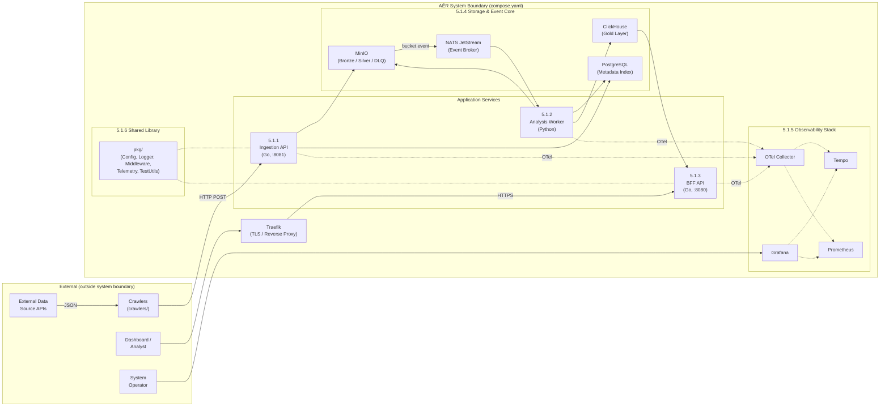

# 5. Building Block View

This chapter decomposes the AĒR system into its logical building blocks at the highest abstraction level (Level 1). The system follows a strict pipeline architecture with data flowing from left to right. There are no direct, synchronous HTTP dependencies between the three application services — all inter-service communication is mediated through shared storage (MinIO) and the NATS JetStream message broker.

## 5.1 Whitebox AĒR Overall System (Level 1)

### 5.1.1 Ingestion API (Go)

**Responsibility:** Acts as the HTTP receiver for raw data submitted by external crawlers. It is source-agnostic — it accepts a generic JSON contract and stores the payload verbatim without inspecting or modifying its content.

**Implementation:** A Go microservice (`services/ingestion-api/`) built with `chi` router. On startup, the service runs `golang-migrate` against PostgreSQL to apply any pending schema migrations from `infra/postgres/migrations/` before the HTTP server begins accepting traffic (see ADR-014). Protected by an API-key middleware (`pkg/middleware/apikey.go`) on all routes except `/healthz` and `/readyz` — the key is configured via `INGESTION_API_KEY`. On each `POST /api/v1/ingest`, it creates an ingestion job with `pending` status in PostgreSQL, uploads each document as a raw JSON object to the MinIO `bronze` bucket, updates the document status to `uploaded`, and records the OpenTelemetry `trace_id` for end-to-end traceability. If any document fails, the job status is set to `completed_with_errors` or `failed`. Provides `/healthz` (liveness), `/readyz` (readiness, checks PostgreSQL + MinIO), and `GET /api/v1/sources?name=<name>` (dynamic source resolution for crawlers) endpoints.

**Key interfaces:** PostgreSQL (SQL INSERT/UPDATE, `golang-migrate` on startup), MinIO (S3 PUT), OTel Collector (gRPC traces).

### 5.1.2 Analysis Worker (Python)

**Responsibility:** Deterministic data harmonization, schema validation, metric extraction, and Dead Letter Queue management. This is the core processing engine of the Medallion Architecture.

**Implementation:** A Python service (`services/analysis-worker/`) using `asyncio` with a configurable pool of worker tasks (`WORKER_COUNT`). Subscribes to NATS JetStream as a durable consumer on subject `aer.lake.bronze` with manual acknowledgement. For each event, the worker performs an idempotency check via PostgreSQL, downloads the raw document from Bronze, validates it against the Silver Contract (`SilverRecord` Pydantic model), uploads the harmonized data to the Silver bucket, extracts numerical metrics (e.g., word count) using deterministic timestamps from the MinIO event metadata, and inserts them into ClickHouse. Documents that fail validation are routed to the `bronze-quarantine` bucket (DLQ). Exposes Prometheus business metrics on `:8001/metrics`.

**Key interfaces:** NATS JetStream (subscribe + ack/nak), MinIO (S3 GET/PUT), PostgreSQL (SQL SELECT/UPDATE for idempotency), ClickHouse (HTTP INSERT), Prometheus (metrics exposition), OTel Collector (gRPC traces).

### 5.1.3 BFF API / Serving Layer (Go)

**Responsibility:** Provides a contract-first, authenticated REST API to the frontend. Decouples consumers from direct database queries and protects the analytical layer from uncontrolled access.

**Implementation:** A Go microservice (`services/bff-api/`) with server stubs and types auto-generated from a modular OpenAPI 3.0 specification via `oapi-codegen` (`make codegen`). Queries ClickHouse for aggregated time-series data with 5-minute downsampling and hard row limits to prevent OOM. Supports optional `source` and `metricName` query parameters to filter by data source and metric dimension (added in Phase 30). Protected by an API-key middleware on all routes except health probes. Exposed to the internet through Traefik via Docker labels (`PathPrefix(/api)`). Provides `/api/v1/healthz` (liveness) and `/api/v1/readyz` (readiness, checks ClickHouse) endpoints.

**Key interfaces:** ClickHouse (native protocol SELECT), Traefik (HTTP routing via labels), OTel Collector (gRPC traces).

### 5.1.4 Storage & Event Core

This block comprises the stateful infrastructure that all application services depend on. No application service creates these resources — they are provisioned by dedicated init containers (see Chapter 8.4).

**MinIO (Object Storage):** The Data Lake. Holds raw data (`bronze`, 90-day ILM), harmonized data (`silver`, 365-day ILM), and quarantined data (`bronze-quarantine`, 30-day ILM). Also acts as the event publisher: every `PUT` to the `bronze` bucket triggers a JetStream notification on subject `aer.lake.bronze` via native MinIO-NATS integration (`MINIO_NOTIFY_NATS_*` environment variables).

**NATS JetStream (Event Broker):** The asynchronous backbone. The JetStream stream `AER_LAKE` (subject filter `aer.lake.>`, file-backed storage) is created at startup by the `nats-init` container (`natsio/nats-box`). MinIO depends on `nats-init` completing successfully before starting, ensuring the stream exists before any events are published.

**PostgreSQL (Metadata Index):** The relational memory. Schema is managed via versioned SQL migrations in `infra/postgres/migrations/` executed by `golang-migrate` on `ingestion-api` startup (see ADR-014). Tables: `sources` (registered data sources with dynamic name-based lookup), `ingestion_jobs` (job lifecycle tracking), and `documents` (per-document status with unique `bronze_object_key`, `trace_id`, and lifecycle states: `pending` → `uploaded` → `processed` / `quarantined`). Enables Progressive Disclosure by linking Gold metrics back to Bronze raw data via trace IDs.

**ClickHouse (OLAP — Gold Layer):** The high-performance analytical database. Schema is managed via versioned SQL migrations in `infra/clickhouse/migrations/`, executed by the `clickhouse-init` container on startup via `infra/clickhouse/migrate.sh` (see ADR-014). Applied versions are tracked in `aer_gold.schema_migrations`. The `aer_gold.metrics` table uses a `MergeTree` engine, ordered by `timestamp`, with a 365-day TTL. Columns: `timestamp`, `value`, `source` (data source identifier), `metric_name` (e.g., `word_count`), and `article_id` (nullable, links back to the specific document). Stores derived numerical time-series metrics inserted by the analysis worker and queried by the BFF API.

### 5.1.5 Observability Stack

A dedicated telemetry pipeline providing end-to-end visibility across the entire system.

**OTel Collector:** Central telemetry gateway. Receives OTLP traces and metrics from all three application services via gRPC (`:4317`). Exports traces to Tempo and metrics to Prometheus. Configuration: `infra/observability/otel-collector.yaml`.

**Grafana Tempo:** Distributed trace backend. Stores and indexes traces for querying via Grafana. Trace data is persisted to a named Docker volume (`tempo_data`) mounted at `/var/tempo`, with a configurable block retention (72h development, 720h production). Trace context is propagated across the NATS message boundary via headers, creating unified spans from ingestion through processing to serving.

**Prometheus:** Metrics aggregation and alerting engine. Scrapes the OTel Collector (`:8889`) and the analysis worker (`:8001`) every 5 seconds. Evaluates alerting rules (`alert.rules.yml`) for worker downtime, DLQ overflow, and processing latency.

**Grafana:** Unified visualization dashboard. Pre-provisioned datasources (Tempo, Prometheus) and dashboards are loaded automatically from `infra/observability/` at container startup. Bridges both `aer-frontend` and `aer-backend` networks.

### 5.1.6 Shared Library (`pkg/`)

A central Go module providing cross-cutting functionality imported by all Go services via `go.work`.

**`pkg/config/`** — Configuration loading via `viper` (environment variables with `.env` fallback).
**`pkg/logger/`** — Structured logging via `slog` with `tint` (colored dev output, JSON in production).
**`pkg/middleware/`** — Shared HTTP middleware. `APIKeyAuth` validates API keys via `X-API-Key` or `Authorization: Bearer` headers (used by both BFF and Ingestion API).
**`pkg/telemetry/`** — OpenTelemetry tracer initialization (OTLP gRPC exporter, configurable endpoint).
**`pkg/testutils/`** — SSoT compose parser (`GetImageFromCompose`) for Testcontainers image tag resolution.

### 5.1.7 External Crawlers

**Responsibility:** Fetch data from public APIs and translate it into the generic AĒR Ingestion Contract before submitting it to the Ingestion API.

**Implementation:** Standalone Go programs under `crawlers/` (e.g., `crawlers/wikipedia-scraper/`). Each crawler is a self-contained binary with its own `go.mod`. Crawlers are deliberately external to the AĒR system boundary — they follow the "Dumb Pipes, Smart Endpoints" pattern (see ADR-010). They communicate with AĒR exclusively via `HTTP POST /api/v1/ingest` and are not orchestrated by `compose.yaml`.

**Key interfaces:** External data source APIs (HTTP GET), Ingestion API (HTTP POST with JSON payload conforming to the Ingestion Contract defined in Chapter 3.2.3, `GET /api/v1/sources?name=<name>` for dynamic `source_id` resolution).