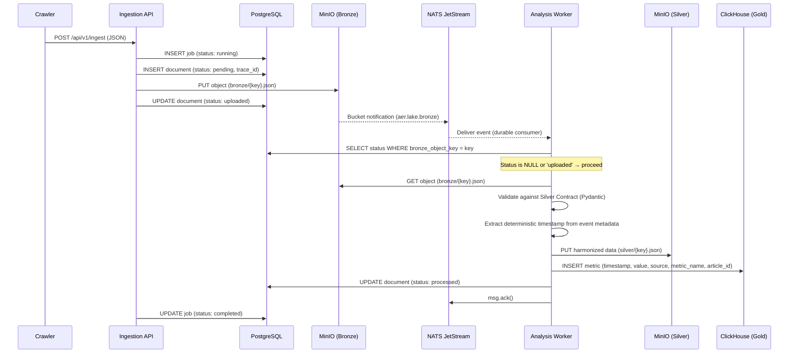
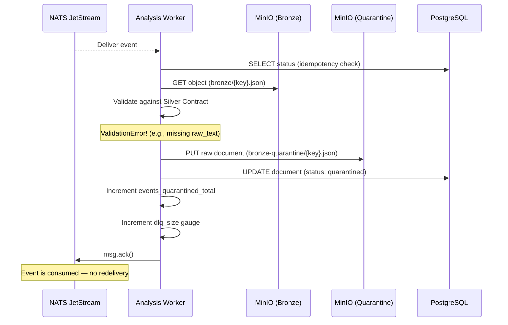

# 6. Runtime View

This chapter describes the deterministic path of data through the AĒR system at runtime. To preserve scientific integrity, all processing steps are strictly sequential within a single event and fully observable via OpenTelemetry traces.

## 6.1 Data Ingestion & Processing Flow (Happy Path)

This is the primary runtime sequence — the path every valid document takes from external source to analytical metric.

The flow in detail:

1. **Crawler → Ingestion API:** An external crawler submits raw data via `POST /api/v1/ingest`. The request contains a `source_id` and an array of documents, each with a deterministic `key` and an opaque JSON `data` blob.

2. **Metadata Tracking (Go → PostgreSQL):** The Ingestion API creates an ingestion job (`status: running`) and logs each document with `status: pending` and the OpenTelemetry `trace_id` before any storage operation. This ensures that even if the MinIO upload fails, the intent to ingest is recorded.

3. **Bronze Upload (Go → MinIO):** The raw JSON is stored verbatim in the `bronze` bucket at the path specified by the document `key`. After a successful upload, the document status is updated to `uploaded`. If the upload fails, the status remains `pending`.

4. **Event Trigger (MinIO → NATS):** MinIO detects the new object and automatically publishes a JetStream notification on subject `aer.lake.bronze`. The OTel trace context is embedded in the object's user metadata for cross-service propagation.

5. **Idempotency Check (Python → PostgreSQL):** The analysis worker receives the event and immediately queries PostgreSQL for the document's current status. If the status is `processed` or `quarantined`, the event is a duplicate — the worker acknowledges it and skips processing entirely.

6. **Harmonization (Python):** The worker downloads the raw document from Bronze and resolves the appropriate **Source Adapter** via the `AdapterRegistry`, keyed by the document's `source_type` field (defaulting to `"legacy"` for pre-Phase 39 data without a `source_type`). The adapter's `harmonize()` method maps the raw data to a `SilverCore` record (universal fields: `document_id`, `source`, `source_type`, `raw_text`, `cleaned_text`, `language`, `timestamp`, `url`, `schema_version`, `word_count`) and an optional `SilverMeta` (source-specific context). The original `raw_text` is preserved unmodified; `cleaned_text` contains the whitespace-normalized version for downstream NLP. The timestamp is extracted from the MinIO event metadata (`eventTime`), not from the system clock — this ensures deterministic, reproducible inserts. If no adapter is registered for the `source_type`, the document is routed to the DLQ.

7. **Silver Upload (Python → MinIO):** The validated `SilverEnvelope` (containing `SilverCore` + optional `SilverMeta`) is uploaded to the `silver` bucket at the same object key. This operation is idempotent — if a previous attempt partially failed after Silver but before Gold, the Silver object is safely overwritten on retry.

8. **Gold Insert (Python → ClickHouse):** The extracted metric is inserted into `aer_gold.metrics` with all dimensions: `timestamp` (deterministic, from event metadata), `value` (word count from `SilverCore.word_count`), `source` (from `SilverCore.source`), `metric_name` (`"word_count"`), and `article_id` (derived from the MinIO object key). If this step fails, an exception propagates, the NATS event is NAK'd for redelivery, and the PostgreSQL status remains `uploaded` — ensuring the metric is retried.

9. **Commit (Python → PostgreSQL + NATS):** After both Silver and Gold writes succeed, the document status is updated to `processed`, Prometheus counters are incremented (`events_processed_total`), and the NATS event is manually acknowledged (`msg.ack()`). Only after this explicit ack does JetStream consider the event fully consumed.

## 6.2 Error Handling & Resilience (Dead Letter Queue Flow)

This flow activates whenever the Silver Contract validation fails. The pipeline isolates the bad data without crashing.

Key behaviors:

1. The worker catches `ValidationError` and `ValueError` exceptions from the Pydantic validation step. It does not crash — the error is logged with structured context (`object_key`, `error`).

2. The original raw document (not the partially harmonized version) is serialized to JSON and uploaded to the `bronze-quarantine` bucket for manual inspection.

3. The PostgreSQL document status is updated to `quarantined`, permanently preventing reprocessing of this specific object key on future NATS redeliveries.

4. Prometheus metrics are updated: `events_quarantined_total` is incremented (Counter), and `dlq_size` is incremented (Gauge). If `dlq_size` exceeds 50 objects for more than 5 minutes, the `DLQOverflow` alert fires.

5. The NATS event is acknowledged — quarantined events must not be redelivered, as the data itself is the problem, not a transient infrastructure failure.

## 6.3 Data Serving & Progressive Disclosure

This sequence describes how consumers retrieve data and trace it back to the original source for qualitative verification.

1. **Dashboard Request:** The consumer (or future frontend) sends `GET /api/v1/metrics?startDate=...&endDate=...` to the BFF API with a valid API key. Optional `source` and `metricName` query parameters allow filtering by data source and metric dimension.

2. **OLAP Query:** The BFF queries ClickHouse with server-side downsampling (`toStartOfFiveMinute()`, `avg()`) and a hard row limit. If `source` or `metricName` filters are provided, they are applied as `WHERE` clauses. The result is returned as strictly typed JSON conforming to the OpenAPI `MetricDataPoint` schema.

3. **Drill-Down:** An analyst identifies an anomaly in the time-series data and wants to inspect the original source document.

4. **Trace Resolution:** The analyst queries the PostgreSQL Metadata Index using the timestamp and source to resolve the `trace_id` and the exact `bronze_object_key`.

5. **Raw Data Access:** The original unstructured document is retrieved from the MinIO `bronze` bucket (if still within the 90-day ILM window) for qualitative review. The complete processing trace is visible in Grafana Tempo, showing every span from ingestion through harmonization to the Gold insert.

## 6.4 Idempotency on NATS Redelivery

When NATS JetStream redelivers an event (e.g., after a worker restart or NAK), the worker must not produce duplicate metrics.

1. **Redelivery:** NATS delivers the same event a second time because the previous consumer instance crashed before acknowledging it.

2. **PostgreSQL Lookup:** The worker queries `SELECT status FROM documents WHERE bronze_object_key = ?`. If the result is `processed` or `quarantined`, the event has already been fully handled.

3. **Skip & Ack:** The worker sets the OTel span attribute `aer.status = skipped_duplicate`, acknowledges the event, and moves on. No Bronze download, no Silver upload, no ClickHouse insert — zero side effects.

4. **Retry on Partial Failure:** If the status is `uploaded` (meaning Bronze succeeded but Gold failed on the previous attempt), the worker reprocesses the event. The Silver upload is idempotent (overwrite), and the ClickHouse insert uses deterministic timestamps, preventing duplicate rows.

## 6.5 Graceful Shutdown (Sentinel Pattern)

When the analysis worker receives a `SIGINT` or `SIGTERM` signal, it must finish in-flight work without corrupting data or tearing database connections.

1. **Signal Received:** The shutdown signal handler sets an `asyncio.Event` (`stop_event`), unblocking the main coroutine.

2. **NATS Drain:** The worker calls `nc.drain()`, which stops accepting new messages from the JetStream subscription and waits for already-buffered messages to be delivered to the callback.

3. **Sentinel Injection:** Exactly one `None` value (sentinel) is pushed into the `asyncio.Queue` for each running worker task. This signals each task to exit its processing loop after completing its current event.

4. **Worker Completion:** `asyncio.gather(*workers)` waits for all worker tasks to finish. Each task processes its in-flight event to completion (including ClickHouse insert and PostgreSQL status update) before exiting.

5. **Clean Exit:** After all workers have finished, the NATS connection is closed. No events are lost — unprocessed messages remain in the JetStream stream and will be redelivered to the next consumer instance.