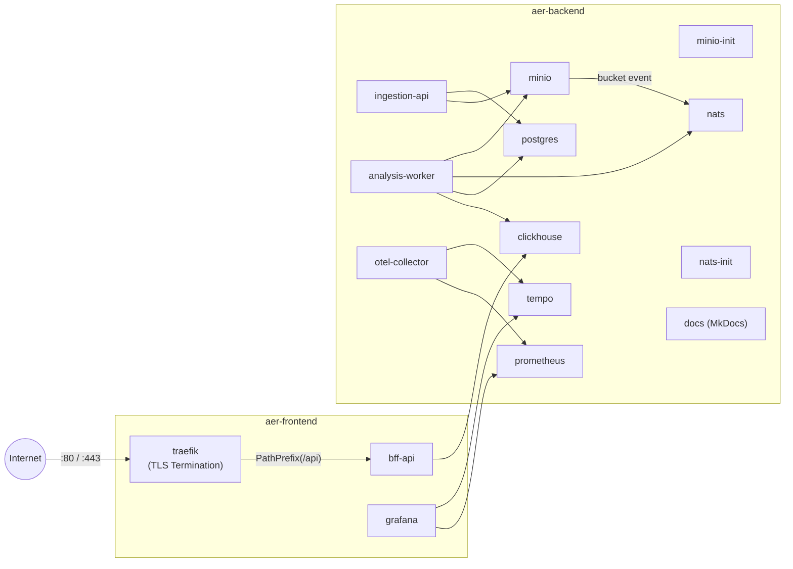
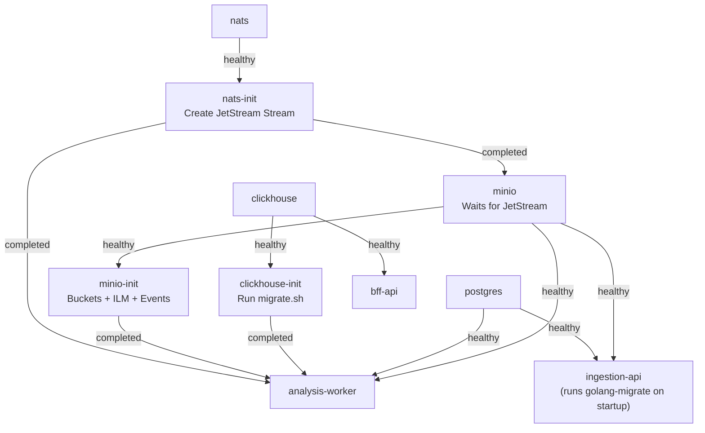
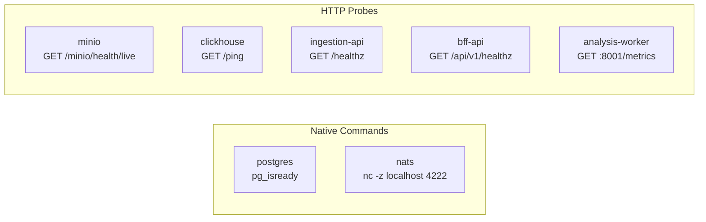
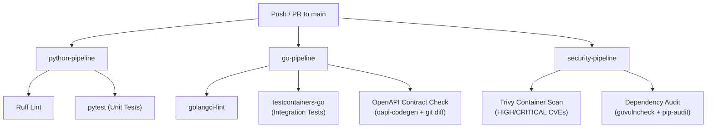

# 7. Deployment View

## 7.1 Overview

AĒR runs as a fully containerized stack orchestrated by a single `compose.yaml` at the repository root. This file is the **Single Source of Truth (SSoT)** for all image versions, network topology, resource limits, and health probes. No service is installed directly on the host machine — the only host prerequisites are Docker (with Compose plugin), Go 1.26.2+, Python 3.12+, and GNU Make.

The stack is managed exclusively through `make` targets, which abstract the underlying `docker compose` and local process management commands.

## 7.2 Network Topology

The compose stack is segmented into two isolated Docker bridge networks to enforce a strict separation between public-facing and internal services.



**Design rationale:** Only the BFF API and Grafana bridge both networks. Databases, NATS, the analysis worker, and init containers are exclusively on `aer-backend` and are unreachable from the internet-facing `aer-frontend` network. Traefik sits exclusively on `aer-frontend` and routes traffic to the BFF via Docker service discovery.

## 7.3 Image Pinning Policy

All infrastructure images in `compose.yaml` use **hard-pinned, immutable version tags**. The use of `latest`, release-candidate, or alpha tags is strictly prohibited. Application services (`ingestion-api`, `analysis-worker`, `bff-api`) are built from local multi-stage Dockerfiles.

**Upgrade policy:** Image versions are upgraded manually and deliberately. Before any upgrade, the changelog of the respective image is reviewed, and the full stack is validated locally via `make up`. Pinned versions are tracked in Git, enabling rollback via `git revert` at any time.

## 7.4 Container Inventory

### 7.4.1 Reverse Proxy & TLS Termination

| Property | Value |
| :--- | :--- |
| **Service** | `traefik` |
| **Image** | `traefik:v3.6.12` |
| **Network** | `aer-frontend` |
| **Ports** | `80` (HTTP → redirect to HTTPS), `443` (HTTPS) |
| **TLS** | Self-signed (dev default); ACME / Let's Encrypt via `compose.prod.yaml` overlay |
| **Resources** | 128 MB RAM, 0.25 CPU |

Traefik discovers backend services via Docker labels. Only `bff-api` is explicitly exposed (`traefik.enable=true`) with the routing rule `PathPrefix(/api)`. All other services remain unexposed to the internet.

**Dev vs. Production TLS:** The base `compose.yaml` uses Traefik's default self-signed certificate (`tls=true`) — no ACME provider is contacted, avoiding certificate errors for `*.example.com` hosts in development and CI. For production with real domains, apply the overlay: `docker compose -f compose.yaml -f compose.prod.yaml up -d`. The overlay adds the ACME certificate resolver and switches all routers to `tls.certresolver=myresolver` for automatic Let's Encrypt certificates.

### 7.4.2 Data Layer

| Service | Image | Port(s) | Network | Memory | CPU | Healthcheck |
| :--- | :--- | :--- | :--- | :--- | :--- | :--- |
| `minio` | `minio/minio:RELEASE.2025-09-07T16-13-09Z` | `9000`, `9001` (Console) | backend | 1 GB | 0.50 | `curl -f http://localhost:9000/minio/health/live` |
| `postgres` | `postgres:18.3-alpine3.23` | `5432` | backend | 512 MB | 0.50 | `pg_isready -U $USER -d $DB` |
| `clickhouse` | `clickhouse/clickhouse-server:26.3.3-alpine` | `8123` (HTTP), `9002→9000` (Native) | backend | 2 GB | 1.00 | `wget --spider -q http://127.0.0.1:8123/ping` |
| `nats` | `nats:2.12.6-alpine3.22` | `4222` (Client), `8222` (Monitor) | backend | 256 MB | 0.25 | `nc -z localhost 4222` |

MinIO is configured as a JetStream-aware event publisher. Every `PUT` to the `bronze` bucket triggers a NATS notification on subject `aer.lake.bronze`, enabling real-time, event-driven processing without polling.

### 7.4.3 Init Containers (Provisioning)

Init containers run once at startup (`restart: "no"`) to provision infrastructure before application services boot. They are a core part of the IaC (Infrastructure as Code) strategy — application services must never create their own infrastructure.

| Service | Image | Purpose | Depends On |
| :--- | :--- | :--- | :--- |
| `nats-init` | `natsio/nats-box:0.19.3` | Creates the JetStream stream `AER_LAKE` with subject filter `aer.lake.>` and file-backed storage. | `nats` (healthy) |
| `minio-init` | `minio/mc:RELEASE.2025-08-13T08-35-41Z` | Creates buckets (`bronze`, `silver`, `bronze-quarantine`), applies ILM retention policies (Bronze: 90d, Silver: 365d, Quarantine: 30d), and registers the NATS event notification on the `bronze` bucket. | `minio` (healthy) |
| `clickhouse-init` | Same ClickHouse image | Runs `infra/clickhouse/migrate.sh` — a shell-based migration runner that executes versioned SQL files from `infra/clickhouse/migrations/` and tracks applied versions in `aer_gold.schema_migrations`. See ADR-014. | `clickhouse` (healthy) |



### 7.4.4 Application Services

All four application services are built from multi-stage Dockerfiles. Go services use a `golang:1.26.2-alpine3.23` builder stage and produce a statically linked binary (`CGO_ENABLED=0`) copied into a minimal `alpine:3.23.3` runtime image. The Python worker uses `python:3.14.3-slim-bookworm` for both build and runtime stages, separating dependency installation from application code via `--prefix=/install`. The builder stage installs `gcc`, `libpq-dev`, and `python3-dev` to compile `psycopg2` from source against the system `libpq` — the `psycopg2-binary` package is used only in development/CI environments (`requirements-dev.txt`) to avoid native compilation overhead. The dashboard uses a `node:22-alpine3.23` builder stage to compile the SvelteKit static bundle via `pnpm` (pinned through Corepack) and copies the output into an `nginx:1.29-alpine3.23` runtime image — no Node runtime ships to production (ADR-020).

| Service | Dockerfile Base | Port | Network(s) | Memory | CPU | Healthcheck |
| :--- | :--- | :--- | :--- | :--- | :--- | :--- |
| `ingestion-api` | `golang:1.26.2-alpine3.23` → `alpine:3.23.3` | `8081` | backend | 128 MB | 0.25 | `wget --spider -q http://localhost:8081/api/v1/healthz` |
| `analysis-worker` | `python:3.14.3-slim-bookworm` | — (no port exposed) | backend | 512 MB | 0.50 | `python -c "urllib.request.urlopen('http://localhost:8001/metrics')"` |
| `bff-api` | `golang:1.26.2-alpine3.23` → `alpine:3.23.3` | `8080` | frontend + backend | 128 MB | 0.25 | `wget --spider -q http://localhost:8080/api/v1/healthz` |
| `dashboard` | `node:22-alpine3.23` → `nginx:1.29-alpine3.23` | `8080` | frontend | 128 MB | 0.25 | `wget --spider -q http://127.0.0.1:8080/healthz` |

The `bff-api` is the only application service that bridges both networks. It is protected by an API-key middleware (`X-API-Key` header or `Authorization: Bearer`) on all routes except the unauthenticated probe endpoints `/healthz` and `/readyz`. Traefik labels route external HTTPS traffic on `PathPrefix(/api)` to this service.

The `dashboard` is a static SvelteKit bundle served by Nginx on unprivileged port `8080` (runs as the non-root `nginx` user). It is attached to the `aer-frontend` network only and has no direct access to backend services — all data comes from the BFF through the browser. Traefik's catch-all router (`PathPrefix(/)` with `!PathPrefix(/api)` and an explicit lower `priority=1`) ensures `/api/*` continues to reach the BFF while all other paths fall through to the SPA. The SvelteKit static adapter emits `build/index.html` as a fallback, and Nginx's `try_files $uri $uri/ /index.html;` keeps client-side routes resolvable without a server-side router.

Because the adapter is `@sveltejs/adapter-static`, SvelteKit resolves `$env/dynamic/public` at **build time**, not at runtime. The two browser-observability values — `PUBLIC_OTLP_ENDPOINT` and `PUBLIC_DEPLOYMENT_ENVIRONMENT` — are therefore promoted to Docker build args in `services/dashboard/Dockerfile` and wired through the `args:` block of the `dashboard` service in `compose.yaml` (Phase 98d). Changing either value requires rebuilding the image (`docker compose build dashboard`) — setting them in the runtime container has no effect. An empty `PUBLIC_OTLP_ENDPOINT` disables browser trace emission entirely and is the recommended default outside of observability-enabled environments.

The `analysis-worker` does not expose an HTTP port to the host. Its Prometheus metrics endpoint (`:8001/metrics`) is used internally as a healthcheck and scrape target but is not mapped to the host.

### 7.4.5 Observability Stack

| Service | Image | Port(s) | Network | Memory | CPU |
| :--- | :--- | :--- | :--- | :--- | :--- |
| `otel-collector` | `otel/opentelemetry-collector:0.149.0` | `4317` (gRPC), `4318` (HTTP) | backend | 256 MB | 0.25 |
| `tempo` | `grafana/tempo:2.10.1` | — (internal only) | backend | 512 MB | 0.25 |
| `prometheus` | `prom/prometheus:v3` | — (internal only) | backend | 512 MB | 0.25 |
| `grafana` | `grafana/grafana:12.4` | `3000` | frontend + backend | 256 MB | 0.25 |

The telemetry pipeline flows as follows: all three application services send OpenTelemetry data (traces and metrics) to the OTel Collector via gRPC (`:4317`). The Collector fans out traces to Tempo and metrics to Prometheus. Grafana connects to both as pre-provisioned datasources (via `grafana-datasources.yaml`). Dashboards and alerting rules are provisioned automatically from files mounted into the Grafana container.

### 7.4.6 Documentation

| Property | Value |
| :--- | :--- |
| **Service** | `docs` |
| **Image** | `squidfunk/mkdocs-material:9.7.6` |
| **Network** | `aer-backend` |
| **Port** | `8000` |
| **Resources** | 256 MB RAM, 0.25 CPU |

The repository root is mounted at `/docs` inside the container. MkDocs runs in live-reload mode (`--livereload --dirty`), enabling instant feedback when editing `.md` files in the `docs/` directory.

## 7.5 Persistent Volumes

| Volume | Mounted By | Purpose |
| :--- | :--- | :--- |
| `minio_data` | `minio` | Bronze, Silver, and Quarantine buckets (the Data Lake). |
| `postgres_data` | `postgres` | Metadata index (sources, ingestion jobs, documents, trace IDs). |
| `clickhouse_data` | `clickhouse` | Gold layer time-series metrics (`aer_gold.metrics`). |
| `tempo_data` | `tempo` | Trace WAL and block storage (`/var/tempo`). Retains traces for 72h (development) or 720h (production). |
| `traefik-certs` | `traefik` | ACME/Let's Encrypt certificates persisted across restarts (production only, via `compose.prod.yaml`). |

Volumes can be selectively wiped via `make infra-clean-{postgres,minio,clickhouse}` or entirely via `make infra-clean`. All wipe commands require interactive confirmation.

## 7.6 Healthcheck Strategy

Every long-running service defines a Docker-level healthcheck. The strategy follows a strict rule: **healthchecks must use HTTP probes or native readiness commands, never log parsing.**



All dependent services use `depends_on` with `condition: service_healthy` or `condition: service_completed_successfully` (for init containers) to enforce a deterministic boot order and eliminate race conditions.

## 7.7 Developer Experience (DevEx)

### 7.7.1 Makefile as Primary Interface

The central `Makefile` at the repository root is the single entry point for all developer operations. It abstracts Docker Compose commands and local process management into intuitive targets.

Running `make` (or `make help`) without arguments prints a formatted overview of all available targets.

| Target | Description |
| :--- | :--- |
| `make up` | Starts the entire stack (infrastructure + all three services). |
| `make down` | Stops everything. |
| `make restart` | Stops and restarts the entire stack. |
| `make infra-up` | Starts only infrastructure (Traefik, databases, NATS, observability, docs). |
| `make infra-restart` | Restarts infrastructure. |
| `make infra-clean[-postgres\|-minio\|-clickhouse]` | Wipes persistent volumes (all or selectively, with confirmation). |
| `make debug-up` | Forwards all backend ports to `localhost` (Zero-Trust opt-in). |
| `make debug-down` | Closes debug port forwarding; backend services keep running. |
| `make services-up` | Starts all three application services in the background. |
| `make services-restart` | Restarts all application services. |
| `make services-clean` | Stops services and removes PID/log files. |
| `make logs` | Tails combined logs of all background services (Ctrl+C is safe). |
| `make test` | Runs the full test suite (Go integration + Python unit tests). |
| `make test-go-pkg` | Runs Go tests for the shared `pkg/` module. |
| `make test-e2e` | Runs the Docker Compose end-to-end smoke test. |
| `make lint` | Runs `golangci-lint` (all Go modules) and `ruff` (Python). |
| `make lint-go-pkg` | Runs `golangci-lint` for `pkg/` only. |
| `make codegen` | Regenerates Go types/stubs from `openapi.yaml` via `oapi-codegen`. |
| `make build-services` | Compiles Go binaries into `./bin/`. |

Individual services can be controlled independently via `make {ingestion,worker,bff}-{up,down,restart}`.

### 7.7.2 Local Development Mode

Every service runs in a container; the development environment is the same container topology as production minus the ACME-issued TLS overlay. `make up` brings up the full stack via `docker compose up -d --wait`, gated by service healthchecks. For frontend iteration, `make backend-up` skips the dashboard container and `make fe-dev` runs the SvelteKit dev server on `:5173`, proxying `/api` through Traefik to the BFF.

The `.env` file (copied from `.env.example`) serves as the central configuration source for both Docker Compose environment variables and the application services (loaded via `viper` in Go and `python-dotenv` in Python).

### 7.7.3 Containerized Mode

For full-stack containerized deployment (e.g., on a VPS), all three application services also have Dockerfile definitions and compose entries. Running `docker compose up -d` brings up the entire stack with self-signed TLS (suitable for internal/staging use). For production with real domains and Let's Encrypt:

```bash
docker compose -f compose.yaml -f compose.prod.yaml up -d
```

Ensure `GRAFANA_HOST`, `MINIO_CONSOLE_HOST`, and `ACME_EMAIL` are set to real values in `.env`.

## 7.8 Exposed Ports (Localhost)

AĒR follows the Zero-Trust posture established in ADR-013. Only Traefik, the BFF API, and the documentation server bind ports to the host by default. All backend services are reachable exclusively over the internal Docker network.

### Default profile (`make up`)

| Port | Service | Purpose |
| :--- | :--- | :--- |
| `80` | Traefik | HTTP (redirects to HTTPS) |
| `443` | Traefik | HTTPS — routes to BFF API, Grafana, MinIO Console |
| `8000` | MkDocs | Architecture documentation (dev convenience) |
| `8080` | BFF API | `GET /api/v1/metrics`, `/api/v1/entities`, `/api/v1/metrics/available`, `/api/v1/healthz`, `/api/v1/readyz` |

### Debug profile (`make debug-up`)

These ports are not exposed in the default stack. `make debug-up` starts a `socat`-based TCP proxy (`debug-ports` service, `profiles: ["debug"]`) that forwards them to `localhost`. Use `make debug-down` to close the forwarding without stopping the stack.

| Port | Service | Purpose |
| :--- | :--- | :--- |
| `3000` | Grafana | Monitoring dashboards (also accessible via Traefik HTTPS) |
| `4222` | NATS | Client connections |
| `4317` | OTel Collector | OpenTelemetry gRPC receiver |
| `4318` | OTel Collector | OpenTelemetry HTTP receiver |
| `5432` | PostgreSQL | Database connections |
| `8081` | Ingestion API | `POST /api/v1/ingest`, `/api/v1/healthz`, `/api/v1/readyz` |
| `8123` | ClickHouse | HTTP interface and playground (`/play`) |
| `8222` | NATS | Monitoring dashboard |
| `9000` | MinIO | S3-compatible API |
| `9001` | MinIO | Web console (also accessible via Traefik HTTPS) |
| `9002` | ClickHouse | Native protocol |

Credentials for all services are defined in the `.env` file (see `.env.example` for defaults).

## 7.9 CI/CD Pipeline

The project uses GitHub Actions (`.github/workflows/ci.yml`) for continuous integration, triggered on every push and pull request to `main`.



**Testcontainers image caching:** The CI pipeline caches Docker images used by Testcontainers (`minio/minio`, `postgres`, `clickhouse/clickhouse-server`) as tarballs via `actions/cache@v4`. On cache hits, images are loaded directly from disk instead of being pulled from registries, significantly reducing pipeline duration.

**SSoT enforcement:** Both Go (`pkg/testutils/compose.go`) and Python (`get_compose_image()`) Testcontainers dynamically parse image tags from `compose.yaml` at test time. No image tags are hardcoded in test files — the compose file is the single source of truth.