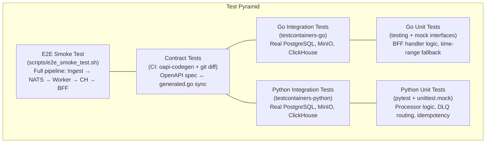
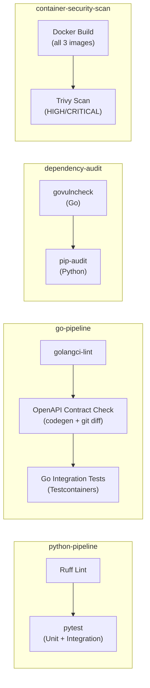

# 8. Cross-cutting Concepts

This chapter documents the architectural patterns and strategies that cut across individual building blocks and apply system-wide. Each concept is implemented in the codebase — this is not aspirational documentation.

## 8.1 Testing Strategy

AĒR follows a hybrid testing strategy (see ADR-005) tailored to the responsibilities of each language layer. The guiding principle: test stateless logic with mocks (fast), test stateful adapters against real infrastructure (reliable).



**Python (Analysis Worker):** Unit tests with mocks (`pytest`, `unittest.mock`) validate the deterministic business logic — harmonization, Silver Contract validation, DLQ routing, idempotency checks, and quarantine serialization. Integration tests (`test_storage.py`) use `testcontainers` to validate connection retry logic (`tenacity`) against real PostgreSQL, MinIO, and ClickHouse containers.

**Go (Ingestion & BFF API):** Integration tests use `testcontainers-go` to spin up ephemeral PostgreSQL, MinIO, and ClickHouse containers. These validate real SQL queries, S3 uploads, and ClickHouse reads — mocking these would hide schema drift bugs. BFF handler tests use a mock storage interface to validate HTTP response mapping, time-range fallback logic, and error handling in isolation.

**Contract Tests:** The CI pipeline regenerates `generated.go` from the OpenAPI spec via `oapi-codegen` and runs `git diff --exit-code` to verify the committed code matches the spec. Any drift fails the build.

**E2E Smoke Test:** A bash script (`scripts/e2e_smoke_test.sh`) boots the entire stack via `docker compose up --build --wait`, ingests a test document, waits for pipeline processing, and queries the BFF API to verify end-to-end data flow. Currently executed manually (see Chapter 11, D-4).

**Test file organisation:** Test files are structured by concern, mirroring the source module structure — e.g., `postgres_documents_test.go` alongside `postgres_documents.go`, `test_extractor_pipeline.py` alongside the extractor modules. Shared infrastructure setup is centralised in `conftest.py` (Python) and in `_test.go` files providing `TestMain` or shared Testcontainer setup (Go), avoiding duplication across per-concern test files.

**Scientific Infrastructure coverage (Phase 72).** Phases 62–68 introduced tables and endpoints that carry methodological context: `source_classifications` (WP-001 Functional Probe Taxonomy), `metric_baselines` (z-score normalisation), `metric_validity` (Krippendorff's-alpha-gated validation), `metric_equivalence` (cross-cultural mapping), and the `/metrics/{metricName}/provenance` endpoint. Phase 72 retroactively closes the test gap across all three pyramid layers: Python unit tests (`test_discourse_context.py`, `test_bias_context.py`, `test_discourse_function_gold.py`, `test_compute_baselines.py`) verify adapter propagation and pure-Python helpers extracted from `scripts/compute_baselines.py`; Go integration tests (`provenance_handler_test.go`, extensions in `metrics_query_test.go` and `postgres_test.go`) verify the handler contracts, the storage layer's normalisation and resolution paths, and the schema semantics of `source_classifications`; the E2E smoke test asserts that `discourse_function` is populated in `aer_gold.metrics`, that `?resolution=hourly` returns data, and that the provenance endpoint exposes tier classification and algorithm description.

**Validation-Gate Testing Pattern.** Endpoints that serve scientifically-conditional results — primarily `GET /metrics?normalization=zscore` — must refuse to respond with synthetic or unvalidated data. The handler layer is tested against a mock store to verify that a request returns HTTP 400 with a descriptive message when no `metric_baselines` row exists, when no `metric_equivalence` row exists, or when the request omits `metricName`. The corresponding happy-path test seeds a baseline and an equivalence entry and asserts that the z-score flow produces the expected normalized value. The pattern generalises: any future endpoint that depends on validated scientific pre-conditions (e.g., Krippendorff's-α above threshold, Fleiss's κ reached) should follow the same mock-store 400/200 contract test pair.

### 8.1.1 SSoT-Enforced Testcontainers

Both Go and Python Testcontainers dynamically parse image tags from `compose.yaml` at test time — no image tags are hardcoded in test files. This enforces that tests always run against the exact same database versions used in development and production.

**Go** (`pkg/testutils/compose.go`): The `GetImageFromCompose(serviceName)` function scans the compose file and extracts the `image:` value for a given service block.

**Python** (`test_storage.py`): The `get_compose_image(service_name)` function implements the same parser logic, navigating the directory hierarchy to find `compose.yaml` at the repository root.

Both parsers follow the same algorithm: find the service block by name, then extract the image string from the `image:` directive within that block's indentation scope.

## 8.2 Shared Foundations (DRY Principle)

To maintain a clean and scalable codebase across multiple Go microservices, AĒR utilizes a Go Workspace (`go.work`) linking `pkg/`, `services/ingestion-api/`, `services/bff-api/`, and `crawlers/wikipedia-scraper/`.

The `pkg/` module is a central, local Go module at the repository root. It encapsulates cross-cutting concerns identical across all Go services:

**`pkg/config/`** — Configuration management powered by `spf13/viper`. Unmarshals environment variables into strongly-typed structs, with graceful fallback to local `.env` files. Every Go service imports this to ensure consistent configuration loading.

**`pkg/logger/`** — Structured logging via `log/slog` with `lmittmann/tint`. Production and staging environments emit JSON; development uses ANSI-colored, human-readable output. Log level is configurable via `LOG_LEVEL`.

**`pkg/telemetry/`** — OpenTelemetry tracer initialization. Configures the OTLP gRPC exporter pointing to the OTel Collector endpoint (configurable via `OTEL_EXPORTER_OTLP_ENDPOINT`). The tracer provider is bound to the application context for clean shutdown.

**`pkg/middleware/`** — Shared HTTP middleware. Currently provides `APIKeyAuth` (`apikey.go`), a `chi`-compatible middleware that validates API keys from the `X-API-Key` header or `Authorization: Bearer` header. Used by both the BFF API and the Ingestion API (DRY).

**`pkg/testutils/`** — The SSoT compose parser (`compose.go`) used by all Go integration tests to dynamically resolve Docker image tags from `compose.yaml`.

Microservices import `pkg/` as a local module via `go.work`. Changes to shared code propagate instantly across all services without versioning or publishing.

## 8.3 Clean Architecture (Microservice Structure)

All Go microservices follow a strict directory structure to enforce Separation of Concerns:

```
services/{service-name}/
├── cmd/api/main.go          # Entry point. Zero business logic. Loads config, injects deps, starts server.
├── internal/
│   ├── config/config.go     # Maps .env variables to service-specific structs via viper.
│   ├── storage/             # Infrastructure adapters, split by concern (e.g., postgres.go,
│   │                        #   postgres_documents.go, postgres_jobs.go, minio.go, clickhouse.go,
│   │                        #   entities_query.go, metrics_query.go). One file per responsibility.
│   ├── core/service.go      # Business logic and orchestration. Depends only on injected interfaces.
│   └── handler/             # HTTP handlers (BFF) or request/response mapping (Ingestion).
├── Dockerfile               # Multi-stage build: golang:alpine builder → alpine runtime.
└── go.mod                   # Module definition with replace directive for local pkg/.
```

The Python analysis worker follows an analogous pattern:

```
services/analysis-worker/
├── main.py                       # Entry point, DI wiring, NATS consumer loop.
├── internal/
│   ├── processor.py              # Business logic and orchestration (Silver validation, extractor dispatch).
│   ├── models.py                 # Pydantic contracts: SilverCore, SilverMeta, SilverEnvelope.
│   ├── silver.py                 # Silver envelope construction and MinIO write.
│   ├── quarantine.py             # DLQ serialization and MinIO quarantine write.
│   ├── metrics.py                # Prometheus metric definitions.
│   ├── storage/                  # Infrastructure adapters, split by concern:
│   │   ├── postgres_client.py    #   PostgreSQL connection pool and document/job queries.
│   │   ├── minio_client.py       #   MinIO client initialization and object read/write.
│   │   └── clickhouse_client.py  #   ClickHouse pool and Gold-layer batch inserts.
│   ├── adapters/                 # Source Adapter pattern (base, registry, legacy, rss).
│   └── extractors/               # MetricExtractor pipeline (base, word_count, sentiment,
│                                 #   language, temporal, entities).
└── tests/                        # pytest test suite with shared fixtures in conftest.py.
```

PostgreSQL uses `psycopg2.ThreadedConnectionPool` (maxconn=10). ClickHouse uses a custom `ClickHousePool` backed by `queue.Queue`, sized to `WORKER_COUNT` — one `clickhouse_connect` client per concurrent worker thread, since the library does not support concurrent queries within a single session.

## 8.4 Infrastructure as Code (IaC)

Microservices must never create infrastructure at startup. They assume all required resources (buckets, tables, streams) already exist. Provisioning is handled by dedicated init containers orchestrated via `compose.yaml`.

| Init Container | Image | Provisions | Depends On |
| :--- | :--- | :--- | :--- |
| `nats-init` | `natsio/nats-box:0.19.3` | JetStream stream `AER_LAKE` (subjects: `aer.lake.>`, file-backed storage). | `nats` (healthy) |
| `minio-init` | `minio/mc:RELEASE.2025-08-13T08-35-41Z` | Buckets (`bronze`, `silver`, `bronze-quarantine`), ILM retention policies (Bronze: 90d, Silver: 365d, Quarantine: 30d), NATS event notification on `bronze` bucket. | `minio` (healthy) |
| PostgreSQL | `golang-migrate` (in-process) | Versioned SQL migrations in `infra/postgres/migrations/` executed by the `ingestion-api` on startup. The original `init.sql` is a no-op stub — schema operations are handled entirely by the migration runner. See ADR-014. | `postgres` (healthy) |
| `clickhouse-init` | Same ClickHouse image | Shell-based migration runner (`infra/clickhouse/migrate.sh`) executes versioned SQL files from `infra/clickhouse/migrations/`. Tracks applied versions in `aer_gold.schema_migrations`. | `clickhouse` (healthy) |

The boot order is deterministic: `nats` → `nats-init` → `minio` (waits for JetStream) → `minio-init` → application services. ClickHouse migrations run via `clickhouse-init` before the `analysis-worker` starts (`condition: service_completed_successfully`). PostgreSQL migrations run in-process when the `ingestion-api` starts (via `golang-migrate`). All infrastructure dependencies use `condition: service_healthy` or `condition: service_completed_successfully`.

## 8.5 CI/CD Pipeline

AĒR uses GitHub Actions (`.github/workflows/ci.yml`) with four parallel jobs triggered on every push and pull request to `main`.



**Performance optimizations:** Testcontainers Docker images are cached as tarballs via `actions/cache@v4` and loaded from disk on cache hits, avoiding registry pulls. Go tools (`golangci-lint`, `oapi-codegen`) are cached in `~/go/bin` keyed to the `.tool-versions` file hash. Go module caches and Python pip caches are enabled via the respective setup actions.

**Security gates:** Trivy scans all three Dockerfiles for HIGH/CRITICAL CVEs with `ignore-unfixed: true` and `exit-code: 1` — unfixed critical vulnerabilities break the build. `govulncheck` audits Go dependencies, and `pip-audit` audits Python dependencies.

**Tooling version pinning:** All CI tools are pinned to exact versions to prevent silent breakage from upstream updates. `golangci-lint` and `oapi-codegen` are installed via `go install <module>@vX.Y.Z`. `pip-audit` is installed via `pip install pip-audit==X.Y.Z`. `govulncheck` is installed via `go install golang.org/x/vuln/cmd/govulncheck@vX.Y.Z`. Pinned versions are declared in `.tool-versions` — the Single Source of Truth for developer tooling versions. Both the CI pipeline and the Makefile (`make setup`) consume this file directly: CI loads it into `$GITHUB_ENV`, the Makefile uses `include .tool-versions`. The Go tools cache key is keyed to the `.tool-versions` file hash, so upgrades require an intentional edit to that file.

## 8.6 Observability

Every dataset entering AĒR is fully traceable from the Gold layer back to the original HTTP request via OpenTelemetry trace IDs. The observability stack is a first-class citizen, not an afterthought.

### 8.6.1 Distributed Tracing

All three services emit OpenTelemetry traces via OTLP gRPC to the OTel Collector (`:4317`). The Collector exports traces to Grafana Tempo. Trace data is persisted to a named Docker volume (`tempo_data` mounted at `/var/tempo`) with a block retention of 72h (development) or 720h (production), ensuring traces survive container restarts. Trace context is propagated across the NATS message boundary via message headers, enabling end-to-end correlation from the crawler's HTTP POST through ingestion, NATS delivery, worker processing, and ClickHouse insertion.

### 8.6.2 Trace Sampling Strategy

Trace sampling is configured via the `OTEL_TRACE_SAMPLE_RATE` environment variable (default: `1.0` — 100% sampling). The sampler is `ParentBased(TraceIDRatioBased(rate))`:

- **`TraceIDRatioBased`** deterministically samples a fraction of root spans based on the trace ID. At `1.0` this is equivalent to `AlwaysSample()`; at `0.1` exactly 10% of root spans are recorded.
- **`ParentBased`** wrapper ensures that child spans always inherit the sampling decision of their parent. This prevents orphaned trace fragments where a child span is recorded but its parent root span is not, which would break trace continuity in Tempo.

| Environment | Recommended `OTEL_TRACE_SAMPLE_RATE` | Rationale |
| :--- | :--- | :--- |
| Development | `1.0` | Full fidelity for debugging; low request volume |
| Production | `0.1` | 10% sampling prevents storage growth at crawler scale |

The sampler is initialized in `pkg/telemetry/otel.go` (`InitProvider`) and the rate is passed from each service's config struct (`OTelSampleRate`). This is implemented as part of R-8 resolution (Phase 36).

### 8.6.3 Prometheus Metrics

The Python analysis worker exposes business metrics on `:8001/metrics` via the `prometheus_client` library. Prometheus scrapes this endpoint (and the OTel Collector's metrics exporter on `:8889`) every 5 seconds.

| Metric | Type | Description |
| :--- | :--- | :--- |
| `events_processed_total` | Counter | Total events successfully processed through the pipeline. |
| `events_quarantined_total` | Counter | Total events routed to the DLQ. |
| `event_processing_duration_seconds` | Histogram | End-to-end processing duration per event (buckets: 50ms–10s). |
| `dlq_size` | Gauge | Current number of objects in the `bronze-quarantine` bucket. |

### 8.6.4 Alerting

Prometheus alerting rules are defined in `infra/observability/prometheus/alert.rules.yml` and evaluate continuously:

| Alert | Condition | Severity |
| :--- | :--- | :--- |
| `WorkerDown` | Scrape target unreachable for > 1 minute. | Critical |
| `DLQOverflow` | `dlq_size > 50` for > 5 minutes. | Warning |
| `HighEventProcessingLatency` | p95 processing duration > 5 seconds for > 5 minutes. | Warning |

### 8.6.5 Dashboards

Grafana dashboards are provisioned automatically from JSON files mounted via `infra/observability/grafana/provisioning/dashboards/`. Datasources (Tempo, Prometheus) are pre-configured via `grafana-datasources.yaml`. No manual Grafana setup is required after `make infra-up`.

## 8.7 Security

### 8.7.1 API Authentication

Both the BFF API and the Ingestion API require an API key on all routes except health probes (`/healthz`, `/readyz`). The key is accepted via the `X-API-Key` header or `Authorization: Bearer <key>`. Requests with missing or invalid keys receive a `401 Unauthorized` response.

| Service | Environment Variable | Purpose |
| :--- | :--- | :--- |
| BFF API | `BFF_API_KEY` | Protects metric queries from unauthorized consumers |
| Ingestion API | `INGESTION_API_KEY` | Protects data submission from unauthorized crawlers |

The authentication middleware is shared between both services via `pkg/middleware/apikey.go` (`APIKeyAuth` function), satisfying the DRY principle. See §8.2 for the shared library structure.

**Constant-time comparison (Phase 75, ADR-018).** `APIKeyAuth` compares the presented token against the configured key using `crypto/subtle.ConstantTimeCompare`, eliminating the dominant timing side channel that byte-by-byte `==` would expose. A sanity test in `pkg/middleware/apikey_test.go` asserts that a wrong key produces the same 401 outcome regardless of how many leading bytes match. Both services inherit the fix from the same source file. The constant-time guarantee applies only to the comparison itself; surrounding work (header parsing, bearer-token extraction, response serialization) is not in scope and is considered acceptable under the current threat model.

### 8.7.2 TLS Termination

Traefik acts as the reverse proxy on the `aer-frontend` network, terminating TLS via ACME/Let's Encrypt (`tlschallenge`). All HTTP traffic on port 80 is redirected to HTTPS on port 443. Only the BFF API is exposed through Traefik (via Docker labels with `PathPrefix(/api)`). All other services remain internal.

### 8.7.3 Network Segmentation

The Docker stack is split into two bridge networks: `aer-frontend` (Traefik, BFF, Grafana) and `aer-backend` (all databases, NATS, workers, observability). Only the BFF API and Grafana bridge both networks. Databases and internal services are unreachable from the internet.

### 8.7.4 HTTP Server Hardening (Phase 82)

Both Go HTTP services (ingestion-api, bff-api) construct their `http.Server` with explicit, bounded timeouts instead of accepting the `net/http` defaults (which are effectively unbounded). This closes a class of slow-loris and dangling-connection denial-of-service vectors that `http.ListenAndServe` would otherwise leave open.

| Setting | Value | Reason |
| :--- | :--- | :--- |
| `ReadHeaderTimeout` | 5s | Slow-header attack ceiling — must finish headers fast |
| `ReadTimeout` | 60s | Upper bound on a full request body read |
| `WriteTimeout` | 60s | Upper bound on flushing a response back to the client |
| `IdleTimeout` | 120s | Keep-alive connection recycle |
| `MaxHeaderBytes` | 1 MiB | Hard cap on request header size |

In addition, `POST /api/v1/ingest` wraps the body reader in `http.MaxBytesReader` keyed off `INGESTION_MAX_BODY_BYTES` (default 16 MiB — see `.env.example`). A payload larger than the cap is rejected with `413 Payload Too Large` *before* the JSON decoder runs, so a malicious crawler cannot exhaust memory by streaming an unbounded document.

On `SIGTERM`, both services call `http.Server.Shutdown` with a drain deadline sourced from `INGESTION_SHUTDOWN_TIMEOUT_SECONDS` / `BFF_SHUTDOWN_TIMEOUT_SECONDS` (default 30s). The drain window is deliberately longer than `WriteTimeout` so a request that was mid-flight when the pod was evicted finishes cleanly instead of getting cut off.

**Generic 500 masking.** Starting in Phase 82, non-4xx errors returned to clients carry a generic `{"error":"internal error"}` body, while the original error is logged server-side at ERROR level with request context. This prevents stack traces, SQL fragments, and other server internals from leaking into the response body when a downstream dependency misbehaves — a defense-in-depth measure against information disclosure.

### 8.7.5 Container Hardening (Phase 84)

All three service images are built from digest-pinned base images (`FROM image:tag@sha256:…`) and run as a non-root user (`uid 10001`, group `aer`) via `USER aer`. Multi-stage builds keep the runtime image minimal — only the compiled binary, CA certificates, and (for the worker) the pre-downloaded SentiWS lexicon ride along into the final layer.

| Control | Mechanism |
| :--- | :--- |
| Reproducible base images | `FROM image:tag@sha256:digest` in every Dockerfile |
| Non-root execution | `USER aer` (uid 10001) with `/usr/sbin/nologin` shell |
| No build toolchain in runtime | Multi-stage `FROM builder AS …` + `COPY --from=builder` |
| Verified third-party downloads | `SENTIWS_SHA256` pin in worker Dockerfile, verified via `sha256sum -c` |
| Hash-locked Python deps | `services/analysis-worker/requirements.lock.txt` + `pip install --require-hashes` |

Rotating the pinned hashes is a deliberate, auditable operation — not something any individual `docker pull` can drift. See §8.7.6 for the runbook.

### 8.7.6 Supply Chain Security

The CI pipeline includes two dedicated security jobs: container image scanning via Trivy (`aquasecurity/trivy-action`) that fails the build on unfixed HIGH/CRITICAL CVEs, and dependency auditing via `govulncheck` (Go) and `pip-audit` (Python) that detect known vulnerabilities in third-party libraries.

**Rotating the supply-chain baseline (Phase 88).** `make deps-refresh` is the single maintainer entrypoint for advancing every externally-pinned dependency in one atomic operation: base image digests across all three Dockerfiles, the analysis-worker `requirements.lock.txt`, and `SENTIWS_SHA256`. The script (`scripts/deps_refresh.sh`) is idempotent on a clean baseline — running it when nothing upstream moved produces an empty `git diff`. The full runbook (when to run it, how to add a Python dependency, how to bump a base image tag, Trivy triage table, failure recovery) lives in [`docs/operations_playbook.md` → Dependency Refresh](../operations_playbook.md#dependency-refresh-supply-chain-baseline).

## 8.8 Data Lifecycle Management

AĒR implements automated, infrastructure-level data retention to prevent unbounded storage growth (see ADR-007).

| Layer | Storage | Retention | Mechanism |
| :--- | :--- | :--- | :--- |
| Bronze | MinIO `bronze` | 90 days | MinIO ILM (`infra/minio/setup.sh`) |
| Quarantine (DLQ) | MinIO `bronze-quarantine` | 30 days | MinIO ILM (`infra/minio/setup.sh`) |
| Silver | MinIO `silver` | 365 days | MinIO ILM (`infra/minio/setup.sh`) |
| Gold | ClickHouse `aer_gold.metrics` | 365 days | ClickHouse TTL on `ReplacingMergeTree` (`infra/clickhouse/init.sql`, migration 000010) |
| Metadata | PostgreSQL | Unlimited | No automated cleanup |

All retention policies are defined in IaC scripts — no application code manages data expiration.

**Silver TTL rationale (Phase 32 / R-3):** A 365-day TTL was adopted as a conservative default before long-term Silver growth data was available. The Gold layer (ClickHouse `aer_gold.metrics`) retains all derived metrics independently under its own 365-day TTL, making Silver objects safe to expire after one year. The Silver bucket acts as a re-evaluation baseline: any re-analysis of data older than 365 days would require a fresh crawl from the source, which is acceptable under the project's data availability guarantees. This value should be revisited once at least one full quarter of production crawl data is available and measured Silver growth significantly exceeds Bronze volume.

### 8.8.1 Tiered Retention (Planned)

WP-005 §5.4 proposes a tiered retention strategy in which raw 5-minute samples are kept for a short window and progressively coarser aggregates retain progressively longer history. The target tiers are:

| Tier | Source table | Retention | Rationale |
| :--- | :--- | :--- | :--- |
| 0–30 days | `aer_gold.metrics` (full 5-minute resolution) | 30 days | Event-scale forensic analysis, debugging |
| 30–365 days | `aer_gold.metrics_hourly` | 1 year | Daily-cycle and weekly-pattern analysis |
| 1–5 years | `aer_gold.metrics_daily` | 5 years | Seasonal and annual trend analysis |
| 5+ years | `aer_gold.metrics_monthly` | indefinite | Multi-year discourse drift |

**Status: planned — not yet active.** The current production retention is the flat 365-day TTL on `aer_gold.metrics` documented in §8.8 above. Activation depends on the materialized views described in §8.13 going live first. Until then, the §8.8 table is authoritative for what the system actually does today.

## 8.9 Developer Tooling

### 8.9.1 Git Hooks

AĒR enforces code quality at the Git level via hooks in `scripts/hooks/`:

**Pre-commit** (`scripts/hooks/pre-commit`): Runs `make lint` (`golangci-lint` for Go, `ruff` for Python). Commits are blocked if linting fails.

**Pre-push** (`scripts/hooks/pre-push`): Runs `make lint`, then `make audit` (`govulncheck` for Go, `pip-audit` for Python), then `make test` (full Go integration tests + Python unit tests). Pushes are blocked if any step fails. This ensures CI parity — no push reaches the remote with known dependency vulnerabilities.

### 8.9.2 Makefile

The central `Makefile` is the single interface for all developer operations. It is a thin wrapper over Docker Compose plus the build/test toolchain. Key targets: `make up` (full containerized stack), `make backend-up` (containerized backend only — for the `make fe-dev` frontend iteration loop), `make infra-up` (infrastructure only), `make services-up` (application services), `make test`, `make lint`, `make audit`, `make codegen`, `make build-services`, `make tidy`. Individual services are controllable via `make {ingestion,worker,bff}-{up,down,restart}`.

### 8.9.3 Configuration Management

All runtime configuration flows through environment variables, sourced from a single `.env` file (copied from `.env.example`). Go services load it via `viper` with `AutomaticEnv()` and `.env` file fallback. Python services use `python-dotenv` and `os.getenv()` with sensible defaults. Docker Compose interpolates the same `.env` file for container environment variables. This guarantees a single source of truth for all configuration across all runtimes.

## 8.10 Extractor Registration Pattern

The analysis worker uses a pipeline architecture for Gold metric extraction. New metrics are added by implementing the `MetricExtractor` protocol and registering the instance in `main.py` — no changes to the processor or existing extractors are required.

**Adding a new per-document metric extractor:**

1. Create `services/analysis-worker/internal/extractors/<name>.py`.
2. Implement the `MetricExtractor` protocol: a `name` property (used in logging) and an `extract(core: SilverCore, article_id: str | None) -> list[GoldMetric]` method.
3. Export from `extractors/__init__.py`.
4. Register the instance in the `extractors` list in `main.py`.

The processor iterates all registered extractors after Silver validation. Each extractor receives the same `SilverCore` and independently produces `GoldMetric` results. A failing extractor is logged and skipped — other extractors' results are still inserted. All metrics from all extractors are batch-inserted into ClickHouse in a single round-trip.

**`EntityExtractor` sub-protocol (Phase 44):** Extractors that produce both `GoldMetric` and `GoldEntity` results implement the `EntityExtractor` protocol, which extends `MetricExtractor` with `extract_entities(core, article_id) -> list[GoldEntity]` and `extract_all(core, article_id) -> tuple[list[GoldMetric], list[GoldEntity]]`. The processor checks `isinstance(extractor, EntityExtractor)` and calls `extract_all()` for single-pass processing — no `hasattr()` ad-hoc polymorphism. Currently implemented by `NamedEntityExtractor`. Extractors must be stateless between documents — no mutable instance-level caching of intermediate results (e.g., spaCy docs). All protocols are `@runtime_checkable` in `extractors/base.py`.

**`ProvenanceExtractor` sub-protocol (Phase 46):** Extractors whose results depend on a versioned resource (e.g. a lexicon or model file) implement the `ProvenanceExtractor` protocol, which extends `MetricExtractor` with a `version_hash: str` property. The processor collects `{extractor.name: extractor.version_hash}` entries from all registered `ProvenanceExtractor` instances at startup and writes the resulting `dict[str, str]` into `SilverEnvelope.extraction_provenance` on every Silver write. This keeps provenance at the metadata layer (Silver) and out of the ClickHouse time-series table, where it is neither human-readable nor analytically useful. Currently implemented by `SentimentExtractor` (SentiWS SHA-256 lexicon hash).

**Architectural boundary — corpus-level extractors (updated Phase 102):** Methods like TF-IDF, topic modelling (LDA), and co-occurrence networks require statistics across multiple documents and cannot run per-document. The `CorpusExtractor` protocol (`extract_batch(records, window)`) is defined in `extractors/base.py`. **Phase 102** introduces the first concrete implementation, `EntityCoOccurrenceExtractor` (`extractors/entity_cooccurrence.py`), as the single scope relaxation explicitly authorised by ADR-020. The scheduling mechanism is a periodic `asyncio` task (`internal/corpus.py::corpus_extraction_loop`) launched alongside the per-document workers in `main.py`, controlled by `CORPUS_EXTRACTION_INTERVAL_SECONDS`, `CORPUS_EXTRACTION_WINDOW_SECONDS`, and `CORPUS_EXTRACTION_ENABLED`. Each tick reads `aer_gold.entities` for every active source over the previous window, enumerates per-article unordered entity pairs (lexicographic canonical form), and bulk-inserts into `aer_gold.entity_cooccurrences` with `ingestion_version = time.time_ns()`. Idempotency is guaranteed by `ReplacingMergeTree(ingestion_version)`. Topic modelling, article clustering, themescape rendering, and embedding-drift extractors remain deferred (ADR-020 §"Explicit non-scope"). See Chapter 11 (R-9) and Chapter 13 (§13.3).

## 8.11 BFF Query Performance — Available Metrics Caching

`GET /api/v1/metrics/available` executes `SELECT DISTINCT metric_name FROM aer_gold.metrics WHERE timestamp >= $1 AND timestamp <= $2` — a table scan whose cost grows linearly with the metrics table. The endpoint accepts `startDate`/`endDate` to scope results to a specific time window, returning only metric names that have data in that range.

**Strategy:** an in-process **single-slot** TTL cache inside `ClickHouseStorage`. The struct holds a `sync.RWMutex`-protected tuple of `([]string, time.Time, startKey time.Time, endKey time.Time)` — exactly one cached entry, not an LRU map. The cache key is `(start, end)`: a hit is valid only when both the TTL has not expired *and* the requested date range matches the cached range. A request with a different range bypasses and replaces the cached entry. This is intentional under Occam's Razor: with a single dashboard consumer, two adjacent ranges thrashing one slot is cheaper than maintaining a multi-slot LRU. If the system grows multiple distinct consumers issuing different ranges concurrently, swap this for `hashicorp/golang-lru/v2`.

```
Request → GetAvailableMetrics(start, end)
              │
              ├─ RLock → cache valid AND key matches? ──YES──▶ return cached names
              │
              └─ NO → query ClickHouse(start, end) → WLock → update cache → return names
```

**Rationale (Occam's Razor):** no Redis, no distributed cache, no pub/sub invalidation. A single in-process struct is sufficient because the BFF API runs as a single container instance. The date-range key ensures correctness when dashboards query different time windows.

**Configuration:** `BFF_METRICS_CACHE_TTL_SECONDS` (default `60`). Set to `0` to disable caching (the constructor treats `≤ 0` as the default 60 s; to effectively bypass, set a very low value like `1`).

**Thread safety:** reads hold a read-lock; the write path acquires a write-lock only after the ClickHouse query completes, minimising lock contention under concurrent load.

### 8.11.1 BFF Sources Cache (Phase 87)

`GET /api/v1/sources` backs the scientific touchpoint workflows in the operator playbook, so it must answer fast and it must not lie about sources the system actually knows about. Since Phase 87 the endpoint reads the canonical `public.sources` row set live from PostgreSQL via a dedicated `bff_readonly` role (see §8.7 — Hard Rule 5 compliance is enforced by the `postgres-init-roles` init container).

To avoid hammering Postgres on every dashboard refresh, `services/bff-api/internal/storage/sources_store.go` wraps the query in a TTL-cached `SourceStore` with a stale-fallback policy:

| Path | Behaviour |
| :--- | :--- |
| Cache fresh (age < TTL) | Return cached slice under a read-lock. |
| Cache stale, refresh succeeds | Replace under a write-lock and return the new slice. |
| Cache stale, refresh *fails* | Log the error at WARN and return the stale slice. Availability beats strict freshness for a list that mutates only on a schema migration. |
| First request, refresh fails | Surface the error to the handler, which returns 500. There is no stale slice to fall back on. |

**Configuration:** `BFF_SOURCES_CACHE_TTL_SECONDS` (default `60`). Matches `BFF_METRICS_CACHE_TTL_SECONDS` in spirit — the number is not magic, it is just "long enough that a dashboard burst doesn't flood Postgres, short enough that a seed migration becomes visible within a refresh cycle."

The `SourceLister` interface in `handler/handler.go` makes the dependency nilable for tests, so handler unit tests inject a fake without spinning up Postgres. Contract: `List(ctx) ([]config.SourceEntry, error)`. Nil listers are a handler-level bug and surface as 500 — see `sources_handler_test.go`.

## 8.12 Hybrid Tier Architecture (Metric Validity)

AĒR classifies metrics into three tiers based on their validation status, following WP-002's recommendation (Option C). See ADR-016 for the full architectural decision.

| Tier | Description | Validation Requirement | Display Behavior |
| :--- | :--- | :--- | :--- |
| **Tier 1** | Immutable baseline metrics | None — always displayed | Always visible in dashboard. Never hidden by higher-tier metrics. |
| **Tier 2** | Validated enrichments (reproducible with seed) | Five-step validation protocol (WP-002 §4) | Available via Progressive Disclosure alongside Tier 1. |
| **Tier 3** | LLM-augmented enrichments (non-deterministic) | Explicit non-determinism flag | Progressive Disclosure only. Never displayed as primary metric. |

**Core Principle:** The dashboard never hides a Tier 1 score behind a Tier 2 or Tier 3 score. Progressive Disclosure adds information — it does not replace it.

**Infrastructure:** The `aer_gold.metric_validity` ClickHouse table (Migration 006, `ReplacingMergeTree`) stores per-metric validation metadata: `alpha_score`, `correlation`, `n_annotated`, `error_taxonomy`, and `valid_until`. The BFF API's `GET /api/v1/metrics/available` endpoint exposes a `validation_status` field per metric (`unvalidated`, `validated`, `expired`), derived by joining available metrics with the validity table. Metrics without a validity entry return `unvalidated`.

**Current State:** All Phase 42 extractors are Tier 1 and report `unvalidated`. The validity table is initially empty — it will be populated when interdisciplinary validation studies are conducted (Chapter 13, §13.5). Per-metric known limitations live in `services/bff-api/configs/metric_provenance.yaml` (the SSoT served by `GET /api/v1/metrics/{metricName}/provenance`) and are anchored in WP-002 §3 — see also §8.15 for the Probe Dossier Pattern, which keeps per-probe scientific context separate from per-metric provenance.

## 8.13 Multi-Resolution Temporal Framework

WP-005 distinguishes five temporal scales at which discourse phenomena unfold — from minute-scale event response to multi-year cultural drift — and recommends that the system serve queries at the resolution best suited to the question being asked. Phase 66 implements this as **query-time aggregation** in the BFF API; pre-aggregated materialized views are prepared as a deferred performance optimization (see below).

**Query-time aggregation (active):** `GET /api/v1/metrics` accepts an optional `resolution` query parameter with values `5min` | `hourly` | `daily` | `weekly` | `monthly` (default `5min`). The BFF maps the parameter to the corresponding ClickHouse bucketing function (`toStartOfFiveMinute` / `toStartOfHour` / `toStartOfDay` / `toStartOfWeek` / `toStartOfMonth`) at query time, used in both the `SELECT` projection and the `GROUP BY`. The same mapping applies to z-score-normalized queries (`?normalization=zscore`), so cross-cultural comparison remains available at every resolution.

**Row-cap scaling:** the per-request OOM guard (`s.rowLimit`) is multiplied by a fixed factor per resolution to account for the natural row reduction wider buckets produce. Multipliers: `5min` ×1, `hourly` ×12, `daily` ×288, `weekly` ×2016, `monthly` ×8640. This keeps long ranges queryable without exhausting the cap, while preserving the same absolute row ceiling for any single resolution.

**Minimum meaningful window:** `GET /api/v1/metrics/available` returns a `minMeaningfulResolution` hint per metric, sourced from a static config map in the BFF (`internal/config/min_resolution.go`). Values are seeded from Probe 0 publication-rate heuristics (WP-005 §3.3): tagesschau.de ≈ 50 articles/day → `hourly`; bundesregierung.de ≈ 5 articles/day → `daily`. Metrics without a recorded heuristic return `null`. The hint is advisory only — the BFF does not enforce it; clients are expected to use it when constructing default dashboard views.

**Deferred materialized views:** `infra/clickhouse/migrations/000009_metrics_resolution_views.sql` records the SQL definitions for `aer_gold.metrics_hourly`, `aer_gold.metrics_daily`, and `aer_gold.metrics_monthly` as commented-out `AggregatingMergeTree` views. They are NOT activated — query-time aggregation is sufficient at current ingestion volumes. The migration documents the activation criteria (p95 GetMetrics latency ≥ 1.5 s, row-cap truncation, or scans ≥ 10⁸ rows) and the activation procedure (new migration, backfill, switch the BFF query layer).

## 8.14 Reflexive Architecture (Phase 67)

WP-006 ("The Reflexive Architecture") formalizes AĒR's commitment to methodological self-disclosure: an observatory of discourse cannot be neutral, and the system's job is not to hide that non-neutrality behind a numeric surface but to expose it at the point of consumption. Phase 67 implements two of the five principles defined in WP-006 §6 and records the remaining three as frontend and governance commitments. The complete architectural decision, including the split between implemented and deferred principles, lives in **ADR-017**.

**Implemented backend surfaces.** Principle 1 (Methodological Transparency) is implemented via `GET /api/v1/metrics/{metricName}/provenance`, which returns tier classification, algorithm description, known limitations, validation status, extractor version hash, and cultural context notes. Static fields are loaded at BFF startup from `services/bff-api/configs/metric_provenance.yaml`; dynamic fields are resolved at request time against `aer_gold.metric_validity` (validation status) and `aer_gold.metric_equivalence` (cultural context notes). Principle 3 (Reflexive Documentation) is implemented via the PostgreSQL `sources.documentation_url` column added in migration 000007 and surfaced by `GET /api/v1/sources`. Since Phase 87 the BFF reads the column live from Postgres via a dedicated `bff_readonly` role (see §8.11.1 and §8.7) — the legacy static mirror (`configs/source_documentation.yaml`) was removed once the read-only role closed the source-of-truth drift. Phase 70 (migration 000008) repointed `documentation_url` from a single bias-profile file to the probe dossier directory `docs/probes/<probe-id>/` — see §8.15.

**Deferred principles.** Principle 2 (Non-Prescriptive Visualization) is captured in `docs/design/visualization_guidelines.md` as requirements for any future frontend — viridis color scales, no red/green encoding, uncertainty alongside point estimates, multiple visualization modes, and a ban on normative labels. Principles 4 (Governed Openness) and 5 (Interpretive Humility) are architectural commitments that will become concrete only once a dashboard and a published governance model exist. Principle 5 is partially prefigured today by the validation-gate pattern from ADR-016: the BFF already refuses `?normalization=zscore` with HTTP 400 when no registered equivalence entry covers the requested metric.

## 8.15 Probe Dossier Pattern (Phase 70)

The Probe Dossier Pattern is a documentation-only cross-cutting concept that organises per-probe scientific context along a fixed structure. Each probe — a coordinated set of data sources sharing a cultural and structural setting — gets its own directory under `docs/probes/<probe-id>/` with five mandatory files:

| File | Working Paper | Content |
| :--- | :--- | :--- |
| `README.md` | (overview) | Probe purpose, source list, calibration status, exit criteria, WP coverage matrix |
| `classification.md` | WP-001 | Etic/emic discourse-function classification mirroring the `source_classifications` row(s) for the probe's sources |
| `bias_assessment.md` | WP-003 | `BiasContext` values plus structural and per-source biases |
| `temporal_profile.md` | WP-005 | Publication-rate heuristics, `min_meaningful_resolution` derivation, cultural-calendar pointer |
| `observer_effect.md` | WP-006 | Completed `observer_effect_assessment.yaml` for the probe |

**WP coverage axes that are deliberately absent from the dossier.** The dossier covers WP-001/003/005/006. WP-002 (metric validity) and WP-004 (cross-cultural comparability) are *system-wide* axes — a validation study is scoped to a `(metric_name, context_key)` pair, not to a probe; an equivalence claim is cross-probe by definition. They live in `aer_gold.metric_validity`, `aer_gold.metric_baselines`, and `aer_gold.metric_equivalence`, and the dossier `README.md` references them via the WP coverage matrix rather than duplicating their content.

**Relationship to `source_classifications`.** Each `classification.md` file is the human-readable mirror of one or more rows in the PostgreSQL `source_classifications` table. The migration that seeds the row and the dossier file that explains it are committed together — the migration is the machine-readable form, the dossier file is the explanation. When the WP-001 §4.4 review process advances a row through `provisional_engineering` → `pending` → `reviewed`, both the new row and the dossier file are updated in the same change.

**Relationship to `documentation_url`.** The PostgreSQL `sources.documentation_url` column (migration 000007) points at the dossier *directory*, not at any single file inside it. Migration 000008 (Phase 70) repointed Probe 0 from the legacy `docs/methodology/probe0_bias_profile.md` file to `docs/probes/probe-0-de-institutional-rss/`. Consumers of `GET /api/v1/sources` follow the directory link and read the README first. Since Phase 87 the BFF reads this column live from the Postgres `sources` table via a dedicated `bff_readonly` read-only role (provisioned by the `postgres-init-roles` init container per Hard Rule 5). The legacy YAML mirror (`configs/source_documentation.yaml`) has been removed to close the source-of-truth drift gap.

**Authoring a new dossier** is described in the [Operations Playbook → "Probe Dossier"](../operations_playbook.md#probe-dossier) subsection. The end-to-end workflow that *produces* a dossier (Steps 1–5 of the Probe Classification Process) lives in the [Scientific Operations Guide → Workflow 1](../scientific_operations_guide.md#workflow-1-classifying-a-new-probe).

## 8.16 Analysis Worker Resilience (Phase 83)

The analysis worker is the only long-running consumer of the Bronze event stream, so its failure modes are the pipeline's failure modes. Phase 83 replaced three implicit assumptions ("workers are infinitely fast", "a failing message eventually stops redelivering", "traces are always cheap") with explicit, bounded mechanisms.

### 8.16.1 Bounded Task Queue & NATS Backpressure

Before Phase 83 the worker used an unbounded `asyncio.Queue`, so a burst of events could inflate the Python heap until the container was OOM-killed. The queue is now constructed with `maxsize = WORKER_COUNT * 4`, a small multiple chosen to absorb brief scheduling jitter without becoming a hidden buffer. When the queue is full, `queue.put()` blocks the NATS message handler, which in turn causes JetStream to stop delivering — backpressure propagates end-to-end instead of being absorbed in RAM.

The JetStream consumer is configured with `max_ack_pending = queue_max_size`, so NATS will never deliver more un-ack'd messages than the worker pool can hold in flight. The two limits are kept in lockstep by construction (both derived from `queue_max_size` in `main.py`) — editing one without the other would silently break the backpressure property.

Quality scenario R-15 ("Unbounded task queue OOM under burst load"), previously listed as an open risk in Ch11, is closed by this change.

### 8.16.2 Poison-Pill Quarantine

A deterministically-failing message (e.g. an adapter bug or a malformed envelope that always throws inside the processor) used to recycle through the consumer forever: the worker would NAK it, JetStream would redeliver it after `ack_wait`, the worker would NAK it again, and so on until the queue filled with the same message and the pipeline starved. Phase 83 gave the consumer explicit retry accounting:

| Parameter | Value | Purpose |
| :--- | :--- | :--- |
| `max_deliver` | 5 | Hard ceiling on redelivery attempts per message |
| `ack_wait` | 60s | Processing deadline before JetStream retries |

On the *final* allowed attempt (`num_delivered >= max_deliver`), the `_handle_message` helper in `main.py` does not NAK. Instead it routes the message to `bronze-quarantine` via `DataProcessor.quarantine_poison_message` and `ack`s it, breaking the NAK→redeliver loop. The `analysis_worker_poison_messages_total` counter (exported at `:8001/metrics`) records the event; the existing `DLQOverflow` alert in §8.6.4 fires if the quarantine bucket starts filling unexpectedly. If the quarantine write itself fails, the handler logs and lets NATS drop the message via `max_deliver` — so a pathological MinIO outage still cannot trap the worker in a spin loop.

### 8.16.3 OTel Trace Sampling

Traces are valuable but not free: a 100 % sampling rate at production document volumes would inflate the Tempo backend and the OTel Collector's heap. The worker now reads `OTEL_TRACE_SAMPLE_RATE` at startup and wraps it in a `ParentBased(TraceIdRatioBased(rate))` sampler, matching the Go services' `pkg/telemetry/otel.go` behaviour. ParentBased means child spans inherit the parent's sampling decision, so a single request produces either a fully-sampled or fully-dropped trace — never a partial skeleton.

Development stacks keep the default 1.0 (100 %) from `.env.example`; production is expected to run at 0.1 (10 %). The knob is purely runtime — no code change is required to retune it.

### 8.16.4 Idempotent Gold Writes (ReplacingMergeTree)

NATS redelivery after a partial success can re-insert rows into ClickHouse Gold tables. Plain `MergeTree` does not deduplicate, so redelivered events would create duplicates. Migration `infra/clickhouse/migrations/000010_replacing_merge_tree.sql` (Phase 74) converted all three Gold fact tables (`aer_gold.metrics`, `aer_gold.entities`, `aer_gold.language_detections`) from `MergeTree` to `ReplacingMergeTree(ingestion_version)`. The `ingestion_version` column is a monotone `UInt64` derived from the MinIO event timestamp (Unix nanoseconds). Redelivered events share the same event time and therefore the same version — `ReplacingMergeTree` collapses them to one row per `ORDER BY` tuple after a merge. Existing rows were migrated with `ingestion_version = 0`.

## 8.17 Frontend Architecture (Cross-cutting Concept)

The AĒR dashboard is a static SvelteKit application (ADR-020) deployed behind Traefik on the `aer-frontend` network. It is the only internet-facing user interface and the only consumer of the BFF API.

**Three surfaces and five layers.** The dashboard presents its data through three orthogonal encounter modes — **Atmosphere** (a 3D rotating globe showing active probes, absence regions, and the live day/night terminator), **Function Lanes** (the four discourse functions from WP-001 as horizontal time-series lanes), and **Reflection** (long-form methodological prose in the Distill.pub style). All three surfaces share a uniform five-layer descent architecture: Immersion (L0) → Orientation (L1) → Exploration (L2) → Analysis (L3) → Provenance (L4) → Evidence (L5). Descent deepens both hermeneutic access and cultural narrowing; no layer replaces the one above it, and every layer is reachable in one interaction from its neighbour.

**Four visualization domains (§5.9).** The visualization stack is separated across four framework-agnostic rendering modules, each serving a distinct domain: three.js (3D atmosphere and Rhizome propagation), MapLibre GL JS + deck.gl (2D geo-analytics at L3), uPlot + Observable Plot + D3 (scientific charts), and D3-force (relational networks). The UI framework (Svelte 5) is responsible only for chrome — panels, controls, layouts, routing. Visualization modules are tested in isolation and are framework-agnostic.

**Dual-Register communication.** Every data point, refusal, and empty state exists simultaneously in a semantic register (plain language) and a methodological register (algorithm, tier, known limitations). Both are present in the DOM; only one is prominent at a time. The transition between registers is a local micro-interaction, never a page navigation. Content for both registers is sourced from the BFF content catalog (Phase 95), not hardcoded in the frontend.

**Epistemic Weight.** Visual prominence of each metric scales with its methodological backing: Tier 1 unvalidated → moderate weight with status badge; Tier 1 validated → full weight with validation badge; Tier 2 with equivalence → full weight; Tier 3 LLM-augmented → visible only via Progressive Disclosure, with distinct styling. Weight is read live from `GET /api/v1/metrics/available` (`validationStatus`) — never derived from a frontend constant.

**High-Fidelity and Low-Fidelity modes.** High-Fidelity targets a 2021-class laptop at 60 fps with full WebGL2 atmosphere. Low-Fidelity replaces the 3D globe with a 2D equirectangular map while preserving all five layers, all three surfaces, and identical scientific depth. Low-Fidelity activates automatically when WebGL2 is unavailable, `prefers-reduced-motion: reduce` is set, or the connection is slow-3G — and is always overridable.

**Atmosphere engine boundary (Phase 99a).** The 3D atmosphere lives in a self-contained workspace package `services/dashboard/packages/engine-3d` that exports a narrow imperative API (`AtmosphereEngine`) and the `hasWebGL2()`/`prefersReducedMotion()` capability probes. The engine is the sole consumer of three.js across the codebase; the rest of the dashboard depends only on its public types. The shell statically imports only `@aer/engine-3d/capability` (a few lines, zero runtime weight) and dynamically imports the engine module from inside `AtmosphereCanvas.svelte` after the capability gate passes — so browsers without WebGL2 never download three.js. Bundle gates enforce this split: shell ≤ 80 kB gz, engine chunk ≤ 250 kB gz (`scripts/check-bundle-size.mjs`). The engine renders vector landmasses (Natural Earth 1:50m, baked at build time into `static/data/landmass.json`) on a deep-blue ocean sphere, with a real-time day/night terminator driven by an in-process NOAA solar-position approximation — no satellite imagery, in line with Design Brief §3.1.

**Live-data wiring (Phase 99b).** The frontend's only backend dependency is the BFF. All wire I/O flows through a single typed client at `src/lib/api/queries.ts`, which wraps OpenAPI-generated types (`src/lib/api/types.ts`) with pure query-option factories — `probesQuery`, `metricsQuery`, `contentQuery` — and a `fetchJson<T>()` helper that returns a `QueryOutcome<T>` discriminated union (`success | refusal | network-error`). HTTP 400 from the BFF is classified as a refusal (the methodological-gate branch of Design Brief §5.4), not an error; 5xx and transport failures are thrown so TanStack Query's retry policy applies. Components consume these factories through TanStack Svelte Query's accessor-based API (`createQuery(() => options)`), which integrates natively with Svelte 5 runes. The `QueryClientProvider` is mounted once at `src/routes/+layout.svelte` with `refetchOnWindowFocus: false` — the Atmosphere is a long-lived WebGL surface and background refetch is wasteful.

**Refusal Surface and Progressive Semantics placement (Phase 99b).** Two primitives close the loop between BFF methodological gates and the user. `src/lib/components/ProgressiveSemantics.svelte` renders a `ContentRegisters` payload (both semantic and methodological variants are always present in the DOM; CSS and `aria-expanded` control prominence — never presence). `src/lib/components/RefusalSurface.svelte` renders any `RefusalOutcome` by looking up the matching record from the Content Catalog (`/content/refusal/{kind}`) and handing it to `ProgressiveSemantics`. The two primitives sit at the same layer in the component tree: every data-bearing region in the dashboard owns a `RefusalSurface` slot adjacent to its success branch, so a methodological refusal is a first-class UI state, not an error condition.

**URL-backed shared state (Phase 99b, Design Brief §5.5).** Six URL parameters (`from`, `to`, `probe`, `ep`, `resolution`, `viewingMode`) are the dashboard's only shared state. `src/lib/state/url.svelte.ts` exposes a single `$state`-backed store with `urlState()` / `setUrl()` accessors; writes use `history.replaceState` exclusively so the browser's history stack captures descents, not every scrubber nudge. Pure (de)serialisation lives in `./url-internals.ts` so vitest can import it without a Svelte compiler pass. The TimeScrubber (`src/lib/components/TimeScrubber.svelte`) is a client of this store and writes `from`/`to` during drag; deep-linking `?probe=<id>&ep=<n>` opens the side panel on first load via a `$effect` in the route component. The `ep` (emission point index) parameter disambiguates clicks on probes that bundle multiple publishers at distinct origins — e.g. probe 0's Tagesschau/Hamburg vs. Bundesregierung/Berlin — without widening `probe` into an array, preserving the "probe as methodological unit" stance. `resolution` and `viewingMode` are plumbed through the store but have no writer in 99b; their L2 control surfaces arrive in Phase 100a.

**Pulse-rate derivation (Phase 99b).** The Atmosphere's per-probe pulse is driven by documents-per-hour over the current time window. Because the `publication_hour` gold metric stores hour-of-day (0–23) as its *value* — not a document count — the BFF's `GET /metrics` response now carries an optional `count` field per bucket (`SELECT count() FROM aer_gold.metrics` at the bucket level). The client's activity derivation sums `count` across each probe's bound sources and divides by the window's hour span, per ROADMAP line 1725 ("N glows share the probe's pulse parameters"). Using the metric `value` for this computation is a latent bug; `count` is the only correct numerator for any document-rate derivation.

**Atmosphere interaction (Phase 99b).** The engine's raycaster emits `probe-selected` (click) and `probe-hovered` (pointer-move) events; `AtmosphereCanvas.svelte` forwards both to the route component. The route renders a fixed tooltip showing `EmissionPoint.label` on hover — the schema-designated tooltip copy, which already disambiguates bundled publishers so no separate "probe name" is needed. Keyboard reach is implemented via a visually-hidden `<ul>` of `<button>` elements mirroring the flat `(probe, emission-point)` list in DOM order. Tab cycles, Enter/Space fires `onProbeSelected`, and focus drives both the tooltip (via `onProbeHovered`) and the on-globe glow highlight (via the new `AtmosphereEngine.setHover()` API, which writes the same `aHover` vertex attribute the pointer raycaster uses). Pointer-move overrides the forced hover on the next frame — pointer-over-keyboard precedence while both are active. Full visual focus feedback at the descent-grammar level lands with Phase 100a's cross-layer keyboard pass.

**Progressive descent L0→L4 on Surface I (Phase 100a).** The Atmosphere route maps the five-layer descent onto a concrete set of components: L0 Immersion is the `AtmosphereCanvas` globe itself; L1 Orientation is a soft top-bar overlay (`L1Overlay.svelte`) that fades in on first interaction and back out after 10 s idle, surfacing the current time window, active probe count + languages, normalization mode, and the emic designations of active probes — each designation is pulled from the Content Catalog (`/content/probe/{id}` → `registers.semantic.short`), never hard-coded (WP-001 §4.2). L2 Exploration exposes the `TimeScrubber` (99b) plus a new `L2Controls.svelte` with a resolution selector (5min / hourly / daily / weekly / monthly) and a pillar-mode toggle (Aleph / Episteme / Rhizome); the TimeScrubber's track now also accepts mouse-wheel zoom, contracting/expanding the selected window around its center. L3 Analysis is the existing `SidePanel` with a new body (`L3AnalysisPanel.svelte`) that renders a uPlot time-series of the selected metric for the selected probe over the selected time window, plus a `"why this shape?"` affordance at the chart corner that opens L4 Provenance (`L4ProvenanceFlyout.svelte`, consuming `/metrics/{metricName}/provenance` and the metric's methodological Content Catalog register via `ProgressiveSemantics`). L4 is a transient disclosure within L3 — deliberately *not* URL-addressable — while L3 is URL-addressable via `view=analysis`. The globe dims to 30 % opacity while the panel is open (§4.1 rule 2, "no layer replaces"). The sidepanel and L4 fly-out coexist on screen; closing L4 ascends to L3, closing L3 ascends to L0.

**View Transitions API (Phase 100a).** Descent (`onProbeSelected`, `onOpenProvenance`) and ascent (`onPanelClose`, Escape) are wrapped in a thin `descend(mutator)` helper in `+page.svelte` that calls `document.startViewTransition(mutator)` when the API is available and falls through to an instant state change otherwise. This is a progressive-enhancement pattern: on Chromium the transition morphs the globe-dim, panel slide-in, and chart fade-in into one coherent frame; on Firefox/Safari-before-support the same state change lands instantly but correctly. No polyfill is pulled in — the fallback is a documented first-class degradation path per Design Brief §7.

**Keyboard descent grammar (Phase 100a).** The descent mechanic is reachable from the keyboard alone: Tab cycles the sr-only probe list (99b); Enter/Space fires `onProbeSelected`, descending to L3; Escape ascends one layer (L4 → L3 → L0) via a top-level `keydown` listener in `+page.svelte` that short-circuits before the `SidePanel`'s own Escape handler so the L4 overlay is always closed first even though it is not nested inside the panel DOM; Shift+Tab at L0 focuses the L1 overlay's region landmark when no input/dialog currently owns focus. Shift+N toggles the Negative Space overlay (`NegativeSpaceToggle.svelte`) — Phase 100a ships the structural toggle only; the visual reweighting (Design Brief §3.4, §4.4) and WP-003 §6 demographic-skew annotations land in a later phase, so the toggle is idempotent for now and its `aria-pressed` state reflects that honestly.

**URL-state descent encoding (Phase 100a).** Two URL parameters extend the Phase 99b set: `view=atmosphere|analysis` encodes the currently-open descent layer, and `metric=<snake_case>` encodes the metric locked onto the L3 chart. A validation regex on `metric` (`/^[a-z0-9_]{1,64}$/i`) keeps URL parsing from admitting structured garbage; `metric` is omitted from the URL when `view !== 'analysis'` and `view` is omitted when it is the default `atmosphere`. Deep-linking `?probe=<id>&view=analysis&metric=<name>` lands directly on L3; refreshing the page preserves descent without a mid-load flash. L4 is not encoded — the fly-out is a transient disclosure within L3 and an explicit non-goal of Back-button semantics.

**L3 chart chunk (Phase 100a).** uPlot is introduced as the scientific-chart renderer (Design Brief §5.9) behind a thin Svelte wrapper at `src/lib/components/TimeSeriesChart.svelte` — the wrapper is intentionally minimal (lifecycle + ResizeObserver only) so the chart is framework-agnostic at its core. uPlot is dynamic-imported from inside the wrapper so it lands in a lazy code-split chunk; `onProbeHovered` in `+page.svelte` fires a best-effort preload of the chunk so that the first click into L3 feels instant. A new `L3_CHUNK_BUDGET_BYTES` gate in `scripts/check-bundle-size.mjs` caps the second-largest lazy chunk at 80 kB gz (current: ~22 kB gz) to protect L3 against future growth the same way the engine chunk gate protects L0. The boundary that forbids static imports of `three`/`@aer/engine-3d` from the shell is extended to cover `uplot` (`tests/unit/lazy-engine.test.ts`).

**Network posture.** The frontend container sits on `aer-frontend` only. It never holds API credentials in the browser — the static API key is injected server-side through Traefik (short-term) or replaced by an OIDC flow (ADR-018, medium-term). The BFF is the sole backend dependency; the dashboard makes no direct calls to ClickHouse, PostgreSQL, or MinIO.

**Navigation Chrome (Phase 105, Design Brief §3.2–3.3).** All three surfaces share a persistent three-part frame:

- **Left side rail** (`src/lib/components/chrome/SideRail.svelte`). A 52 px fixed vertical strip hosting the three surface anchors (Atmosphere ●, Function Lanes ≡, Reflection ¶), a return-to-Atmosphere planet glyph (◉) at the top, a compact scope indicator (active probe ID truncated), and the pillar-mode toggle (A / E / R for Aleph / Episteme / Rhizome). The pillar toggle writes `?viewingMode=` — same parameter previously owned by `L2Controls.svelte`, which is retired from Surface I in Phase 105. All targets are native `<a>` or `<button>` elements; no custom focus management is needed.

- **Top scope bar** (`src/lib/components/chrome/ScopeBar.svelte`). A fixed horizontal strip spanning from the right edge of the rail to the left edge of the tray. Slot-based — each surface provides its own content: time window label + resolution selector + Negative Space toggle on Surface I; lane switcher on Surface II (Phase 106); section anchor on Surface III (Phase 109). Position respects the `--tray-right-edge` custom property so it compresses correctly when the tray opens in push-mode.

- **Methodology tray** (`src/lib/components/chrome/MethodologyTray.svelte`). A right-edge docked element (Design Brief §3.3). Closed state: a 28 px tab strip with "Methodology" rotated 90° and a tier-badge slot — Phase 108 binds the badge to the live `tierClassification` + `validationStatus` of the focused metric and adds a small known-limitations indicator dot when `knownLimitations.length > 0`. Open state: a 360 px full-height panel that parallel-fetches `/api/v1/content/metric/{name}` and `/api/v1/metrics/{name}/provenance`, renders the Dual-Register record (methodological register primary per Brief §7.7) plus tier/algorithm/extractor/cultural-context provenance and a `Read the full Working Paper` deep link into `/reflection/wp/{id}?section=…` (Phase 109 target — link works as a stub before then). Push-mode by default — on open, writes `--tray-right-edge: var(--tray-open-width)` to `:root` so the scope bar and Surface II layouts compress; at viewports below 900 px the tray falls back to overlay-mode (no content compression). Not a dialog — no focus trap, because the surface behind it remains live (Design Brief §4.1 rule 2). The tray is now the single L4 Provenance surface — the Phase 100a `L4ProvenanceFlyout.svelte` was retired in Phase 108. Pure tier-mapping and Working-Paper-anchor parsing live in `methodology-tray-internals.ts` so they are unit-tested without a Svelte compiler pass.

**Route group and URL state (Phase 105).** The main surfaces (`/`, `/lanes`, `/reflection`) live under a `(app)/` route group in `src/routes/` that wraps them with the chrome layout (SideRail + MethodologyTray). Story routes under `src/routes/stories/` sit outside the group and inherit only the root layout (QueryClientProvider), keeping chrome off the component-catalogue pages. The URL state (`src/lib/state/url-internals.ts`) gains a `sourceId` parameter for source-scope narrowing in Surface II (Phase 106, Phase 111 Silver toggle): it is only serialised when a probe is selected, dropping cleanly on probe-deselect.

**Focused-metric store (Phase 105).** `src/lib/state/metric.svelte.ts` introduces a module-scoped `$state` store for the currently-focused metric (`metricName` + optional `chartContext`). Chart interactions on any surface write to it via `setFocusedMetric()`; the methodology tray subscribes and updates its content in place. The store is intentionally not URL-backed — focused-metric state is transient UI state, distinct from the persistent `?metric=` URL parameter that encodes the L3 panel's locked metric for deep-linking.

**Tray + Negative-Space store (Phase 108).** `src/lib/state/tray.svelte.ts` is the single source of truth for two cross-surface flags: `trayOpen` (the methodology tray's open/closed state — replaces the Phase 100a per-page `provenanceOpen` rune) and `negativeSpaceActive` (Brief §3.4 / §4.4 overlay flag — formerly local to `(app)/+page.svelte`). Both flags must outlive any single surface because the tray is mounted in the `(app)` layout while the toggles that mutate them live on per-surface scope bars; a shared module-scoped `$state` avoids prop-drilling through SvelteKit's layout boundary. The tray reads the effective focused metric as `focusedMetric()?.metricName ?? url.metric` so URL-backed metric selection (L3 selector, view-mode controls) and explicit transient focus (chart clicks, `setFocusedMetric()`) both retarget the tray content. Under `negativeSpaceActive=true`, the open-state panel body re-orders via CSS `flex order` so the known-limitations section bubbles to the top — both registers stay in the DOM, satisfying §5.7 ("both registers in DOM").

See [Design Brief](../design/design_brief.md) for the full architecture, interaction grammar, and extensibility commitments. See ADR-020 for the technology stack rationale.

## 8.18 Content Catalog (Phase 95)

The Content Catalog is the BFF subsystem that serves Dual-Register content — paired semantic and methodological text — for every entity that the dashboard must explain: metrics, probes, discourse functions, and refusal types. It implements the architectural commitment from Design Brief §5.7 and §8.17: no Dual-Register copy may be hardcoded in frontend source; all copy arrives via API.

**Storage format.** Content is authored in YAML files under `services/bff-api/configs/content/`, organized by locale and entity type:

```
configs/content/
├── en/
│   ├── metrics/           # one file per metric (word_count.yaml, …)
│   ├── probes/            # one file per probe (probe-0-de-institutional-rss.yaml)
│   ├── discourse_functions/  # one file per function
│   └── refusals/          # one file per refusal type
└── de/
    └── (same structure)
```

Each YAML file is a `ContentRecord` with: `entityId`, `entityType`, `locale`, `registers.semantic.{short,long}`, `registers.methodological.{short,long}`, `contentVersion` (semver-like string), `lastReviewedBy`, `lastReviewedDate`, and optional `workingPaperAnchors`. The `short` register variant is ≤ 200 characters (for hover/badge surfaces); the `long` variant is ≤ 2000 characters (for Layer 4 Provenance panels).

**Startup loading and validation.** `config.LoadContentCatalog(rootPath)` walks the directory tree, parses each `.yaml` file, and validates required fields and character limits. A malformed or invalid file aborts startup with a clear error — the service must not start with broken content. The in-memory catalog is keyed by `locale:entityType:entityId` and held for the process lifetime. There is no runtime file watching in Phase 95.

**API shape.** The catalog is exposed via:

```
GET /api/v1/content/{entityType}/{entityId}?locale=en|de
```

`entityType` is one of `metric`, `probe`, `discourse_function`, `refusal`. `locale` defaults to `en`. The response is a `ContentResponse` JSON object containing both registers and all metadata. Returns 404 if no entry exists for the requested entity and locale; 400 if `entityType` is not a valid enum value.

**i18n model.** Locale is a per-record attribute, not a shared index. EN and DE records are independent files with independent `contentVersion` and `lastReviewedDate` fields. A DE record that lags behind its EN counterpart carries an older `lastReviewedDate` — the frontend can use this to surface a "translation may be outdated" indicator without coupling the two files.

**Versioning.** `contentVersion` is a semver-like string (e.g., `v2026-04-a`) that is incremented on every editorial update. Consumers who cache content responses can compare `contentVersion` to detect staleness. There is no server-side caching of the catalog beyond the startup load — updates require a service restart.

**Relationship to other subsystems.** The Content Catalog is the authoritative source for all Dual-Register copy. The metric provenance endpoint (`GET /api/v1/metrics/{metricName}/provenance`) serves structured methodological metadata (tier classification, known limitations, extractor hash) from `metric_provenance.yaml` — these are machine-readable fields for programmatic use. The Content Catalog serves human-authored prose for the same metrics — these are the reading copy for the frontend's Layer 4 panels. Both serve different facets of the reflexive architecture; neither replaces the other.

See [Design Brief §5.7](../design/design_brief.md) for the Dual-Register communication pattern. See §8.17 for the frontend architecture that consumes this subsystem. See the Glossary for the **Content Catalog** entry (§12).

## 8.19 API Contract Layout & Tooling (Phase 96)

Every HTTP service owns a contract-first OpenAPI 3.0 specification under `services/<service>/api/`. The layout is modular — paths, schemas, parameters, and responses live in their own files — and codegen runs against the modular tree directly. A custom bundler produces a single-file artifact for Swagger UI. See ADR-021 for the contract-first decision across all HTTP services.

**Modular directory layout.**

```
services/<service>/api/
├── openapi.yaml              # root document: info, servers, security, paths, components
├── codegen.yaml              # oapi-codegen config
├── paths/                    # one file per path (*.yaml)
├── schemas/                  # named component schemas
├── parameters/               # reusable query/path parameters
└── responses/                # reusable responses (e.g., InternalServerError)
```

`services/bff-api/` and `services/ingestion-api/` both follow this layout. The BFF uses `chi-server` + `strict-server` + `types` generation into `internal/handler/generated.go`. The ingestion API currently generates `types` only into `internal/apicontract/generated.go` so the contract documents the external surface without forcing a hand-written-handler rewrite in the same phase.

**`$ref` style — the two-style convention.** JSON Reference's `#` means "current document". This produces a non-obvious rule split that AĒR enforces explicitly:

| Location of `$ref` | Allowed form | Reason |
| :--- | :--- | :--- |
| `api/paths/*.yaml` (path-level, referencing a top-level schema) | `#/components/schemas/X` | Required for `kin-openapi` (oapi-codegen) to produce a **named** Go type via path-item flattening. Switching to `../schemas/X.yaml` collapses to an anonymous inline type. |
| `api/paths/*.yaml` (non-component targets — e.g., shared responses) | `../responses/X.yaml` | No top-level component exists to reference. |
| Inside any `api/schemas/*.yaml`, `api/parameters/*.yaml`, `api/responses/*.yaml` | `../schemas/X.yaml` (external file) | `#/components/...` inside an external file is unresolvable — `#` refers to the file itself, not the root. |

The first row is the only context in which `#/components/...` is sanctioned. `kin-openapi` handles it because it inlines the path-item into the root document before resolving the ref. Strict bundlers (`redocly bundle`, `swagger-cli bundle`) do not — which is why AĒR ships a custom bundler, not one of those off-the-shelf tools.

**Lint gate.** `scripts/openapi_ref_style_check.sh` (wired into `make lint` via `openapi-lint`) fails CI if any file under `services/*/api/{schemas,parameters,responses}/` contains a `$ref: '#/...'`. Path files are intentionally out of scope — the sanctioned `#/components/...` pattern must remain usable there.

**Bundling.** `scripts/openapi_bundle.py` produces `services/<service>/api/openapi.bundle.yaml` by emulating `kin-openapi`'s path-item flattening: it inlines path files into the root first (so their `#/components/...` refs become valid against the combined document), then resolves remaining external-file refs. The bundle is gitignored, rebuilt on demand via `make openapi-bundle`, and consumed by Swagger UI. Codegen does **not** read the bundle — it runs against the modular source directly.

**Swagger UI.** A `swagger-ui` service (`swaggerapi/swagger-ui`, pinned tag) lives in `compose.yaml` under the `dev` compose profile so it is absent in production. It is bound to `127.0.0.1:8089` (loopback-only, not published through Traefik) and mounts both bundle files with a multi-spec dropdown. Start with `make swagger-up` (bundles specs then starts the container); see the Operations Playbook for the full workflow.

**CI enforcement.** Three independent checks:

1. `make openapi-lint` — ref-style convention.
2. `make codegen && git diff --exit-code` — spec and generated code are in sync.
3. `make openapi-bundle` — spec tree bundles successfully for both services (catches structural breaks before they reach Swagger UI).

See [ADR-021](09_architecture_decisions.md#adr-021-contract-first-for-all-http-services).

## 8.20 Probe Dossier & Article Browsing (Phase 101)

The Iteration 5 reframing (ADR-020 §Backend-Work) makes Surface II's **Probe Dossier** the canonical landing for a selected probe and adds an **article browser** plus an **L5 Evidence** detail surface. Phase 101 ships the BFF endpoints, the schema migrations, and the MinIO read path that back these surfaces.

**Schema deltas (PostgreSQL).** Migration 000011 adds `silver_eligible BOOLEAN NOT NULL DEFAULT false` plus the review-metadata columns (`silver_review_reviewer`, `silver_review_date`, `silver_review_rationale`, `silver_review_reference`) to `public.sources` so Silver-layer self-service can be gated per-source per WP-006 §5.2 — Probe 0's two sources are seeded as auto-eligible per Manifesto §VI. Migration 000012 adds a nullable `article_id VARCHAR(64)` to `public.documents` (with an index); the analysis worker writes the deterministic SHA-256 hash to this column when it commits a document as `processed`, giving the BFF the inverse map (article_id → bronze object key) it needs to resolve L5 Evidence requests. The `bff_readonly` Postgres role grants in `infra/postgres/init-roles.sh` are extended with `SELECT` on `documents`, `ingestion_jobs`, and `source_classifications` so the BFF can compose the dossier without escalating privileges.

**MinIO read path.** A new least-privilege service account `aer_bff_policy` is provisioned by `infra/minio/setup.sh` and holds `s3:GetObject` only — on `silver/*` and `bronze/*`. The BFF uses this account (`BFF_MINIO_ACCESS_KEY` / `BFF_MINIO_SECRET_KEY`) to fetch `SilverEnvelope` JSON for the article-detail handler. No mutation path on the BFF side; a misconfigured account cannot write Silver.

**Endpoints.**

- `GET /api/v1/probes/{id}/dossier` — composite Probe Dossier payload: probe identity, derived function coverage (per WP-001 §5.1), and one card per source carrying counts (total + in-window), publication frequency per day, etic/emic classification (from `source_classifications`), and Silver-eligibility state. Optional `windowStart` / `windowEnd` parameters narrow the in-window count. Composed server-side to keep Surface II's first paint waterfall-free.
- `GET /api/v1/sources/{id}/articles` — paginated article listing for a source, accepting either the integer source id or the canonical name. Filters: `start`, `end`, `language`, `entityMatch` (case-insensitive substring on extracted entities), `sentimentBand` (`negative` / `neutral` / `positive`). Pagination is offset-based at the storage layer wrapped in an opaque base64 cursor; the cursor shape can evolve without an API break.
- `GET /api/v1/articles/{id}` — L5 Evidence: cleaned text + Silver metadata + per-extractor provenance. Subject to a **k-anonymity gate** (WP-006 §7): the BFF counts the article's aggregation group for the referenced metric (`metricName`, default `word_count`) bucketed by article date in `aer_gold.metrics`. If the count is below `BFF_K_ANONYMITY_THRESHOLD` (default 10), the response is HTTP 403 carrying a `RefusalPayload` (gate, threshold, observed, working-paper anchor). The refusal shape is intentionally distinct from the generic `Error` so the frontend can render it as a Surface-III-linked methodological surface rather than a bare error toast.

**Worker change.** The analysis worker now writes `article_id` back to `public.documents` immediately before committing the document as `processed` (`update_document_article_id`). The write happens inside the same Phase 91 partial-success window as the existing status update, so a worker crash between Silver upload and the article_id write leaves the document in `pending` and the next NATS delivery re-runs the full pipeline idempotently.

## 8.21 View-Mode Query Endpoints (Phase 102)

ADR-020 §"View-mode queries" specifies four BFF endpoints that back the Function-Lanes view-mode matrix on Surface II. Each cell of the matrix is a (discipline × presentation form) pair; the four endpoints below cover the MVP cells (EDA × distributional, EDA × heatmap, metadata-mining × correlation matrix, Network Science × force-directed graph) for any metric in `aer_gold.metrics`.

**Scope convention.** Every view-mode endpoint accepts `scope=probe|source` (default `probe`) plus a `scopeId`. `scope=probe` looks up the registry-loaded `ProbeRegistry` and pushes a `source IN (…)` predicate built from the probe's `sources` list into ClickHouse; `scope=source` becomes `source = ?`. Unknown probe ids return HTTP 404; unknown sources simply yield an empty result (the metrics table is the authoritative source-name registry, not a separate validation surface). All endpoints validate the `start`/`end` window and return HTTP 400 on `end <= start`.

**Endpoints.**

- `GET /api/v1/metrics/{metricName}/distribution` — returns histogram bins plus a quantile summary (`min`, `max`, `mean`, `median`, `p05`, `p25`, `p75`, `p95`, `count`) for the requested metric. The `bins` parameter is clamped to `[1, 200]` (default 30); bin edges are derived from the in-window `(min, max)` of the sample so skewed distributions (e.g. `sentiment_score` ∈ `[-1, 1]`) bin without manual range tuning. Backs ridgeline / violin / density renderings without a second round-trip.
- `GET /api/v1/metrics/{metricName}/heatmap` — 2D aggregation. `xDimension`/`yDimension` are drawn from the enum `dayOfWeek | hour | source | entityLabel | language`. `dayOfWeek` and `hour` use ClickHouse's `toDayOfWeek` / `toHour` on the metric timestamp; `source` groups by `source`; `entityLabel` and `language` `INNER JOIN` `aer_gold.entities` / `aer_gold.language_detections` on `(article_id, source)` (the language join restricts to `rank = 1`). Cells are returned as `(x, y, value, count)` tuples with `value = avg(metric.value)`.
- `GET /api/v1/metrics/correlation` — pairwise Pearson correlation matrix for 2–10 metrics within the scope. Per-metric per-bucket means are computed in ClickHouse (`toStartOfFiveMinute(timestamp)`) and the correlation is computed in Go over the pivoted result so that buckets where any metric is missing simply drop out of the pair (not the whole matrix). Cells with fewer than two paired samples or zero variance return `null`. The fixed 5-minute bucket matches the `metrics` time-series endpoint's default resolution.
- `GET /api/v1/entities/cooccurrence` — top-N entity-pair edges aggregated from `aer_gold.entity_cooccurrences` (read with `FINAL` for ReplacingMergeTree dedup) plus the union of incident nodes with degree and total weight. `topN` is clamped to `[1, 500]` (default 50). Edges carry both `weight` (sum of `cooccurrence_count`) and `articleCount` (`uniqExact(article_id)`); nodes derive their stats from the truncated edge set so degree counts never reference invisible edges.

**Implementation notes.** Each endpoint shares a single `resolveScope(rawScope, rawScopeId) → (kind, sources, reason, ok)` helper in `internal/handler/view_mode_handlers.go` so the probe-registry lookup and 400/404 differentiation live in one place. Storage queries live in `internal/storage/{distribution,heatmap,correlation,cooccurrence}_query.go`; all four queries reuse the standard middleware (`X-API-Key`, request-bounded ClickHouse pool) and surface failures through the shared `genericInternalError` opaque message so storage internals never leak. Tests cover both the handler layer (mock `Store`, scope resolution, HTTP-status mapping) and the storage layer (Testcontainer ClickHouse with seeded fixtures for distribution histograms, heatmap dimensions, correlation lockstep, and co-occurrence aggregation).

## 8.22 Silver-Layer Endpoints with Eligibility Gate (Phase 103)

Phase 103 lands the BFF surface for Silver-layer self-service access — the `cleaned_text` payload plus the source-specific `SilverMeta` blob captured during harmonisation. Unlike Gold (already aggregated and k-anonymity-safe by construction), Silver exposes raw harmonised text and therefore requires an explicit per-source eligibility gate per WP-006 §5.2. Probe 0's two sources are seeded as auto-eligible by the Phase 101 migration; any new source defaults to `silver_eligible = false` and stays gated until a one-off Postgres migration records the review tuple (`silver_review_reviewer`, `silver_review_date`, `silver_review_rationale`, `silver_review_reference`).

**Endpoints.**

- `GET /api/v1/sources?silverOnly=true` — list filter on the existing `/sources` endpoint. Returns only sources whose `silver_eligible` flag is set so the dashboard's Silver-layer source picker does not surface ineligible sources only to refuse them later.
- `GET /api/v1/sources/{id}` — source detail with the eligibility tuple and the WP-006 §5.2 review metadata (`silverEligible`, `silverReviewReviewer`, `silverReviewDate`, `silverReviewRationale`, `silverReviewReference`). **Not gated**: the endpoint exists precisely so reviewers and operators can see *whether* a source is eligible and on what grounds — gating it would hide the very state the endpoint is meant to expose.
- `GET /api/v1/silver/documents?sourceId=…&start=…&end=…&limit=…&cursor=…` — paginated Silver document summaries for one source. Subject to the eligibility gate. The list response is composed from PostgreSQL (`documents → ingestion_jobs → sources` for source identity) joined with ClickHouse Gold-layer rows (word_count metric, rank-1 language detection) so a single page does not require a per-row MinIO read; `cleaned_text` and the `SilverMeta` blob are returned only by the detail endpoint.
- `GET /api/v1/silver/documents/{id}` — full SilverEnvelope for one article: `SilverCore` (cleaned_text included), the source-specific `SilverMeta` blob (per ADR-015 explicitly unstable), and the per-extractor provenance map captured at extraction time. Subject to the eligibility gate via the article's source.

**Eligibility gate.** The shared helper `Server.requireSilverEligible(identifier)` in `internal/handler/silver_handlers.go` resolves the source via `DossierStore.ResolveSourceWithEligibility` (a new SELECT over `public.sources` returning the full eligibility tuple via the `bff_readonly` role) and returns one of three sentinel errors: `errSilverNotConfigured` (handler 500), `errSilverSourceNotFound` (HTTP 404 with generic `Error`), or `errSilverNotEligible` (HTTP 403 with a `RefusalPayload` carrying `gate=silver_eligibility`, `message`, and `workingPaperAnchor=WP-006#section-5.2`). The refusal shape reuses the same schema as the k-anonymity gate (Phase 101) so the frontend renders both gates through the same Surface-III-linked methodological surface (Brief §3.3) rather than as bare error toasts. The list and detail endpoints generate per-endpoint typed 403 responses (`ListSilverDocuments403JSONResponse`, `GetSilverDocumentDetail403JSONResponse`) because the strict-server interface defines distinct response types per operation; the helpers `silverListRefusal()` / `silverDetailRefusal()` build the canonical payload in one place.

**Deferred to Phase 103b.** The original Phase 103 spec listed `GET /api/v1/silver/aggregations/{aggregationType}` for distributional/heatmap/correlation queries over Silver fields. Silver lives as individual MinIO JSON envelopes with no queryable index, so a real query path requires a Silver-projection ClickHouse table that the analysis worker writes alongside the MinIO upload. That table plus the aggregation endpoints land together in Phase 103b — the eligibility gate from this phase is reused unchanged.

## 8.23 Silver-Layer Aggregation Endpoints with Projection Table (Phase 103b)

Phase 103b lands the aggregation surface deferred from Phase 103. Silver itself stays as individual MinIO JSON envelopes — that is the canonical Silver record per ADR-015. To make distributional, heatmap, and correlation queries cheap (analogous to the Phase 102 Gold view-mode endpoints) the analysis worker now writes a one-row-per-document **projection** of the Silver fields needed for those aggregations into a new ClickHouse table at the same point Silver is uploaded to MinIO.

**Schema deltas (ClickHouse).** Migration 000012 creates `aer_silver.documents` with columns `(timestamp, source, article_id, language, cleaned_text_length, word_count, raw_entity_count, ingestion_version)`, `ENGINE = ReplacingMergeTree(ingestion_version)`, `ORDER BY (timestamp, source, article_id)`, and a 365-day TTL on `timestamp` — mirroring the Gold tables' lifecycle so retention is governed by one rule. `raw_entity_count` is a deterministic pre-NER capitalised-token count (`internal/silver_projection.py:_CAPITALIZED_TOKEN`); the spaCy NER count remains in `aer_gold.entities` and is unaffected.

**Worker write path.** `internal/processor.py` calls `silver_projection.upload_silver_projection(ch, core, ingestion_version)` immediately after computing `ingestion_version` from the deterministic MinIO event time. The projection insert reuses the same monotone version as the Gold inserts so NATS redelivery emits identical `(timestamp, source, article_id)` rows that ReplacingMergeTree collapses on merge / FINAL. A failed projection insert is logged and swallowed: a missing projection row only impacts the aggregation endpoints, and the canonical Silver record is the MinIO envelope — hard-failing here would jeopardise the rest of the pipeline.

**Endpoint.**

- `GET /api/v1/silver/aggregations/{aggregationType}?sourceId=…&start=…&end=…&bins=…` — single endpoint dispatching on the path parameter:
  - `cleaned_text_length`, `word_count`, `raw_entity_count` — histogram bins + quantile summary (the `distribution` payload, identical shape to `/metrics/{name}/distribution`).
  - `cleaned_text_length_by_hour` (dayOfWeek × hour heatmap of cleaned-text length), `word_count_by_source` (source × dayOfWeek heatmap of word count) — the `heatmap` payload.
  - `cleaned_text_length_vs_word_count` — pairwise Pearson correlation across the two projection fields, computed via ClickHouse's exact `corr()`. On insufficient samples the off-diagonal is returned as `null` so the frontend can render an "n/a" cell without inventing a number.

The response always carries `aggregationType`, `source`, `windowStart`, `windowEnd`, plus exactly one of `distribution` / `heatmap` / `correlation`. The frontend dispatches on `aggregationType` rather than introspecting which payload field is present.

**Eligibility gate.** The endpoint reuses Phase 103's `Server.requireSilverEligible` — non-eligible sources return HTTP 403 with the same `RefusalPayload` shape (`gate=silver_eligibility`, `workingPaperAnchor=WP-006#section-5.2`). Eligibility is granted out-of-band by a one-off Postgres migration after the WP-006 §5.2 review; it is never a request parameter.

**Implementation notes.** The aggregation queries live in `internal/storage/silver_aggregation_query.go` (`GetSilverDistribution`, `GetSilverHeatmap`, `GetSilverCorrelation`). `IsSilverDistributionKind` / `IsSilverHeatmapKind` / `IsSilverCorrelationKind` route the path-param enum to the correct query shape. Heatmap queries currently expose two fixed (xDim, yDim, valueField) triples; additional cells register by extending the same dispatch helpers — no new endpoint per cell. Tests in `internal/handler/silver_handlers_test.go` cover each aggregation type plus the eligibility-gate, source-not-found, and bad-window paths. The worker's projection logic is covered in `tests/test_silver_projection.py`.

## 8.24 Content Catalog Expansion (Phase 104)

Phase 104 grows the Dual-Register content catalog from the Phase 95 foundation (metrics, probes, discourse functions, refusals) to the full set required by Iteration 5's expanded surface.

**New entity types.** The catalog now supports eight entity types (previously four):

| Entity type | Purpose | Count (en+de) |
|---|---|---|
| `metric` | Per-metric Dual-Register prose | 6 × 2 = 12 |
| `probe` | Per-probe emic/etic context | 1 × 2 = 2 |
| `discourse_function` | Four WP-001 function descriptions | 4 × 2 = 8 |
| `refusal` | Methodological gate explanations | 6 × 2 = 12 |
| `view_mode` | Per-cell × per-metric analytical guidance | 18 × 2 = 36 |
| `empty_lane` | Invitation text for lanes with no active source | 4 × 2 = 8 |
| `open_research_question` | WP §7/§8 open question summaries | 6 × 2 = 12 |
| `primer` | Structured reference documents | 1 × 2 = 2 |

Total: 92 YAML files across `services/bff-api/configs/content/{en,de}/`.

**Metric entries (Phase 104 delta).** `temporal_distribution` (combined) is superseded by separate `publication_hour` and `publication_weekday` entries matching the actual Gold metric names. Both are Tier 1 with UTC-offset and circular-variable caveats documented.

**View-mode cell entries.** Eighteen entries cover the three Phase 107 MVP cells (`time_series`, `distribution`, `cooccurrence_network`) × six metrics. Entries for metric × cell combinations that are not analytically meaningful (e.g., `cooccurrence_network_word_count`) explain the mismatch and redirect to appropriate alternatives — this is substantive UX content, not placeholder text.

**Refusal entries (Phase 104 additions).** Three new refusals complement the existing three:
- `silver_non_eligible` — WP-006 §5.2 eligibility gate; referenced by Phase 103 BFF gate and Phase 111 toggle UX.
- `pillar_unavailable` — informational gate for when Aleph/Episteme/Rhizome data is absent for the requested scope.
- `cross_source_without_equivalence` — WP-004 §3 measurement equivalence gate; blocks absolute direct comparison of NLP metrics across sources; allows temporal deviation comparison.

**Empty-lane invitations.** One entry per WP-001 discourse function (epistemic authority, power legitimation, cohesion identity, subversion friction). Each explains what the function observes, why its absence is analytically significant, and how to add a source via the probe registration process. These are consumed by the Phase 106 function-lane shell.

**Open research questions.** Six entries, one per Working Paper §7 or §8 open-questions section (WP-001 §8 through WP-006 §8). Each entry names the disciplinary scope, the key questions, and the concrete pipeline hooks where external collaboration can contribute. These populate the Phase 109 Surface III `/reflection/open-questions` hub.

**Globe primer.** The `globe_primer` entry for `primer` entity type is a structured Markdown document (with `## ` headings and inline `<!-- PARAM:... -->` placeholders rendered by Phase 109 Surface III). It explains the Atmosphere surface, what probe glyphs and source satellites represent, how to descend to Surface II, and — importantly — what AĒR does *not* show (the Negative Space framing). The primer is reachable from Surface I's scope bar and from the Phase 110 satellite interaction.

**Validation limits.** The `short` field limit was raised from 200 to 300 characters and the `long` limit from 2000 to 4000 characters. The original 200/2000 limits served single-metric prose; the new entity types (primers, research questions) require more space while still being bounded. Both limits remain enforced by `LoadContentCatalog` and by the new `TestContentCatalogLoads` test.

**Validation tests.** `internal/config/content_catalog_test.go` (new) provides three checks:
1. `TestContentCatalogLoads` — the real `configs/content/` tree loads without error (schema conformance, duplicate key check).
2. `TestContentCatalogLocaleParity` — every `en` record has a `de` counterpart with the same entityType and entityId.
3. `TestContentCatalogCrossReferences` — every `WP-NNN §M` or `WP-NNN §M.K` anchor in any content field resolves to a heading in the English WP markdown under `docs/methodology/en/`. This test catches drift when WP documents are restructured.

**OpenAPI / codegen.** `api/paths/content.yaml` and `api/schemas/ContentResponse.yaml` now enumerate all eight entity types. `make codegen` regenerates `GetContentParamsEntityType` and `ContentResponseEntityType` accordingly.

---

## 8.12 Surface II Architecture — Probe Dossier and Function-Lane Shell (Phase 106)

Surface II (Function Lanes) is the primary scientific surface of the AĒR dashboard. It is reached from Surface I (Atmosphere) by selecting a probe, and provides two views: the **Probe Dossier** (default landing) and the **Function-Lane Shell** (per-discourse-function analysis view).

### Route structure

```
/lanes                               ← no probe selected (invite card)
/lanes/[probeId]/dossier             ← Probe Dossier (default Surface II landing)
/lanes/[probeId]/[functionKey]       ← Function Lane for one WP-001 discourse function
```

All `[probeId]` routes are `prerender = false; ssr = false` — they are served by the SPA fallback (`index.html`) and rendered entirely client-side. Probe IDs are not known at build time.

### Probe Dossier

Consumes `GET /api/v1/probes/{id}/dossier` (Phase 101) — a server-composed payload that avoids request waterfalls on first paint. The Dossier renders:

- Probe identity (ID, language badge)
- **Function coverage indicator**: N/4 covered, per-function status pills (WP-001 §5.1)
- **Source cards** (one per source in the probe): name, type, article counts (total and in window), publication frequency, etic primary/secondary function, emic designation and context, Silver-eligibility badge
- **ArticlePreviewList** per source (lazy, expanded on demand): paginated via cursor, filters for language and sentiment band, opens L5 EvidenceReader on row click

### Function-Lane Shell

Four lane slots matching WP-001's four discourse functions:

| Function key | Abbr | Label |
|---|---|---|
| `epistemic_authority` | EA | Epistemic Authority |
| `power_legitimation` | PL | Power Legitimation |
| `cohesion_identity` | CI | Cohesion & Identity |
| `subversion_friction` | SF | Subversion & Friction |

A fifth slot is reserved per Design Brief §8.1 but empty in Phase 106.

Each lane:
- Filters dossier sources by `primaryFunction === functionKey`
- If matching sources exist: renders one uPlot time-series chart per source for `sentiment_score` at hourly resolution
- If no matching sources: renders the empty-lane Dual-Register invitation from the Content Catalog (`entity_type=empty_lane, entity_id=<functionKey>`)

The view-mode matrix (analytical disciplines × presentation forms) lands on top of this shell in Phase 107.

### Probe scope vs. source scope propagation

The scope model follows Design Brief §3.5 (probe-first, source as presentation layer):

- **Default scope**: probe scope — all sources in the probe aggregate.
- **Source scope**: set when the user clicks "Narrow scope" on a source card in the Dossier. Propagated via `?sourceId=<sourceName>` URL query parameter (managed by `url.svelte.ts`'s `setUrl({ sourceId })` API).
- The scope indicator in the top ScopeBar shows the active `sourceId` and provides a one-click clear button.
- Lane metrics queries use `source=<sourceId>` when source scope is active, or the full probe set otherwise.
- Scope persists when switching between function lanes within the same probe. It is cleared when the user navigates to a different probe or explicitly clears via the ScopeBar badge.

### L5 Evidence Reader

A `Dialog`-based modal overlay (`L5EvidenceReader.svelte`) launched from article rows in the `ArticlePreviewList`. It fetches `GET /api/v1/articles/{id}` and handles two outcomes:

- **Success**: renders article metadata header, cleaned text, optional raw text toggle, and collapsible extraction-provenance / SilverMeta sections.
- **HTTP 403 (k-anonymity gate)**: renders `RefusalSurface` with the `k_anonymity_threshold_not_met` refusal kind, followed by a methodological note (WP-006 §7). The reader does not trap focus behind the refusal — the surface behind remains live (Design Brief §4.1 rule 2).

The 403 path is handled by `fetchJson`'s refusal branch (updated in Phase 106 to treat both 400 and 403 as methodological refusals rather than network errors).

### Navigation chrome

The SideRail's Function Lanes link (`≡`) navigates to `/lanes/<activeProbe>/dossier` when a probe is active (read from `page.params.probeId` on dossier/lane pages, falling back to `url.probe` on the Atmosphere page). It falls back to `/lanes` (the invite card) when no probe is active.

The ScopeBar within the `[probeId]` layout provides lane-switching tabs for the four function keys without re-mounting the chrome.

## 8.13 Surface II — View-Mode Matrix (Phase 107)

The Function-Lane Shell from Phase 106 (one uPlot time-series per source) becomes one cell of a two-axis catalog:

- **Analytical disciplines** (matrix rows): NLP, EDA, Network Science, Metadata Mining, Clustering — non-exhaustive, extensible per Brief §4.2.3.
- **Presentation forms** (matrix columns): time series, distribution, force-directed graph — extensible per the same principle.

A concrete cell is a `(presentation × metric)` pair, identified by the canonical key `<presentation>_<metric>` (e.g. `time_series_sentiment_score`, `cooccurrence_network_word_count`). The Phase 104 content catalog stores one Dual-Register entry per cell, one entry per locale.

### Frontend registry

The matrix lives in `services/dashboard/src/lib/viewmodes/`:

- `registry.ts` enumerates the **presentation forms** (typed `PresentationDefinition`s) and exposes `listPresentations()`, `getPresentation(id)`, and `cellContentId(presentation, metric)`.
- The **cell catalog** is dynamic: `availableMetrics × presentations` — never a hardcoded enum (Brief §8.3). Available metrics come from `/api/v1/metrics/available`; the same key shape resolves the matching content-catalog entry.
- Each presentation's component is **lazy-loaded** through a `loadComponent: () => Promise<Component>` indirection so heavy libraries (Observable Plot, d3-force) ship as separate chunks only when the cell is selected (Brief §7).

### MVP cells (Phase 107)

| Presentation | Discipline | BFF endpoint | Library | Layout |
|---|---|---|---|---|
| `time_series` | NLP | `GET /api/v1/metrics` | uPlot (existing `TimeSeriesChart`) | per-source small multiples |
| `distribution` | EDA | `GET /api/v1/metrics/{name}/distribution` | Observable Plot | per-scope histogram + quantile summary |
| `cooccurrence_network` | Network Science | `GET /api/v1/entities/cooccurrence` | d3-force + SVG | per-scope force-directed graph |

The three are deliberately drawn from structurally different cells of the matrix (one chart, one distributional, one network) per Brief §4.2.3 — not three variants of the same discipline.

### View-mode switcher and URL state

Selection lives in `?viewMode=<presentation>` on Surface II URLs (`/lanes/[probeId]/[functionKey]`). The parameter is parsed and validated by `src/lib/state/url-internals.ts` against a fixed enum (`time_series | distribution | cooccurrence_network`) and is only serialised when a `probe` is also present. The switcher itself slots into the top ScopeBar via `ViewModeSwitcher.svelte` and writes through `setUrl({ viewMode })` — same write path as the rest of the URL state.

### Scope parameter wiring

Every view-mode query takes the scope from the same store as Phase 106:

- `scope = 'source'` and `scopeId = url.sourceId` when source-scope narrowing is active.
- `scope = 'probe'` and `scopeId = dossier.probeId` otherwise.

The switcher is unchanged across scope modes — the active cell re-runs against the new scope automatically because `scope` and `scopeId` are part of every cell's TanStack Query key.

### Extensibility contract

Adding a new presentation form (e.g. `heatmap`, `correlation_matrix`) requires:

1. Add the new id to `ViewMode` in `url-internals.ts` and to the `VIEW_MODES` enum array.
2. Add a `PresentationDefinition` entry in `registry.ts` with a `loadComponent` that lazy-imports the new cell.
3. Implement the cell component under `src/lib/components/viewmodes/`, accepting `ViewModeCellProps`.
4. Author one content-catalog yaml per `(presentation × metric)` pair under `services/bff-api/configs/content/{en,de}/view_modes/`.

No `FunctionLaneShell` change is required — the shell renders whatever the registry returns. Adding a new analytical discipline is purely a content-side and presentation-mapping concern; the discipline label is carried in `PresentationDefinition.discipline`.

### Bundle posture

Observable Plot lands in its own dynamic-import chunk (~125 kB gzipped) only when the user selects the EDA × distribution cell. d3-force lands in a separate (smaller) chunk for the Network Science cell. The shell budget (80 kB gzipped, Phase 97) is unchanged; the second-largest lazy chunk budget is raised from 80 kB to 160 kB in `scripts/check-bundle-size.mjs` to accommodate Plot. The engine chunk budget (250 kB, Phase 99a) is unchanged.

## 8.14 Surface III Architecture — Reflection (Phase 109)

Surface III (Reflection) is the primary methodological surface of the AĒR dashboard. It renders the complete scientific foundation of the system as long-form, typographically disciplined content in the Distill.pub style. See [Design Brief §5.7 and §6](../design/design_brief.md) for the full design authority.

### Route structure

```
/reflection                          ← landing: WP index + primer entry + open-questions entry
/reflection/wp/[id]                  ← Working Paper reader (WP-001 through WP-006)
/reflection/probe/[id]               ← Probe Dossier — methodological view
/reflection/metric/[name]            ← Metric provenance — long-form algorithm + validation record
/reflection/open-questions           ← Open Research Questions hub (all 50 questions, grouped by WP)
/reflection/primer/globe             ← "How to read the globe" primer
```

All routes are `prerender = false; ssr = false` — served by the SPA fallback. The `/reflection/wp/[id]` load function fetches WP content at navigation time via a server-relative `fetch('/content/papers/wp-NNN.md')`.

### Content sources

Working Paper content is served from `services/dashboard/static/content/papers/` as static assets — copied from `docs/methodology/en/WP-{NNN}-en-*.md` at project time (render-only; the authoritative source remains in `docs/`). No build-time processing; the SvelteKit static adapter serves them verbatim and the browser fetches them in the `+page.ts` load function.

Open Research Questions and paper metadata are static TypeScript modules (`src/lib/reflection/open-questions.ts`, `src/lib/reflection/papers.ts`) compiled into the bundle — no runtime fetch required.

### Markdown renderer

`src/lib/reflection/md.ts` implements a minimal GFM renderer targeting the exact subset used in the six WP files: h2–h4 (with slug IDs for anchor scrolling), paragraphs, fenced code blocks, blockquotes, HR, tables, unordered and ordered lists. Inline: bold, italic, inline code, standard links, and **WP cross-reference resolution**.

Cross-reference resolution converts both `[WP-NNN §N]` bracket syntax and bare `WP-NNN §N` prose patterns into `<a class="cross-ref">` links pointing to `/reflection/wp/wp-nnn?section=N`. The `crossRefHref(anchor)` utility is exported for use by other modules (e.g., the metric provenance page resolves `workingPaperAnchors` from the content catalog). The renderer has no runtime dependencies and is fully unit-tested in `tests/unit/reflection-papers.test.ts`.

### Inline interactive cells (Distill-style)

The WP reader supports embedded Observable Plot cells after named sections. The `interactiveCells` field in `papers.ts` declares `{ afterSection, cellId }` pairs per paper; the WP page renders `<InlineChart cellId={…} />` after the corresponding section.

`src/lib/components/reflection/InlineChart.svelte` fetches live Probe 0 data via TanStack Query and renders with Observable Plot. WP-002 §3 uses `sentiment-window-demo` — a 7/30/90-day windowed line chart of `sentiment_score`. The chart is responsive (ResizeObserver), uses design tokens for colours, and degrades gracefully when the BFF is unavailable.

### Entry points

Surface III is reachable from:
- The left side rail (¶ glyph) — always visible.
- Metric Badge components → `/reflection/metric/:name`.
- Methodology Tray "Read the full Working Paper" links → `/reflection/wp/wp-NNN?section=…` (Phase 108).
- Probe Dossier footer on Surface II → `/reflection/probe/:id`.
- The globe primer link on Surface I's scope bar (Phase 110).

### Open Research Questions hub

`src/lib/reflection/open-questions.ts` contains all 50 open research questions faithfully transcribed from the §7 and §8 sections of WP-001 through WP-006. Each question carries: `disciplinaryScope`, `shortLabel`, full `question` text, optional `deliverable`, and optional `pipelineHook` (where external collaboration can contribute to the AĒR pipeline). The hub at `/reflection/open-questions` groups questions by source paper and renders the full catalog.

See [Design Brief](../design/design_brief.md) for the Dual-Register communication pattern that governs how Reflection content is authored and presented. See §8.17 for the cross-cutting frontend architecture that hosts Surface III.

## 8.15 Surface I Refinement — Probe-First Emission and Source Satellites (Phase 110)

Surface I (Atmosphere) is a landing overview, not an analysis surface (per the Iteration 5 reframing). Phase 110 reflects this in the engine and on the surface itself: the globe carries one **probe glyph** per probe — at the spherical centroid of its emission points — and one **source satellite** per emission point. The probe glyph is the only scope-selectable target on Surface I; satellites are read-only secondary geometry.

**Engine boundary (`@aer/engine-3d`).** `ProbeMarker` keeps `emissionPoints[]` for source-aware rendering; each entry can carry an optional `sourceName`. The engine maintains two `Points` meshes:

- `probeGlyphMesh` — full-brightness, full-size glow at the centroid (computed by `probeCentroidLatLon` in `glow.ts` via spherical-vector averaging, robust across the ±180° dateline). Selectable via the raycaster; emits `probe-selected` and `probe-hovered`.
- `satelliteMesh` — smaller (`SATELLITE_POINT_WORLD_SIZE = 32`), muted (`SATELLITE_BRIGHTNESS_SCALE = 0.6`), drawn behind the probe glyph (`renderOrder`). Hit by the raycaster only when no probe glyph is under the pointer; emits `satellite-selected` and `satellite-hovered` — never `probe-selected`. Satellites are not selection-capable as scope targets, so their `aSelected` attribute stays pinned at zero.

`ProbeSelection` collapses to `{ probeId }`. `SatelliteSelection` is a separate type carrying `{ probeId, sourceName, label }`. The Phase 100a `(probeId, emissionPointIndex)` selection model is deprecated; the legacy `?ep=` URL parameter is parsed for back-compat with bookmarked deep links but is no longer written.

**Surface I behaviour.** `(app)/+page.svelte` wires four event paths:

- `probe-hovered` → Progressive Semantics tooltip (semantic register prominent — probe identity + language; methodological register expandable in the side panel and the methodology tray, per Brief §4.5).
- `probe-selected` → opens the L3 side panel (`L3AnalysisPanel`), writes `?probe=<id>&view=analysis&metric=<name>`, flies the camera to the probe centroid (`flyToOnSelection`).
- `satellite-hovered` → tooltip naming the source (`{label}` headline + `source · {sourceName}` meta + nav affordance).
- `satellite-selected` → routes to `/lanes/<probeId>/dossier?sourceId=<sourceName>` via `goto(...)`. Phase 110 contract: this never changes scope to "source-only on Surface I"; it is a navigation event that hands the user to Surface II's Probe Dossier with the source pre-filtered.

**Probe Dossier (Surface II) pre-filter.** `ProbeDossier.svelte` accepts a `preFilteredSourceId` prop (read by `[probeId]/dossier/+page.svelte` from `urlState().sourceId`). When the param matches a source on the dossier, the source-card grid renders only that card and a "Filtered to source `<name>`… Show all sources" status note links back to the unfiltered dossier. Function-coverage indicator and probe header are unaffected — eligibility/coverage are probe-level concerns.

**Scope-bar primer link.** Surface I's `ScopeBar` ends with a `How to read the globe →` link to `/reflection/primer/globe` (the Surface III primer wired in Phase 109).

**Deprecation note.** Phase 100a's source-click descent on Surface I is retired by this phase — its L3/L4 companion panels were already deprecated in the reframing-note supersession list, and no visual-regression baselines for them are captured in `tests/e2e/__snapshots__/`. The new probe-glyph + satellite rendering is not snapshotted (the additive WebGL layer's per-pixel output is hardware-dependent and noisy under headless rendering); engine-level coverage lives in the Vitest unit suite for `glow.ts`, including `probeCentroidLatLon` cases for empty input, single point, two co-hemispheric points, antipodal cancellation, and dateline-straddling pairs.

## 8.16 Silver-Layer Toggle — Surface II Data-Source Selection (Phase 111)

Phase 111 exposes the Silver-layer aggregation endpoints (§8.23) on Surface II behind a segmented **Gold / Silver** toggle in the Function-Lane ScopeBar. The design constraint from Design Brief §9 is that the view-mode matrix cells must operate identically over Silver data — the toggle shifts the data source; it does not change the analytical surface.

**URL state.** The active data layer is serialised as `?layer=silver` in the page URL. `layer=gold` (the default) is omitted to keep URLs clean; the parameter is never emitted unless a probe is selected, because the Silver layer is meaningless without a probe context. The `DataLayer = 'gold' | 'silver'` union type lives in `src/lib/state/url-internals.ts` alongside the rest of the URL state schema. `writeToSearch` emits `layer=silver` only when both `state.probe` and `state.layer === 'silver'` are truthy; `readFromSearch` uses `parseEnum(p.get('layer'), DATA_LAYERS)` for safe round-trips. The toggle persists across scope-bar interactions (source filtering, metric selection) — narrowing to a source re-evaluates eligibility without clearing the layer choice.

**Toggle component.** `SilverLayerToggle.svelte` is a two-button segmented control placed in the `[probeId]/+layout.svelte` ScopeBar after the ViewModeSwitcher. "Au Gold" sets `layer: null`; "Ag Silver" sets `layer: 'silver'`. The Silver-active state uses `#7ec4a0` (the Silver palette green) for the active ring and fill-opacity, matching the "Ag" badge in DistributionCell and the `SilverIneligiblePanel` badge.

**Eligibility evaluation.** `FunctionLaneShell.svelte` reads `dataLayer` from `urlState()` and `activeSourceRecord` from the `ProbeDossierSource[]` array. Silver requires a `source`-scope selection — the lane is meaningless over a probe-aggregate Silver query because the `/api/v1/silver/aggregations/*` endpoint accepts only a single `sourceId`. Three routing branches:

1. **`layer=silver`, no source selected** — renders a "narrow to a source" notice. No query is fired.
2. **`layer=silver`, source selected, `source.silverEligible === false`** — renders `SilverIneligiblePanel` with the source record. No query is fired.
3. **`layer=silver`, source selected, `source.silverEligible === true`** — renders the view-mode matrix with `dataLayer="silver"` passed to each cell.

The `silverEligible` flag arrives in the `ProbeDossierSourceDto` from `GET /api/v1/probes/{id}/dossier` (Phase 101); no additional round-trip is needed.

**Eligibility-gate UX contract (`SilverIneligiblePanel`).** When a source is Silver-ineligible, `SilverIneligiblePanel.svelte` renders instead of the view-mode matrix. The panel is intentionally static (no BFF query). It displays the source name, two paragraphs explaining the WP-006 §5.2 gate, and a metadata row showing the source type plus `silverReviewDate` if already set (even for ineligible outcomes — operators must see when a prior review was recorded). The green left-border accent (`#7ec4a0`, 3 px) and badge style are consistent with the broader Silver palette so the governance boundary feels designed rather than incidental. This replaces the generic refusal surface for this path — the eligibility refusal is a deliberate methodological boundary, not an error.

**Cell-level Silver routing.** Each view-mode cell receives `dataLayer` via `ViewModeCellProps`:

- **`DistributionCell`** — the primary Silver cell. Maintains two query paths: `distQ` (Gold, `GET /metrics/{name}/distribution`, disabled when `dataLayer=silver`) and `silverDistQ` (Silver, `GET /silver/aggregations/{type}`, enabled when `dataLayer=silver` and `scope=source`). The Gold metric name maps to the Silver aggregation type via `GOLD_TO_SILVER = { word_count: 'word_count', entity_count: 'raw_entity_count' }`, falling back to `word_count` — the universally available Silver field. The histogram and quantile-summary rendering code is unchanged; it receives a normalised `activeDist = { bins, summary }` regardless of the active layer. A "Ag" badge in the cell header marks Silver-mode data. A `silver_eligibility` refusal (HTTP 403) surfaces through `RefusalSurface` exactly as other refusal types do.
- **`TimeSeriesCell`** — renders a "Time-series view is not available for Silver-layer data" notice when `dataLayer=silver`. The underlying ClickHouse Gold time-series has no Silver equivalent; Distribution is the closest analogue.
- **`CoOccurrenceNetworkCell`** — renders a "Co-occurrence network is not available for Silver-layer data" notice when `dataLayer=silver`. Entity co-occurrence analysis depends on Gold-layer NER extractions which have no Silver projection.

**Query factory.** `silverAggregationQuery` in `src/lib/api/queries.ts` routes to `/api/v1/silver/aggregations/{aggregationType}` with `sourceId`, `start`, `end`, and optional `bins` parameters. A 403 response with `gate=silver_eligibility` is classified as a `RefusalKind` refusal (not a retryable error) so TanStack Query does not retry it. A 5xx throws a `network-error` outcome to trigger TanStack Query's retry policy. The factory includes `aggregationType` in the query key so `word_count` and `raw_entity_count` caches are independent.

**Governance boundary.** The Silver toggle is not a power-user escape hatch — it is a governed affordance. The eligibility gate enforces WP-006 §5.2 at the UI layer (via `silverEligible`) and at the BFF layer (via `requireSilverEligible`). The UI-layer check is informational only; the BFF gate is the authoritative enforcement point. A UI bug that bypasses the eligibility panel cannot grant data access because the BFF returns HTTP 403 for ineligible sources unconditionally. This dual-layer design follows Defence-in-Depth for the governance boundary.

## 8.17 Negative Space Overlay (Phase 112)

Phase 112 implements the "what AĒR doesn't see" overlay per Design Brief §4.4 and §5.4. The overlay is a global reading mode: once active, it persists across surface transitions until the user deactivates it.

**URL state.** The overlay is serialised as `?negSpace=1` in the page URL. `negSpace=null` (the default) is never emitted; only `true` triggers `p.set('negSpace', '1')` in `writeToSearch`. Unlike `layer`, the `negSpace` parameter is **not** scoped to a probe — the overlay is a system-level epistemic stance, not a per-probe query modifier. `readFromSearch` parses `p.get('negSpace') === '1'` to `true`; any other value (including `negSpace=0`) is treated as `null`. URL round-trips are tested in `tests/unit/url-state.test.ts`.

**State management.** `tray.svelte.ts` exposes `negativeSpaceActive(): boolean` and `setNegativeSpaceActive(next: boolean): void`. As of Phase 112 these delegate to `urlState()` / `setUrl()` from `url.svelte.ts`; prior to Phase 112 they maintained local `$state`. The tray is not URL-backed (`trayOpen` remains session-only) but the overlay is, so the two remain in the same module to share the existing API surface consumed by the methodology tray and all three surfaces.

**Toggle placement.** `NegativeSpaceToggle.svelte` is placed at the bottom of `SideRail.svelte`, below the pillar-mode toggle, separated by a rail divider. This placement makes it reachable from any surface in a single interaction per Design Brief §4.1 rule 1. The keyboard shortcut `Shift+N` is registered globally via `onMount` so the rail does not need to be focused. The toggle is a compact 28×34 px button with ∅ glyph and "NS" label, matching the pillar-button aesthetic. `aria-pressed` reflects the live state.

**Behavior matrix:**

| Surface | negSpace off | negSpace on |
|---|---|---|
| **Surface I — Atmosphere** | Globe renders normally; unmonitored regions are visually recessive (dark, unsaturated). | Stage receives `filter: saturate(0.6) hue-rotate(20deg) brightness(0.85)`; monitored probe glyphs become visually secondary. A coverage-boundary banner appears above the globe (`"Coverage boundary mode — unmonitored regions foregrounded"`) with a link to WP-001 §5.3. |
| **Surface II — Function Lanes** | Empty lanes render as quiet dashed-border invitation panels. | Empty lanes gain solid border and accent background (`neg-space-prominent`) — absence is treated as a first-class data point, not a gap. Non-empty lanes render a demographic-scope annotation (citing WP-003 §6.1) in the lane body above the view-mode cell. |
| **Surface III — Working Paper** | TOC sidebar renders normally. | TOC sidebar renders a "Scope boundary" aside above the contents list, with prose noting what the Working Paper's probe coverage excludes (demographic variation, informal discourse, out-of-probe sources). A link to WP-001 §5.3 is included. |
| **Methodology tray** | Dual-register → tier/algorithm → limitations → cultural context (canonical order). | `limitations-first` CSS flex order applied: the Known Limitations section is reordered to the top of the panel body (implemented in Phase 108, verified end-to-end in Phase 112). |

**Design decisions.**
- The CSS filter approach for Surface I is deliberate: modifying the Three.js/WebGL rendering pipeline would require an engine API extension. A CSS filter applied to the canvas container achieves the visual inversion (foregrounding dark/unmonitored areas) without touching the engine. The filter is applied to the entire stage `div` so probe tooltips and the keyboard navigation list remain unaffected.
- Demographic-skew annotations on Surface II are static prose referencing WP-003 §6.1. Dynamic annotation content (per-source demographic coverage assessments) is deferred pending CSS interdisciplinary review — static annotations prevent the overlay from silently doing nothing while keeping the research boundary visible.
- The tray's `limitations-first` behaviour (Phase 108) is verified here end-to-end. The `negSpace` value read inside `MethodologyTray.svelte` flows from `urlState().negSpace` via `negativeSpaceActive()`, so the tray reacts reactively to URL changes without additional wiring.
