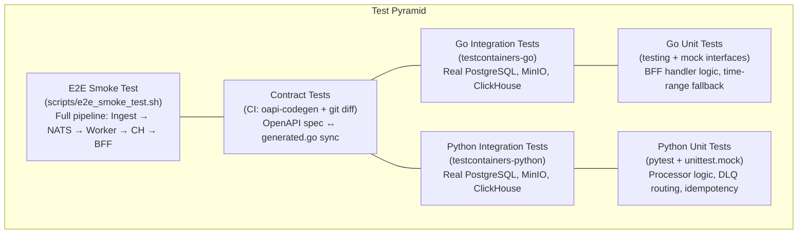
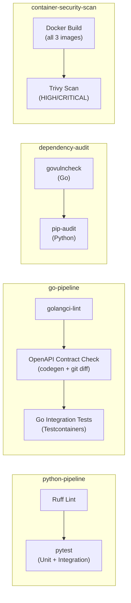

# 8. Cross-cutting Concepts

This chapter documents the architectural patterns and strategies that cut across individual building blocks and apply system-wide. Each concept is implemented in the codebase — this is not aspirational documentation.

## 8.1 Testing Strategy

AĒR follows a hybrid testing strategy (see ADR-005) tailored to the responsibilities of each language layer. The guiding principle: test stateless logic with mocks (fast), test stateful adapters against real infrastructure (reliable).



**Python (Analysis Worker):** Unit tests with mocks (`pytest`, `unittest.mock`) validate the deterministic business logic — harmonization, Silver Contract validation, DLQ routing, idempotency checks, and quarantine serialization. Integration tests (`test_storage.py`) use `testcontainers` to validate connection retry logic (`tenacity`) against real PostgreSQL, MinIO, and ClickHouse containers.

**Go (Ingestion & BFF API):** Integration tests use `testcontainers-go` to spin up ephemeral PostgreSQL, MinIO, and ClickHouse containers. These validate real SQL queries, S3 uploads, and ClickHouse reads — mocking these would hide schema drift bugs. BFF handler tests use a mock storage interface to validate HTTP response mapping, time-range fallback logic, and error handling in isolation.

**Contract Tests:** The CI pipeline regenerates `generated.go` from the OpenAPI spec via `oapi-codegen` and runs `git diff --exit-code` to verify the committed code matches the spec. Any drift fails the build.

**E2E Smoke Test:** A bash script (`scripts/e2e_smoke_test.sh`) boots the entire stack via `docker compose up --build --wait`, ingests a test document, waits for pipeline processing, and queries the BFF API to verify end-to-end data flow. Currently executed manually (see Chapter 11, D-4).

### 8.1.1 SSoT-Enforced Testcontainers

Both Go and Python Testcontainers dynamically parse image tags from `compose.yaml` at test time — no image tags are hardcoded in test files. This enforces that tests always run against the exact same database versions used in development and production.

**Go** (`pkg/testutils/compose.go`): The `GetImageFromCompose(serviceName)` function scans the compose file and extracts the `image:` value for a given service block.

**Python** (`test_storage.py`): The `get_compose_image(service_name)` function implements the same parser logic, navigating the directory hierarchy to find `compose.yaml` at the repository root.

Both parsers follow the same algorithm: find the service block by name, then extract the image string from the `image:` directive within that block's indentation scope.

## 8.2 Shared Foundations (DRY Principle)

To maintain a clean and scalable codebase across multiple Go microservices, AĒR utilizes a Go Workspace (`go.work`) linking `pkg/`, `services/ingestion-api/`, `services/bff-api/`, and `crawlers/wikipedia-scraper/`.

The `pkg/` module is a central, local Go module at the repository root. It encapsulates cross-cutting concerns identical across all Go services:

**`pkg/config/`** — Configuration management powered by `spf13/viper`. Unmarshals environment variables into strongly-typed structs, with graceful fallback to local `.env` files. Every Go service imports this to ensure consistent configuration loading.

**`pkg/logger/`** — Structured logging via `log/slog` with `lmittmann/tint`. Production and staging environments emit JSON; development uses ANSI-colored, human-readable output. Log level is configurable via `LOG_LEVEL`.

**`pkg/telemetry/`** — OpenTelemetry tracer initialization. Configures the OTLP gRPC exporter pointing to the OTel Collector endpoint (configurable via `OTEL_EXPORTER_OTLP_ENDPOINT`). The tracer provider is bound to the application context for clean shutdown.

**`pkg/middleware/`** — Shared HTTP middleware. Currently provides `APIKeyAuth` (`apikey.go`), a `chi`-compatible middleware that validates API keys from the `X-API-Key` header or `Authorization: Bearer` header. Used by both the BFF API and the Ingestion API (DRY).

**`pkg/testutils/`** — The SSoT compose parser (`compose.go`) used by all Go integration tests to dynamically resolve Docker image tags from `compose.yaml`.

Microservices import `pkg/` as a local module via `go.work`. Changes to shared code propagate instantly across all services without versioning or publishing.

## 8.3 Clean Architecture (Microservice Structure)

All Go microservices follow a strict directory structure to enforce Separation of Concerns:

```
services/{service-name}/
├── cmd/api/main.go          # Entry point. Zero business logic. Loads config, injects deps, starts server.
├── internal/
│   ├── config/config.go     # Maps .env variables to service-specific structs via viper.
│   ├── storage/             # Infrastructure adapters (postgres.go, minio.go, clickhouse.go).
│   ├── core/service.go      # Business logic and orchestration. Depends only on injected interfaces.
│   └── handler/             # HTTP handlers (BFF) or request/response mapping (Ingestion).
├── Dockerfile               # Multi-stage build: golang:alpine builder → alpine runtime.
└── go.mod                   # Module definition with replace directive for local pkg/.
```

The Python analysis worker follows an analogous pattern: `main.py` (entry point, DI wiring), `internal/processor.py` (business logic), `internal/models.py` (Pydantic contracts), `internal/storage.py` (infrastructure initialization with retry logic), and `internal/metrics.py` (Prometheus metric definitions).

## 8.4 Infrastructure as Code (IaC)

Microservices must never create infrastructure at startup. They assume all required resources (buckets, tables, streams) already exist. Provisioning is handled by dedicated init containers orchestrated via `compose.yaml`.

| Init Container | Image | Provisions | Depends On |
| :--- | :--- | :--- | :--- |
| `nats-init` | `natsio/nats-box:0.19.3` | JetStream stream `AER_LAKE` (subjects: `aer.lake.>`, file-backed storage). | `nats` (healthy) |
| `minio-init` | `minio/mc:RELEASE.2025-08-13T08-35-41Z` | Buckets (`bronze`, `silver`, `bronze-quarantine`), ILM retention policies (Bronze: 90d, Silver: 365d, Quarantine: 30d), NATS event notification on `bronze` bucket. | `minio` (healthy) |
| PostgreSQL | `golang-migrate` (in-process) | Versioned SQL migrations in `infra/postgres/migrations/` executed by the `ingestion-api` on startup. The original `init.sql` is a no-op stub — schema operations are handled entirely by the migration runner. See ADR-014. | `postgres` (healthy) |
| `clickhouse-init` | Same ClickHouse image | Shell-based migration runner (`infra/clickhouse/migrate.sh`) executes versioned SQL files from `infra/clickhouse/migrations/`. Tracks applied versions in `aer_gold.schema_migrations`. | `clickhouse` (healthy) |

The boot order is deterministic: `nats` → `nats-init` → `minio` (waits for JetStream) → `minio-init` → application services. ClickHouse migrations run via `clickhouse-init` before the `analysis-worker` starts (`condition: service_completed_successfully`). PostgreSQL migrations run in-process when the `ingestion-api` starts (via `golang-migrate`). All infrastructure dependencies use `condition: service_healthy` or `condition: service_completed_successfully`.

## 8.5 CI/CD Pipeline

AĒR uses GitHub Actions (`.github/workflows/ci.yml`) with four parallel jobs triggered on every push and pull request to `main`.



**Performance optimizations:** Testcontainers Docker images are cached as tarballs via `actions/cache@v4` and loaded from disk on cache hits, avoiding registry pulls. Go tools (`golangci-lint`, `oapi-codegen`) are cached in `~/go/bin` keyed to the CI config hash. Go module caches and Python pip caches are enabled via the respective setup actions.

**Security gates:** Trivy scans all three Dockerfiles for HIGH/CRITICAL CVEs with `ignore-unfixed: true` and `exit-code: 1` — unfixed critical vulnerabilities break the build. `govulncheck` audits Go dependencies, and `pip-audit` audits Python dependencies.

**Tooling version pinning:** All CI tools are pinned to exact versions to prevent silent breakage from upstream updates. `golangci-lint` and `oapi-codegen` are installed via `go install <module>@vX.Y.Z`. `pip-audit` is installed via `pip install pip-audit==X.Y.Z`. `govulncheck` is installed via `go install golang.org/x/vuln/cmd/govulncheck@vX.Y.Z`. Pinned versions are declared directly in `ci.yml` and covered by the Go tools cache key (keyed to the workflow file hash), so upgrades require an intentional edit to the workflow.

## 8.6 Observability

Every dataset entering AĒR is fully traceable from the Gold layer back to the original HTTP request via OpenTelemetry trace IDs. The observability stack is a first-class citizen, not an afterthought.

### 8.6.1 Distributed Tracing

All three services emit OpenTelemetry traces via OTLP gRPC to the OTel Collector (`:4317`). The Collector exports traces to Grafana Tempo. Trace data is persisted to a named Docker volume (`tempo_data` mounted at `/var/tempo`) with a block retention of 72h (development) or 720h (production), ensuring traces survive container restarts. Trace context is propagated across the NATS message boundary via message headers, enabling end-to-end correlation from the crawler's HTTP POST through ingestion, NATS delivery, worker processing, and ClickHouse insertion.

### 8.6.2 Trace Sampling Strategy

Trace sampling is configured via the `OTEL_TRACE_SAMPLE_RATE` environment variable (default: `1.0` — 100% sampling). The sampler is `ParentBased(TraceIDRatioBased(rate))`:

- **`TraceIDRatioBased`** deterministically samples a fraction of root spans based on the trace ID. At `1.0` this is equivalent to `AlwaysSample()`; at `0.1` exactly 10% of root spans are recorded.
- **`ParentBased`** wrapper ensures that child spans always inherit the sampling decision of their parent. This prevents orphaned trace fragments where a child span is recorded but its parent root span is not, which would break trace continuity in Tempo.

| Environment | Recommended `OTEL_TRACE_SAMPLE_RATE` | Rationale |
| :--- | :--- | :--- |
| Development | `1.0` | Full fidelity for debugging; low request volume |
| Production | `0.1` | 10% sampling prevents storage growth at crawler scale |

The sampler is initialized in `pkg/telemetry/otel.go` (`InitProvider`) and the rate is passed from each service's config struct (`OTelSampleRate`). This is implemented as part of R-8 resolution (Phase 36).

### 8.6.3 Prometheus Metrics

The Python analysis worker exposes business metrics on `:8001/metrics` via the `prometheus_client` library. Prometheus scrapes this endpoint (and the OTel Collector's metrics exporter on `:8889`) every 5 seconds.

| Metric | Type | Description |
| :--- | :--- | :--- |
| `events_processed_total` | Counter | Total events successfully processed through the pipeline. |
| `events_quarantined_total` | Counter | Total events routed to the DLQ. |
| `event_processing_duration_seconds` | Histogram | End-to-end processing duration per event (buckets: 50ms–10s). |
| `dlq_size` | Gauge | Current number of objects in the `bronze-quarantine` bucket. |

### 8.6.4 Alerting

Prometheus alerting rules are defined in `infra/observability/prometheus/alert.rules.yml` and evaluate continuously:

| Alert | Condition | Severity |
| :--- | :--- | :--- |
| `WorkerDown` | Scrape target unreachable for > 1 minute. | Critical |
| `DLQOverflow` | `dlq_size > 50` for > 5 minutes. | Warning |
| `HighEventProcessingLatency` | p95 processing duration > 5 seconds for > 5 minutes. | Warning |

### 8.6.5 Dashboards

Grafana dashboards are provisioned automatically from JSON files mounted via `infra/observability/grafana/provisioning/dashboards/`. Datasources (Tempo, Prometheus) are pre-configured via `grafana-datasources.yaml`. No manual Grafana setup is required after `make infra-up`.

## 8.7 Security

### 8.7.1 API Authentication

Both the BFF API and the Ingestion API require an API key on all routes except health probes (`/healthz`, `/readyz`). The key is accepted via the `X-API-Key` header or `Authorization: Bearer <key>`. Requests with missing or invalid keys receive a `401 Unauthorized` response.

| Service | Environment Variable | Purpose |
| :--- | :--- | :--- |
| BFF API | `BFF_API_KEY` | Protects metric queries from unauthorized consumers |
| Ingestion API | `INGESTION_API_KEY` | Protects data submission from unauthorized crawlers |

The authentication middleware is shared between both services via `pkg/middleware/apikey.go` (`APIKeyAuth` function), satisfying the DRY principle. See §8.2 for the shared library structure.

### 8.7.2 TLS Termination

Traefik acts as the reverse proxy on the `aer-frontend` network, terminating TLS via ACME/Let's Encrypt (`tlschallenge`). All HTTP traffic on port 80 is redirected to HTTPS on port 443. Only the BFF API is exposed through Traefik (via Docker labels with `PathPrefix(/api)`). All other services remain internal.

### 8.7.3 Network Segmentation

The Docker stack is split into two bridge networks: `aer-frontend` (Traefik, BFF, Grafana) and `aer-backend` (all databases, NATS, workers, observability). Only the BFF API and Grafana bridge both networks. Databases and internal services are unreachable from the internet.

### 8.7.4 Supply Chain Security

The CI pipeline includes two dedicated security jobs: container image scanning via Trivy (`aquasecurity/trivy-action`) that fails the build on unfixed HIGH/CRITICAL CVEs, and dependency auditing via `govulncheck` (Go) and `pip-audit` (Python) that detect known vulnerabilities in third-party libraries.

## 8.8 Data Lifecycle Management

AĒR implements automated, infrastructure-level data retention to prevent unbounded storage growth (see ADR-007).

| Layer | Storage | Retention | Mechanism |
| :--- | :--- | :--- | :--- |
| Bronze | MinIO `bronze` | 90 days | MinIO ILM (`infra/minio/setup.sh`) |
| Quarantine (DLQ) | MinIO `bronze-quarantine` | 30 days | MinIO ILM (`infra/minio/setup.sh`) |
| Silver | MinIO `silver` | 365 days | MinIO ILM (`infra/minio/setup.sh`) |
| Gold | ClickHouse `aer_gold.metrics` | 365 days | ClickHouse TTL on `MergeTree` (`infra/clickhouse/init.sql`) |
| Metadata | PostgreSQL | Unlimited | No automated cleanup |

All retention policies are defined in IaC scripts — no application code manages data expiration.

**Silver TTL rationale (Phase 32 / R-3):** A 365-day TTL was adopted as a conservative default before long-term Silver growth data was available. The Gold layer (ClickHouse `aer_gold.metrics`) retains all derived metrics independently under its own 365-day TTL, making Silver objects safe to expire after one year. The Silver bucket acts as a re-evaluation baseline: any re-analysis of data older than 365 days would require a fresh crawl from the source, which is acceptable under the project's data availability guarantees. This value should be revisited once at least one full quarter of production crawl data is available and measured Silver growth significantly exceeds Bronze volume.

## 8.9 Developer Tooling

### 8.9.1 Git Hooks

AĒR enforces code quality at the Git level via hooks in `scripts/hooks/`:

**Pre-commit** (`scripts/hooks/pre-commit`): Runs `make lint` (`golangci-lint` for Go, `ruff` for Python). Commits are blocked if linting fails.

**Pre-push** (`scripts/hooks/pre-push`): Runs `make lint` followed by `make test` (full Go integration tests + Python unit tests). Pushes are blocked if either linting or tests fail.

### 8.9.2 Makefile

The central `Makefile` is the single interface for all developer operations. It abstracts Docker Compose commands, local process management (via `scripts/start.sh` / `scripts/stop.sh`), and build tooling into memorable targets. Key targets: `make up` (full stack), `make infra-up` (infrastructure only), `make services-up` (application services), `make test`, `make lint`, `make codegen`, `make build-services`, `make tidy`. Individual services are controllable via `make {ingestion,worker,bff}-{up,down,restart}`.

## 8.10 Extractor Registration Pattern

The analysis worker uses a pipeline architecture for Gold metric extraction. New metrics are added by implementing the `MetricExtractor` protocol and registering the instance in `main.py` — no changes to the processor or existing extractors are required.

**Adding a new per-document metric extractor:**

1. Create `services/analysis-worker/internal/extractors/<name>.py`.
2. Implement the `MetricExtractor` protocol: a `name` property (used in logging) and an `extract(core: SilverCore, article_id: str | None) -> list[GoldMetric]` method.
3. Export from `extractors/__init__.py`.
4. Register the instance in the `extractors` list in `main.py`.

The processor iterates all registered extractors after Silver validation. Each extractor receives the same `SilverCore` and independently produces `GoldMetric` results. A failing extractor is logged and skipped — other extractors' results are still inserted. All metrics from all extractors are batch-inserted into ClickHouse in a single round-trip.

**`EntityExtractor` sub-protocol (Phase 44):** Extractors that produce both `GoldMetric` and `GoldEntity` results implement the `EntityExtractor` protocol, which extends `MetricExtractor` with `extract_entities(core, article_id) -> list[GoldEntity]` and `extract_all(core, article_id) -> tuple[list[GoldMetric], list[GoldEntity]]`. The processor checks `isinstance(extractor, EntityExtractor)` and calls `extract_all()` for single-pass processing — no `hasattr()` ad-hoc polymorphism. Currently implemented by `NamedEntityExtractor`. Extractors must be stateless between documents — no mutable instance-level caching of intermediate results (e.g., spaCy docs). All protocols are `@runtime_checkable` in `extractors/base.py`.

**`ProvenanceExtractor` sub-protocol (Phase 46):** Extractors whose results depend on a versioned resource (e.g. a lexicon or model file) implement the `ProvenanceExtractor` protocol, which extends `MetricExtractor` with a `version_hash: str` property. The processor collects `{extractor.name: extractor.version_hash}` entries from all registered `ProvenanceExtractor` instances at startup and writes the resulting `dict[str, str]` into `SilverEnvelope.extraction_provenance` on every Silver write. This keeps provenance at the metadata layer (Silver) and out of the ClickHouse time-series table, where it is neither human-readable nor analytically useful. Currently implemented by `SentimentExtractor` (SentiWS SHA-256 lexicon hash).

**Architectural boundary — corpus-level extractors:** Methods like TF-IDF, topic modeling (LDA), and co-occurrence networks require statistics across multiple documents and cannot run per-document. The `CorpusExtractor` protocol (`extract_batch(cores, window)`) is defined in `extractors/base.py` as an interface placeholder. No corpus extractors are implemented — they require a scheduling mechanism (cron or NATS-triggered batch jobs) that is not yet built. See Chapter 11 (R-9) and Chapter 13 (§13.3).

### 8.9.3 Configuration Management

All runtime configuration flows through environment variables, sourced from a single `.env` file (copied from `.env.example`). Go services load it via `viper` with `AutomaticEnv()` and `.env` file fallback. Python services use `python-dotenv` and `os.getenv()` with sensible defaults. Docker Compose interpolates the same `.env` file for container environment variables. This guarantees a single source of truth for all configuration across all runtimes.

## 8.11 BFF Query Performance — Available Metrics Caching

`GET /api/v1/metrics/available` executes `SELECT DISTINCT metric_name FROM aer_gold.metrics WHERE timestamp >= $1 AND timestamp <= $2` — a table scan whose cost grows linearly with the metrics table. The endpoint accepts `startDate`/`endDate` to scope results to a specific time window, returning only metric names that have data in that range.

**Strategy:** an in-process TTL cache inside `ClickHouseStorage`. The struct holds a `sync.RWMutex`-protected tuple of `([]string, time.Time, startKey time.Time, endKey time.Time)`. The cache key is `(start, end)`: a hit is valid only when both the TTL has not expired *and* the requested date range matches the cached range. A request with a different range bypasses and replaces the cached entry.

```
Request → GetAvailableMetrics(start, end)
              │
              ├─ RLock → cache valid AND key matches? ──YES──▶ return cached names
              │
              └─ NO → query ClickHouse(start, end) → WLock → update cache → return names
```

**Rationale (Occam's Razor):** no Redis, no distributed cache, no pub/sub invalidation. A single in-process struct is sufficient because the BFF API runs as a single container instance. The date-range key ensures correctness when dashboards query different time windows.

**Configuration:** `BFF_METRICS_CACHE_TTL_SECONDS` (default `60`). Set to `0` to disable caching (the constructor treats `≤ 0` as the default 60 s; to effectively bypass, set a very low value like `1`).

**Thread safety:** reads hold a read-lock; the write path acquires a write-lock only after the ClickHouse query completes, minimising lock contention under concurrent load.