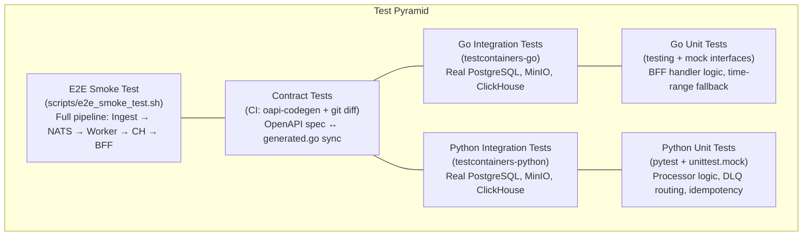
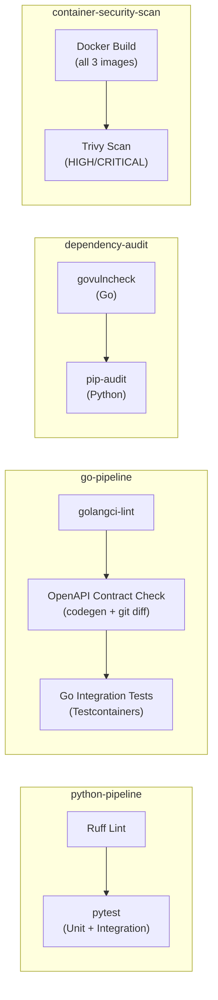

# 8. Cross-cutting Concepts

This chapter documents the architectural patterns and strategies that cut across individual building blocks and apply system-wide. Each concept is implemented in the codebase — this is not aspirational documentation.

## 8.1 Testing Strategy

AĒR follows a hybrid testing strategy (see ADR-005) tailored to the responsibilities of each language layer. The guiding principle: test stateless logic with mocks (fast), test stateful adapters against real infrastructure (reliable).



**Python (Analysis Worker):** Unit tests with mocks (`pytest`, `unittest.mock`) validate the deterministic business logic — harmonization, Silver Contract validation, DLQ routing, idempotency checks, and quarantine serialization. Integration tests (`test_storage.py`) use `testcontainers` to validate connection retry logic (`tenacity`) against real PostgreSQL, MinIO, and ClickHouse containers.

**Go (Ingestion & BFF API):** Integration tests use `testcontainers-go` to spin up ephemeral PostgreSQL, MinIO, and ClickHouse containers. These validate real SQL queries, S3 uploads, and ClickHouse reads — mocking these would hide schema drift bugs. BFF handler tests use a mock storage interface to validate HTTP response mapping, time-range fallback logic, and error handling in isolation.

**Contract Tests:** The CI pipeline regenerates `generated.go` from the OpenAPI spec via `oapi-codegen` and runs `git diff --exit-code` to verify the committed code matches the spec. Any drift fails the build.

**E2E Smoke Test:** A bash script (`scripts/e2e_smoke_test.sh`) boots the entire stack via `docker compose up --build --wait`, ingests a test document, waits for pipeline processing, and queries the BFF API to verify end-to-end data flow. Currently executed manually (see Chapter 11, D-4).

**Test file organisation:** Test files are structured by concern, mirroring the source module structure — e.g., `postgres_documents_test.go` alongside `postgres_documents.go`, `test_extractor_pipeline.py` alongside the extractor modules. Shared infrastructure setup is centralised in `conftest.py` (Python) and in `_test.go` files providing `TestMain` or shared Testcontainer setup (Go), avoiding duplication across per-concern test files.

**Scientific Infrastructure coverage (Phase 72).** Phases 62–68 introduced tables and endpoints that carry methodological context: `source_classifications` (WP-001 Functional Probe Taxonomy), `metric_baselines` (z-score normalisation), `metric_validity` (Krippendorff's-alpha-gated validation), `metric_equivalence` (cross-cultural mapping), and the `/metrics/{metricName}/provenance` endpoint. Phase 72 retroactively closes the test gap across all three pyramid layers: Python unit tests (`test_discourse_context.py`, `test_bias_context.py`, `test_discourse_function_gold.py`, `test_compute_baselines.py`) verify adapter propagation and pure-Python helpers extracted from `scripts/compute_baselines.py`; Go integration tests (`provenance_handler_test.go`, extensions in `metrics_query_test.go` and `postgres_test.go`) verify the handler contracts, the storage layer's normalisation and resolution paths, and the schema semantics of `source_classifications`; the E2E smoke test asserts that `discourse_function` is populated in `aer_gold.metrics`, that `?resolution=hourly` returns data, and that the provenance endpoint exposes tier classification and algorithm description.

**Validation-Gate Testing Pattern.** Endpoints that serve scientifically-conditional results — primarily `GET /metrics?normalization=zscore` — must refuse to respond with synthetic or unvalidated data. The handler layer is tested against a mock store to verify that a request returns HTTP 400 with a descriptive message when no `metric_baselines` row exists, when no `metric_equivalence` row exists, or when the request omits `metricName`. The corresponding happy-path test seeds a baseline and an equivalence entry and asserts that the z-score flow produces the expected normalized value. The pattern generalises: any future endpoint that depends on validated scientific pre-conditions (e.g., Krippendorff's-α above threshold, Fleiss's κ reached) should follow the same mock-store 400/200 contract test pair.

### 8.1.1 SSoT-Enforced Testcontainers

Both Go and Python Testcontainers dynamically parse image tags from `compose.yaml` at test time — no image tags are hardcoded in test files. This enforces that tests always run against the exact same database versions used in development and production.

**Go** (`pkg/testutils/compose.go`): The `GetImageFromCompose(serviceName)` function scans the compose file and extracts the `image:` value for a given service block.

**Python** (`test_storage.py`): The `get_compose_image(service_name)` function implements the same parser logic, navigating the directory hierarchy to find `compose.yaml` at the repository root.

Both parsers follow the same algorithm: find the service block by name, then extract the image string from the `image:` directive within that block's indentation scope.

## 8.2 Shared Foundations (DRY Principle)

To maintain a clean and scalable codebase across multiple Go microservices, AĒR utilizes a Go Workspace (`go.work`) linking `pkg/`, `services/ingestion-api/`, `services/bff-api/`, and `crawlers/wikipedia-scraper/`.

The `pkg/` module is a central, local Go module at the repository root. It encapsulates cross-cutting concerns identical across all Go services:

**`pkg/config/`** — Configuration management powered by `spf13/viper`. Unmarshals environment variables into strongly-typed structs, with graceful fallback to local `.env` files. Every Go service imports this to ensure consistent configuration loading.

**`pkg/logger/`** — Structured logging via `log/slog` with `lmittmann/tint`. Production and staging environments emit JSON; development uses ANSI-colored, human-readable output. Log level is configurable via `LOG_LEVEL`.

**`pkg/telemetry/`** — OpenTelemetry tracer initialization. Configures the OTLP gRPC exporter pointing to the OTel Collector endpoint (configurable via `OTEL_EXPORTER_OTLP_ENDPOINT`). The tracer provider is bound to the application context for clean shutdown.

**`pkg/middleware/`** — Shared HTTP middleware. Currently provides `APIKeyAuth` (`apikey.go`), a `chi`-compatible middleware that validates API keys from the `X-API-Key` header or `Authorization: Bearer` header. Used by both the BFF API and the Ingestion API (DRY).

**`pkg/testutils/`** — The SSoT compose parser (`compose.go`) used by all Go integration tests to dynamically resolve Docker image tags from `compose.yaml`.

Microservices import `pkg/` as a local module via `go.work`. Changes to shared code propagate instantly across all services without versioning or publishing.

## 8.3 Clean Architecture (Microservice Structure)

All Go microservices follow a strict directory structure to enforce Separation of Concerns:

```
services/{service-name}/
├── cmd/api/main.go          # Entry point. Zero business logic. Loads config, injects deps, starts server.
├── internal/
│   ├── config/config.go     # Maps .env variables to service-specific structs via viper.
│   ├── storage/             # Infrastructure adapters, split by concern (e.g., postgres.go,
│   │                        #   postgres_documents.go, postgres_jobs.go, minio.go, clickhouse.go,
│   │                        #   entities_query.go, metrics_query.go). One file per responsibility.
│   ├── core/service.go      # Business logic and orchestration. Depends only on injected interfaces.
│   └── handler/             # HTTP handlers (BFF) or request/response mapping (Ingestion).
├── Dockerfile               # Multi-stage build: golang:alpine builder → alpine runtime.
└── go.mod                   # Module definition with replace directive for local pkg/.
```

The Python analysis worker follows an analogous pattern:

```
services/analysis-worker/
├── main.py                       # Entry point, DI wiring, NATS consumer loop.
├── internal/
│   ├── processor.py              # Business logic and orchestration (Silver validation, extractor dispatch).
│   ├── models.py                 # Pydantic contracts: SilverCore, SilverMeta, SilverEnvelope.
│   ├── silver.py                 # Silver envelope construction and MinIO write.
│   ├── quarantine.py             # DLQ serialization and MinIO quarantine write.
│   ├── metrics.py                # Prometheus metric definitions.
│   ├── storage/                  # Infrastructure adapters, split by concern:
│   │   ├── postgres_client.py    #   PostgreSQL connection pool and document/job queries.
│   │   ├── minio_client.py       #   MinIO client initialization and object read/write.
│   │   └── clickhouse_client.py  #   ClickHouse pool and Gold-layer batch inserts.
│   ├── adapters/                 # Source Adapter pattern (base, registry, legacy, rss).
│   └── extractors/               # MetricExtractor pipeline (base, word_count, sentiment,
│                                 #   language, temporal, entities).
└── tests/                        # pytest test suite with shared fixtures in conftest.py.
```

PostgreSQL uses `psycopg2.ThreadedConnectionPool` (maxconn=10). ClickHouse uses a custom `ClickHousePool` backed by `queue.Queue`, sized to `WORKER_COUNT` — one `clickhouse_connect` client per concurrent worker thread, since the library does not support concurrent queries within a single session.

## 8.4 Infrastructure as Code (IaC)

Microservices must never create infrastructure at startup. They assume all required resources (buckets, tables, streams) already exist. Provisioning is handled by dedicated init containers orchestrated via `compose.yaml`.

| Init Container | Image | Provisions | Depends On |
| :--- | :--- | :--- | :--- |
| `nats-init` | `natsio/nats-box:0.19.3` | JetStream stream `AER_LAKE` (subjects: `aer.lake.>`, file-backed storage). | `nats` (healthy) |
| `minio-init` | `minio/mc:RELEASE.2025-08-13T08-35-41Z` | Buckets (`bronze`, `silver`, `bronze-quarantine`), ILM retention policies (Bronze: 90d, Silver: 365d, Quarantine: 30d), NATS event notification on `bronze` bucket. | `minio` (healthy) |
| PostgreSQL | `golang-migrate` (in-process) | Versioned SQL migrations in `infra/postgres/migrations/` executed by the `ingestion-api` on startup. The original `init.sql` is a no-op stub — schema operations are handled entirely by the migration runner. See ADR-014. | `postgres` (healthy) |
| `clickhouse-init` | Same ClickHouse image | Shell-based migration runner (`infra/clickhouse/migrate.sh`) executes versioned SQL files from `infra/clickhouse/migrations/`. Tracks applied versions in `aer_gold.schema_migrations`. | `clickhouse` (healthy) |

The boot order is deterministic: `nats` → `nats-init` → `minio` (waits for JetStream) → `minio-init` → application services. ClickHouse migrations run via `clickhouse-init` before the `analysis-worker` starts (`condition: service_completed_successfully`). PostgreSQL migrations run in-process when the `ingestion-api` starts (via `golang-migrate`). All infrastructure dependencies use `condition: service_healthy` or `condition: service_completed_successfully`.

## 8.5 CI/CD Pipeline

AĒR uses GitHub Actions (`.github/workflows/ci.yml`) with four parallel jobs triggered on every push and pull request to `main`.



**Performance optimizations:** Testcontainers Docker images are cached as tarballs via `actions/cache@v4` and loaded from disk on cache hits, avoiding registry pulls. Go tools (`golangci-lint`, `oapi-codegen`) are cached in `~/go/bin` keyed to the `.tool-versions` file hash. Go module caches and Python pip caches are enabled via the respective setup actions.

**Security gates:** Trivy scans all three Dockerfiles for HIGH/CRITICAL CVEs with `ignore-unfixed: true` and `exit-code: 1` — unfixed critical vulnerabilities break the build. `govulncheck` audits Go dependencies, and `pip-audit` audits Python dependencies.

**Tooling version pinning:** All CI tools are pinned to exact versions to prevent silent breakage from upstream updates. `golangci-lint` and `oapi-codegen` are installed via `go install <module>@vX.Y.Z`. `pip-audit` is installed via `pip install pip-audit==X.Y.Z`. `govulncheck` is installed via `go install golang.org/x/vuln/cmd/govulncheck@vX.Y.Z`. Pinned versions are declared in `.tool-versions` — the Single Source of Truth for developer tooling versions. Both the CI pipeline and the Makefile (`make setup`) consume this file directly: CI loads it into `$GITHUB_ENV`, the Makefile uses `include .tool-versions`. The Go tools cache key is keyed to the `.tool-versions` file hash, so upgrades require an intentional edit to that file.

## 8.6 Observability

Every dataset entering AĒR is fully traceable from the Gold layer back to the original HTTP request via OpenTelemetry trace IDs. The observability stack is a first-class citizen, not an afterthought.

### 8.6.1 Distributed Tracing

All three services emit OpenTelemetry traces via OTLP gRPC to the OTel Collector (`:4317`). The Collector exports traces to Grafana Tempo. Trace data is persisted to a named Docker volume (`tempo_data` mounted at `/var/tempo`) with a block retention of 72h (development) or 720h (production), ensuring traces survive container restarts. Trace context is propagated across the NATS message boundary via message headers, enabling end-to-end correlation from the crawler's HTTP POST through ingestion, NATS delivery, worker processing, and ClickHouse insertion.

### 8.6.2 Trace Sampling Strategy

Trace sampling is configured via the `OTEL_TRACE_SAMPLE_RATE` environment variable (default: `1.0` — 100% sampling). The sampler is `ParentBased(TraceIDRatioBased(rate))`:

- **`TraceIDRatioBased`** deterministically samples a fraction of root spans based on the trace ID. At `1.0` this is equivalent to `AlwaysSample()`; at `0.1` exactly 10% of root spans are recorded.
- **`ParentBased`** wrapper ensures that child spans always inherit the sampling decision of their parent. This prevents orphaned trace fragments where a child span is recorded but its parent root span is not, which would break trace continuity in Tempo.

| Environment | Recommended `OTEL_TRACE_SAMPLE_RATE` | Rationale |
| :--- | :--- | :--- |
| Development | `1.0` | Full fidelity for debugging; low request volume |
| Production | `0.1` | 10% sampling prevents storage growth at crawler scale |

The sampler is initialized in `pkg/telemetry/otel.go` (`InitProvider`) and the rate is passed from each service's config struct (`OTelSampleRate`). This is implemented as part of R-8 resolution (Phase 36).

### 8.6.3 Prometheus Metrics

The Python analysis worker exposes business metrics on `:8001/metrics` via the `prometheus_client` library. Prometheus scrapes this endpoint (and the OTel Collector's metrics exporter on `:8889`) every 5 seconds.

| Metric | Type | Description |
| :--- | :--- | :--- |
| `events_processed_total` | Counter | Total events successfully processed through the pipeline. |
| `events_quarantined_total` | Counter | Total events routed to the DLQ. |
| `event_processing_duration_seconds` | Histogram | End-to-end processing duration per event (buckets: 50ms–10s). |
| `dlq_size` | Gauge | Current number of objects in the `bronze-quarantine` bucket. |

### 8.6.4 Alerting

Prometheus alerting rules are defined in `infra/observability/prometheus/alert.rules.yml` and evaluate continuously:

| Alert | Condition | Severity |
| :--- | :--- | :--- |
| `WorkerDown` | Scrape target unreachable for > 1 minute. | Critical |
| `DLQOverflow` | `dlq_size > 50` for > 5 minutes. | Warning |
| `HighEventProcessingLatency` | p95 processing duration > 5 seconds for > 5 minutes. | Warning |

### 8.6.5 Dashboards

Grafana dashboards are provisioned automatically from JSON files mounted via `infra/observability/grafana/provisioning/dashboards/`. Datasources (Tempo, Prometheus) are pre-configured via `grafana-datasources.yaml`. No manual Grafana setup is required after `make infra-up`.

## 8.7 Security

### 8.7.1 API Authentication

Both the BFF API and the Ingestion API require an API key on all routes except health probes (`/healthz`, `/readyz`). The key is accepted via the `X-API-Key` header or `Authorization: Bearer <key>`. Requests with missing or invalid keys receive a `401 Unauthorized` response.

| Service | Environment Variable | Purpose |
| :--- | :--- | :--- |
| BFF API | `BFF_API_KEY` | Protects metric queries from unauthorized consumers |
| Ingestion API | `INGESTION_API_KEY` | Protects data submission from unauthorized crawlers |

The authentication middleware is shared between both services via `pkg/middleware/apikey.go` (`APIKeyAuth` function), satisfying the DRY principle. See §8.2 for the shared library structure.

**Constant-time comparison (Phase 75, ADR-018).** `APIKeyAuth` compares the presented token against the configured key using `crypto/subtle.ConstantTimeCompare`, eliminating the dominant timing side channel that byte-by-byte `==` would expose. A sanity test in `pkg/middleware/apikey_test.go` asserts that a wrong key produces the same 401 outcome regardless of how many leading bytes match. Both services inherit the fix from the same source file. The constant-time guarantee applies only to the comparison itself; surrounding work (header parsing, bearer-token extraction, response serialization) is not in scope and is considered acceptable under the current threat model.

### 8.7.2 TLS Termination

Traefik acts as the reverse proxy on the `aer-frontend` network, terminating TLS via ACME/Let's Encrypt (`tlschallenge`). All HTTP traffic on port 80 is redirected to HTTPS on port 443. Only the BFF API is exposed through Traefik (via Docker labels with `PathPrefix(/api)`). All other services remain internal.

### 8.7.3 Network Segmentation

The Docker stack is split into two bridge networks: `aer-frontend` (Traefik, BFF, Grafana) and `aer-backend` (all databases, NATS, workers, observability). Only the BFF API and Grafana bridge both networks. Databases and internal services are unreachable from the internet.

### 8.7.4 HTTP Server Hardening (Phase 82)

Both Go HTTP services (ingestion-api, bff-api) construct their `http.Server` with explicit, bounded timeouts instead of accepting the `net/http` defaults (which are effectively unbounded). This closes a class of slow-loris and dangling-connection denial-of-service vectors that `http.ListenAndServe` would otherwise leave open.

| Setting | Value | Reason |
| :--- | :--- | :--- |
| `ReadHeaderTimeout` | 5s | Slow-header attack ceiling — must finish headers fast |
| `ReadTimeout` | 60s | Upper bound on a full request body read |
| `WriteTimeout` | 60s | Upper bound on flushing a response back to the client |
| `IdleTimeout` | 120s | Keep-alive connection recycle |
| `MaxHeaderBytes` | 1 MiB | Hard cap on request header size |

In addition, `POST /api/v1/ingest` wraps the body reader in `http.MaxBytesReader` keyed off `INGESTION_MAX_BODY_BYTES` (default 16 MiB — see `.env.example`). A payload larger than the cap is rejected with `413 Payload Too Large` *before* the JSON decoder runs, so a malicious crawler cannot exhaust memory by streaming an unbounded document.

On `SIGTERM`, both services call `http.Server.Shutdown` with a drain deadline sourced from `INGESTION_SHUTDOWN_TIMEOUT_SECONDS` / `BFF_SHUTDOWN_TIMEOUT_SECONDS` (default 30s). The drain window is deliberately longer than `WriteTimeout` so a request that was mid-flight when the pod was evicted finishes cleanly instead of getting cut off.

**Generic 500 masking.** Starting in Phase 82, non-4xx errors returned to clients carry a generic `{"error":"internal error"}` body, while the original error is logged server-side at ERROR level with request context. This prevents stack traces, SQL fragments, and other server internals from leaking into the response body when a downstream dependency misbehaves — a defense-in-depth measure against information disclosure.

### 8.7.5 Container Hardening (Phase 84)

All three service images are built from digest-pinned base images (`FROM image:tag@sha256:…`) and run as a non-root user (`uid 10001`, group `aer`) via `USER aer`. Multi-stage builds keep the runtime image minimal — only the compiled binary, CA certificates, and (for the worker) the pre-downloaded SentiWS lexicon ride along into the final layer.

| Control | Mechanism |
| :--- | :--- |
| Reproducible base images | `FROM image:tag@sha256:digest` in every Dockerfile |
| Non-root execution | `USER aer` (uid 10001) with `/usr/sbin/nologin` shell |
| No build toolchain in runtime | Multi-stage `FROM builder AS …` + `COPY --from=builder` |
| Verified third-party downloads | `SENTIWS_SHA256` pin in worker Dockerfile, verified via `sha256sum -c` |
| Hash-locked Python deps | `services/analysis-worker/requirements.lock.txt` + `pip install --require-hashes` |

Rotating the pinned hashes is a deliberate, auditable operation — not something any individual `docker pull` can drift. See §8.7.6 for the runbook.

### 8.7.6 Supply Chain Security

The CI pipeline includes two dedicated security jobs: container image scanning via Trivy (`aquasecurity/trivy-action`) that fails the build on unfixed HIGH/CRITICAL CVEs, and dependency auditing via `govulncheck` (Go) and `pip-audit` (Python) that detect known vulnerabilities in third-party libraries.

**Rotating the supply-chain baseline (Phase 88).** `make deps-refresh` is the single maintainer entrypoint for advancing every externally-pinned dependency in one atomic operation: base image digests across all three Dockerfiles, the analysis-worker `requirements.lock.txt`, and `SENTIWS_SHA256`. The script (`scripts/deps_refresh.sh`) is idempotent on a clean baseline — running it when nothing upstream moved produces an empty `git diff`. The full runbook (when to run it, how to add a Python dependency, how to bump a base image tag, Trivy triage table, failure recovery) lives in [`docs/operations_playbook.md` → Dependency Refresh](../operations_playbook.md#dependency-refresh-supply-chain-baseline).

## 8.8 Data Lifecycle Management

AĒR implements automated, infrastructure-level data retention to prevent unbounded storage growth (see ADR-007).

| Layer | Storage | Retention | Mechanism |
| :--- | :--- | :--- | :--- |
| Bronze | MinIO `bronze` | 90 days | MinIO ILM (`infra/minio/setup.sh`) |
| Quarantine (DLQ) | MinIO `bronze-quarantine` | 30 days | MinIO ILM (`infra/minio/setup.sh`) |
| Silver | MinIO `silver` | 365 days | MinIO ILM (`infra/minio/setup.sh`) |
| Gold | ClickHouse `aer_gold.metrics` | 365 days | ClickHouse TTL on `ReplacingMergeTree` (`infra/clickhouse/init.sql`, migration 000010) |
| Metadata | PostgreSQL | Unlimited | No automated cleanup |

All retention policies are defined in IaC scripts — no application code manages data expiration.

**Silver TTL rationale (Phase 32 / R-3):** A 365-day TTL was adopted as a conservative default before long-term Silver growth data was available. The Gold layer (ClickHouse `aer_gold.metrics`) retains all derived metrics independently under its own 365-day TTL, making Silver objects safe to expire after one year. The Silver bucket acts as a re-evaluation baseline: any re-analysis of data older than 365 days would require a fresh crawl from the source, which is acceptable under the project's data availability guarantees. This value should be revisited once at least one full quarter of production crawl data is available and measured Silver growth significantly exceeds Bronze volume.

### 8.8.1 Tiered Retention (Planned)

WP-005 §5.4 proposes a tiered retention strategy in which raw 5-minute samples are kept for a short window and progressively coarser aggregates retain progressively longer history. The target tiers are:

| Tier | Source table | Retention | Rationale |
| :--- | :--- | :--- | :--- |
| 0–30 days | `aer_gold.metrics` (full 5-minute resolution) | 30 days | Event-scale forensic analysis, debugging |
| 30–365 days | `aer_gold.metrics_hourly` | 1 year | Daily-cycle and weekly-pattern analysis |
| 1–5 years | `aer_gold.metrics_daily` | 5 years | Seasonal and annual trend analysis |
| 5+ years | `aer_gold.metrics_monthly` | indefinite | Multi-year discourse drift |

**Status: planned — not yet active.** The current production retention is the flat 365-day TTL on `aer_gold.metrics` documented in §8.8 above. Activation depends on the materialized views described in §8.13 going live first. Until then, the §8.8 table is authoritative for what the system actually does today.

## 8.9 Developer Tooling

### 8.9.1 Git Hooks

AĒR enforces code quality at the Git level via hooks in `scripts/hooks/`:

**Pre-commit** (`scripts/hooks/pre-commit`): Runs `make lint` (`golangci-lint` for Go, `ruff` for Python). Commits are blocked if linting fails.

**Pre-push** (`scripts/hooks/pre-push`): Runs `make lint`, then `make audit` (`govulncheck` for Go, `pip-audit` for Python), then `make test` (full Go integration tests + Python unit tests). Pushes are blocked if any step fails. This ensures CI parity — no push reaches the remote with known dependency vulnerabilities.

### 8.9.2 Makefile

The central `Makefile` is the single interface for all developer operations. It abstracts Docker Compose commands, local process management (via `scripts/start.sh` / `scripts/stop.sh`), and build tooling into memorable targets. Key targets: `make up` (full stack), `make infra-up` (infrastructure only), `make services-up` (application services), `make test`, `make lint`, `make audit`, `make codegen`, `make build-services`, `make tidy`. Individual services are controllable via `make {ingestion,worker,bff}-{up,down,restart}`.

### 8.9.3 Configuration Management

All runtime configuration flows through environment variables, sourced from a single `.env` file (copied from `.env.example`). Go services load it via `viper` with `AutomaticEnv()` and `.env` file fallback. Python services use `python-dotenv` and `os.getenv()` with sensible defaults. Docker Compose interpolates the same `.env` file for container environment variables. This guarantees a single source of truth for all configuration across all runtimes.

## 8.10 Extractor Registration Pattern

The analysis worker uses a pipeline architecture for Gold metric extraction. New metrics are added by implementing the `MetricExtractor` protocol and registering the instance in `main.py` — no changes to the processor or existing extractors are required.

**Adding a new per-document metric extractor:**

1. Create `services/analysis-worker/internal/extractors/<name>.py`.
2. Implement the `MetricExtractor` protocol: a `name` property (used in logging) and an `extract(core: SilverCore, article_id: str | None) -> list[GoldMetric]` method.
3. Export from `extractors/__init__.py`.
4. Register the instance in the `extractors` list in `main.py`.

The processor iterates all registered extractors after Silver validation. Each extractor receives the same `SilverCore` and independently produces `GoldMetric` results. A failing extractor is logged and skipped — other extractors' results are still inserted. All metrics from all extractors are batch-inserted into ClickHouse in a single round-trip.

**`EntityExtractor` sub-protocol (Phase 44):** Extractors that produce both `GoldMetric` and `GoldEntity` results implement the `EntityExtractor` protocol, which extends `MetricExtractor` with `extract_entities(core, article_id) -> list[GoldEntity]` and `extract_all(core, article_id) -> tuple[list[GoldMetric], list[GoldEntity]]`. The processor checks `isinstance(extractor, EntityExtractor)` and calls `extract_all()` for single-pass processing — no `hasattr()` ad-hoc polymorphism. Currently implemented by `NamedEntityExtractor`. Extractors must be stateless between documents — no mutable instance-level caching of intermediate results (e.g., spaCy docs). All protocols are `@runtime_checkable` in `extractors/base.py`.

**`ProvenanceExtractor` sub-protocol (Phase 46):** Extractors whose results depend on a versioned resource (e.g. a lexicon or model file) implement the `ProvenanceExtractor` protocol, which extends `MetricExtractor` with a `version_hash: str` property. The processor collects `{extractor.name: extractor.version_hash}` entries from all registered `ProvenanceExtractor` instances at startup and writes the resulting `dict[str, str]` into `SilverEnvelope.extraction_provenance` on every Silver write. This keeps provenance at the metadata layer (Silver) and out of the ClickHouse time-series table, where it is neither human-readable nor analytically useful. Currently implemented by `SentimentExtractor` (SentiWS SHA-256 lexicon hash).

**Architectural boundary — corpus-level extractors:** Methods like TF-IDF, topic modeling (LDA), and co-occurrence networks require statistics across multiple documents and cannot run per-document. The `CorpusExtractor` protocol (`extract_batch(cores, window)`) is defined in `extractors/base.py` as an interface placeholder. No corpus extractors are implemented — they require a scheduling mechanism (cron or NATS-triggered batch jobs) that is not yet built. See Chapter 11 (R-9) and Chapter 13 (§13.3).

## 8.11 BFF Query Performance — Available Metrics Caching

`GET /api/v1/metrics/available` executes `SELECT DISTINCT metric_name FROM aer_gold.metrics WHERE timestamp >= $1 AND timestamp <= $2` — a table scan whose cost grows linearly with the metrics table. The endpoint accepts `startDate`/`endDate` to scope results to a specific time window, returning only metric names that have data in that range.

**Strategy:** an in-process **single-slot** TTL cache inside `ClickHouseStorage`. The struct holds a `sync.RWMutex`-protected tuple of `([]string, time.Time, startKey time.Time, endKey time.Time)` — exactly one cached entry, not an LRU map. The cache key is `(start, end)`: a hit is valid only when both the TTL has not expired *and* the requested date range matches the cached range. A request with a different range bypasses and replaces the cached entry. This is intentional under Occam's Razor: with a single dashboard consumer, two adjacent ranges thrashing one slot is cheaper than maintaining a multi-slot LRU. If the system grows multiple distinct consumers issuing different ranges concurrently, swap this for `hashicorp/golang-lru/v2`.

```
Request → GetAvailableMetrics(start, end)
              │
              ├─ RLock → cache valid AND key matches? ──YES──▶ return cached names
              │
              └─ NO → query ClickHouse(start, end) → WLock → update cache → return names
```

**Rationale (Occam's Razor):** no Redis, no distributed cache, no pub/sub invalidation. A single in-process struct is sufficient because the BFF API runs as a single container instance. The date-range key ensures correctness when dashboards query different time windows.

**Configuration:** `BFF_METRICS_CACHE_TTL_SECONDS` (default `60`). Set to `0` to disable caching (the constructor treats `≤ 0` as the default 60 s; to effectively bypass, set a very low value like `1`).

**Thread safety:** reads hold a read-lock; the write path acquires a write-lock only after the ClickHouse query completes, minimising lock contention under concurrent load.

### 8.11.1 BFF Sources Cache (Phase 87)

`GET /api/v1/sources` backs the scientific touchpoint workflows in the operator playbook, so it must answer fast and it must not lie about sources the system actually knows about. Since Phase 87 the endpoint reads the canonical `public.sources` row set live from PostgreSQL via a dedicated `bff_readonly` role (see §8.7 — Hard Rule 5 compliance is enforced by the `postgres-init-roles` init container).

To avoid hammering Postgres on every dashboard refresh, `services/bff-api/internal/storage/sources_store.go` wraps the query in a TTL-cached `SourceStore` with a stale-fallback policy:

| Path | Behaviour |
| :--- | :--- |
| Cache fresh (age < TTL) | Return cached slice under a read-lock. |
| Cache stale, refresh succeeds | Replace under a write-lock and return the new slice. |
| Cache stale, refresh *fails* | Log the error at WARN and return the stale slice. Availability beats strict freshness for a list that mutates only on a schema migration. |
| First request, refresh fails | Surface the error to the handler, which returns 500. There is no stale slice to fall back on. |

**Configuration:** `BFF_SOURCES_CACHE_TTL_SECONDS` (default `60`). Matches `BFF_METRICS_CACHE_TTL_SECONDS` in spirit — the number is not magic, it is just "long enough that a dashboard burst doesn't flood Postgres, short enough that a seed migration becomes visible within a refresh cycle."

The `SourceLister` interface in `handler/handler.go` makes the dependency nilable for tests, so handler unit tests inject a fake without spinning up Postgres. Contract: `List(ctx) ([]config.SourceEntry, error)`. Nil listers are a handler-level bug and surface as 500 — see `sources_handler_test.go`.

## 8.12 Hybrid Tier Architecture (Metric Validity)

AĒR classifies metrics into three tiers based on their validation status, following WP-002's recommendation (Option C). See ADR-016 for the full architectural decision.

| Tier | Description | Validation Requirement | Display Behavior |
| :--- | :--- | :--- | :--- |
| **Tier 1** | Immutable baseline metrics | None — always displayed | Always visible in dashboard. Never hidden by higher-tier metrics. |
| **Tier 2** | Validated enrichments (reproducible with seed) | Five-step validation protocol (WP-002 §4) | Available via Progressive Disclosure alongside Tier 1. |
| **Tier 3** | LLM-augmented enrichments (non-deterministic) | Explicit non-determinism flag | Progressive Disclosure only. Never displayed as primary metric. |

**Core Principle:** The dashboard never hides a Tier 1 score behind a Tier 2 or Tier 3 score. Progressive Disclosure adds information — it does not replace it.

**Infrastructure:** The `aer_gold.metric_validity` ClickHouse table (Migration 006, `ReplacingMergeTree`) stores per-metric validation metadata: `alpha_score`, `correlation`, `n_annotated`, `error_taxonomy`, and `valid_until`. The BFF API's `GET /api/v1/metrics/available` endpoint exposes a `validation_status` field per metric (`unvalidated`, `validated`, `expired`), derived by joining available metrics with the validity table. Metrics without a validity entry return `unvalidated`.

**Current State:** All Phase 42 extractors are Tier 1 and report `unvalidated`. The validity table is initially empty — it will be populated when interdisciplinary validation studies are conducted (Chapter 13, §13.5). Per-metric known limitations live in `services/bff-api/configs/metric_provenance.yaml` (the SSoT served by `GET /api/v1/metrics/{metricName}/provenance`) and are anchored in WP-002 §3 — see also §8.15 for the Probe Dossier Pattern, which keeps per-probe scientific context separate from per-metric provenance.

## 8.13 Multi-Resolution Temporal Framework

WP-005 distinguishes five temporal scales at which discourse phenomena unfold — from minute-scale event response to multi-year cultural drift — and recommends that the system serve queries at the resolution best suited to the question being asked. Phase 66 implements this as **query-time aggregation** in the BFF API; pre-aggregated materialized views are prepared as a deferred performance optimization (see below).

**Query-time aggregation (active):** `GET /api/v1/metrics` accepts an optional `resolution` query parameter with values `5min` | `hourly` | `daily` | `weekly` | `monthly` (default `5min`). The BFF maps the parameter to the corresponding ClickHouse bucketing function (`toStartOfFiveMinute` / `toStartOfHour` / `toStartOfDay` / `toStartOfWeek` / `toStartOfMonth`) at query time, used in both the `SELECT` projection and the `GROUP BY`. The same mapping applies to z-score-normalized queries (`?normalization=zscore`), so cross-cultural comparison remains available at every resolution.

**Row-cap scaling:** the per-request OOM guard (`s.rowLimit`) is multiplied by a fixed factor per resolution to account for the natural row reduction wider buckets produce. Multipliers: `5min` ×1, `hourly` ×12, `daily` ×288, `weekly` ×2016, `monthly` ×8640. This keeps long ranges queryable without exhausting the cap, while preserving the same absolute row ceiling for any single resolution.

**Minimum meaningful window:** `GET /api/v1/metrics/available` returns a `minMeaningfulResolution` hint per metric, sourced from a static config map in the BFF (`internal/config/min_resolution.go`). Values are seeded from Probe 0 publication-rate heuristics (WP-005 §3.3): tagesschau.de ≈ 50 articles/day → `hourly`; bundesregierung.de ≈ 5 articles/day → `daily`. Metrics without a recorded heuristic return `null`. The hint is advisory only — the BFF does not enforce it; clients are expected to use it when constructing default dashboard views.

**Deferred materialized views:** `infra/clickhouse/migrations/000009_metrics_resolution_views.sql` records the SQL definitions for `aer_gold.metrics_hourly`, `aer_gold.metrics_daily`, and `aer_gold.metrics_monthly` as commented-out `AggregatingMergeTree` views. They are NOT activated — query-time aggregation is sufficient at current ingestion volumes. The migration documents the activation criteria (p95 GetMetrics latency ≥ 1.5 s, row-cap truncation, or scans ≥ 10⁸ rows) and the activation procedure (new migration, backfill, switch the BFF query layer).

## 8.14 Reflexive Architecture (Phase 67)

WP-006 ("The Reflexive Architecture") formalizes AĒR's commitment to methodological self-disclosure: an observatory of discourse cannot be neutral, and the system's job is not to hide that non-neutrality behind a numeric surface but to expose it at the point of consumption. Phase 67 implements two of the five principles defined in WP-006 §6 and records the remaining three as frontend and governance commitments. The complete architectural decision, including the split between implemented and deferred principles, lives in **ADR-017**.

**Implemented backend surfaces.** Principle 1 (Methodological Transparency) is implemented via `GET /api/v1/metrics/{metricName}/provenance`, which returns tier classification, algorithm description, known limitations, validation status, extractor version hash, and cultural context notes. Static fields are loaded at BFF startup from `services/bff-api/configs/metric_provenance.yaml`; dynamic fields are resolved at request time against `aer_gold.metric_validity` (validation status) and `aer_gold.metric_equivalence` (cultural context notes). Principle 3 (Reflexive Documentation) is implemented via the PostgreSQL `sources.documentation_url` column added in migration 000007 and surfaced by `GET /api/v1/sources`. Since Phase 87 the BFF reads the column live from Postgres via a dedicated `bff_readonly` role (see §8.11.1 and §8.7) — the legacy static mirror (`configs/source_documentation.yaml`) was removed once the read-only role closed the source-of-truth drift. Phase 70 (migration 000008) repointed `documentation_url` from a single bias-profile file to the probe dossier directory `docs/probes/<probe-id>/` — see §8.15.

**Deferred principles.** Principle 2 (Non-Prescriptive Visualization) is captured in `docs/design/visualization_guidelines.md` as requirements for any future frontend — viridis color scales, no red/green encoding, uncertainty alongside point estimates, multiple visualization modes, and a ban on normative labels. Principles 4 (Governed Openness) and 5 (Interpretive Humility) are architectural commitments that will become concrete only once a dashboard and a published governance model exist. Principle 5 is partially prefigured today by the validation-gate pattern from ADR-016: the BFF already refuses `?normalization=zscore` with HTTP 400 when no registered equivalence entry covers the requested metric.

## 8.15 Probe Dossier Pattern (Phase 70)

The Probe Dossier Pattern is a documentation-only cross-cutting concept that organises per-probe scientific context along a fixed structure. Each probe — a coordinated set of data sources sharing a cultural and structural setting — gets its own directory under `docs/probes/<probe-id>/` with five mandatory files:

| File | Working Paper | Content |
| :--- | :--- | :--- |
| `README.md` | (overview) | Probe purpose, source list, calibration status, exit criteria, WP coverage matrix |
| `classification.md` | WP-001 | Etic/emic discourse-function classification mirroring the `source_classifications` row(s) for the probe's sources |
| `bias_assessment.md` | WP-003 | `BiasContext` values plus structural and per-source biases |
| `temporal_profile.md` | WP-005 | Publication-rate heuristics, `min_meaningful_resolution` derivation, cultural-calendar pointer |
| `observer_effect.md` | WP-006 | Completed `observer_effect_assessment.yaml` for the probe |

**WP coverage axes that are deliberately absent from the dossier.** The dossier covers WP-001/003/005/006. WP-002 (metric validity) and WP-004 (cross-cultural comparability) are *system-wide* axes — a validation study is scoped to a `(metric_name, context_key)` pair, not to a probe; an equivalence claim is cross-probe by definition. They live in `aer_gold.metric_validity`, `aer_gold.metric_baselines`, and `aer_gold.metric_equivalence`, and the dossier `README.md` references them via the WP coverage matrix rather than duplicating their content.

**Relationship to `source_classifications`.** Each `classification.md` file is the human-readable mirror of one or more rows in the PostgreSQL `source_classifications` table. The migration that seeds the row and the dossier file that explains it are committed together — the migration is the machine-readable form, the dossier file is the explanation. When the WP-001 §4.4 review process advances a row through `provisional_engineering` → `pending` → `reviewed`, both the new row and the dossier file are updated in the same change.

**Relationship to `documentation_url`.** The PostgreSQL `sources.documentation_url` column (migration 000007) points at the dossier *directory*, not at any single file inside it. Migration 000008 (Phase 70) repointed Probe 0 from the legacy `docs/methodology/probe0_bias_profile.md` file to `docs/probes/probe-0-de-institutional-rss/`. Consumers of `GET /api/v1/sources` follow the directory link and read the README first. Since Phase 87 the BFF reads this column live from the Postgres `sources` table via a dedicated `bff_readonly` read-only role (provisioned by the `postgres-init-roles` init container per Hard Rule 5). The legacy YAML mirror (`configs/source_documentation.yaml`) has been removed to close the source-of-truth drift gap.

**Authoring a new dossier** is described in the [Operations Playbook → "Probe Dossier"](../operations_playbook.md#probe-dossier) subsection. The end-to-end workflow that *produces* a dossier (Steps 1–5 of the Probe Classification Process) lives in the [Scientific Operations Guide → Workflow 1](../scientific_operations_guide.md#workflow-1-classifying-a-new-probe).

## 8.16 Analysis Worker Resilience (Phase 83)

The analysis worker is the only long-running consumer of the Bronze event stream, so its failure modes are the pipeline's failure modes. Phase 83 replaced three implicit assumptions ("workers are infinitely fast", "a failing message eventually stops redelivering", "traces are always cheap") with explicit, bounded mechanisms.

### 8.16.1 Bounded Task Queue & NATS Backpressure

Before Phase 83 the worker used an unbounded `asyncio.Queue`, so a burst of events could inflate the Python heap until the container was OOM-killed. The queue is now constructed with `maxsize = WORKER_COUNT * 4`, a small multiple chosen to absorb brief scheduling jitter without becoming a hidden buffer. When the queue is full, `queue.put()` blocks the NATS message handler, which in turn causes JetStream to stop delivering — backpressure propagates end-to-end instead of being absorbed in RAM.

The JetStream consumer is configured with `max_ack_pending = queue_max_size`, so NATS will never deliver more un-ack'd messages than the worker pool can hold in flight. The two limits are kept in lockstep by construction (both derived from `queue_max_size` in `main.py`) — editing one without the other would silently break the backpressure property.

Quality scenario R-15 ("Unbounded task queue OOM under burst load"), previously listed as an open risk in Ch11, is closed by this change.

### 8.16.2 Poison-Pill Quarantine

A deterministically-failing message (e.g. an adapter bug or a malformed envelope that always throws inside the processor) used to recycle through the consumer forever: the worker would NAK it, JetStream would redeliver it after `ack_wait`, the worker would NAK it again, and so on until the queue filled with the same message and the pipeline starved. Phase 83 gave the consumer explicit retry accounting:

| Parameter | Value | Purpose |
| :--- | :--- | :--- |
| `max_deliver` | 5 | Hard ceiling on redelivery attempts per message |
| `ack_wait` | 60s | Processing deadline before JetStream retries |

On the *final* allowed attempt (`num_delivered >= max_deliver`), the `_handle_message` helper in `main.py` does not NAK. Instead it routes the message to `bronze-quarantine` via `DataProcessor.quarantine_poison_message` and `ack`s it, breaking the NAK→redeliver loop. The `analysis_worker_poison_messages_total` counter (exported at `:8001/metrics`) records the event; the existing `DLQOverflow` alert in §8.6.4 fires if the quarantine bucket starts filling unexpectedly. If the quarantine write itself fails, the handler logs and lets NATS drop the message via `max_deliver` — so a pathological MinIO outage still cannot trap the worker in a spin loop.

### 8.16.3 OTel Trace Sampling

Traces are valuable but not free: a 100 % sampling rate at production document volumes would inflate the Tempo backend and the OTel Collector's heap. The worker now reads `OTEL_TRACE_SAMPLE_RATE` at startup and wraps it in a `ParentBased(TraceIdRatioBased(rate))` sampler, matching the Go services' `pkg/telemetry/otel.go` behaviour. ParentBased means child spans inherit the parent's sampling decision, so a single request produces either a fully-sampled or fully-dropped trace — never a partial skeleton.

Development stacks keep the default 1.0 (100 %) from `.env.example`; production is expected to run at 0.1 (10 %). The knob is purely runtime — no code change is required to retune it.

### 8.16.4 Idempotent Gold Writes (ReplacingMergeTree)

NATS redelivery after a partial success can re-insert rows into ClickHouse Gold tables. Plain `MergeTree` does not deduplicate, so redelivered events would create duplicates. Migration `infra/clickhouse/migrations/000010_replacing_merge_tree.sql` (Phase 74) converted all three Gold fact tables (`aer_gold.metrics`, `aer_gold.entities`, `aer_gold.language_detections`) from `MergeTree` to `ReplacingMergeTree(ingestion_version)`. The `ingestion_version` column is a monotone `UInt64` derived from the MinIO event timestamp (Unix nanoseconds). Redelivered events share the same event time and therefore the same version — `ReplacingMergeTree` collapses them to one row per `ORDER BY` tuple after a merge. Existing rows were migrated with `ingestion_version = 0`.

## 8.17 Frontend Architecture (Cross-cutting Concept)

The AĒR dashboard is a static SvelteKit application (ADR-020) deployed behind Traefik on the `aer-frontend` network. It is the only internet-facing user interface and the only consumer of the BFF API.

**Three surfaces and five layers.** The dashboard presents its data through three orthogonal encounter modes — **Atmosphere** (a 3D rotating globe showing active probes, absence regions, and the live day/night terminator), **Function Lanes** (the four discourse functions from WP-001 as horizontal time-series lanes), and **Reflection** (long-form methodological prose in the Distill.pub style). All three surfaces share a uniform five-layer descent architecture: Immersion (L0) → Orientation (L1) → Exploration (L2) → Analysis (L3) → Provenance (L4) → Evidence (L5). Descent deepens both hermeneutic access and cultural narrowing; no layer replaces the one above it, and every layer is reachable in one interaction from its neighbour.

**Four visualization domains (§5.9).** The visualization stack is separated across four framework-agnostic rendering modules, each serving a distinct domain: three.js (3D atmosphere and Rhizome propagation), MapLibre GL JS + deck.gl (2D geo-analytics at L3), uPlot + Observable Plot + D3 (scientific charts), and D3-force (relational networks). The UI framework (Svelte 5) is responsible only for chrome — panels, controls, layouts, routing. Visualization modules are tested in isolation and are framework-agnostic.

**Dual-Register communication.** Every data point, refusal, and empty state exists simultaneously in a semantic register (plain language) and a methodological register (algorithm, tier, known limitations). Both are present in the DOM; only one is prominent at a time. The transition between registers is a local micro-interaction, never a page navigation. Content for both registers is sourced from the BFF content catalog (Phase 95), not hardcoded in the frontend.

**Epistemic Weight.** Visual prominence of each metric scales with its methodological backing: Tier 1 unvalidated → moderate weight with status badge; Tier 1 validated → full weight with validation badge; Tier 2 with equivalence → full weight; Tier 3 LLM-augmented → visible only via Progressive Disclosure, with distinct styling. Weight is read live from `GET /api/v1/metrics/available` (`validationStatus`) — never derived from a frontend constant.

**High-Fidelity and Low-Fidelity modes.** High-Fidelity targets a 2021-class laptop at 60 fps with full WebGL2 atmosphere. Low-Fidelity replaces the 3D globe with a 2D equirectangular map while preserving all five layers, all three surfaces, and identical scientific depth. Low-Fidelity activates automatically when WebGL2 is unavailable, `prefers-reduced-motion: reduce` is set, or the connection is slow-3G — and is always overridable.

**Network posture.** The frontend container sits on `aer-frontend` only. It never holds API credentials in the browser — the static API key is injected server-side through Traefik (short-term) or replaced by an OIDC flow (ADR-018, medium-term). The BFF is the sole backend dependency; the dashboard makes no direct calls to ClickHouse, PostgreSQL, or MinIO.

See [Design Brief](../design/design_brief.md) for the full architecture, interaction grammar, and extensibility commitments. See ADR-020 for the technology stack rationale.
