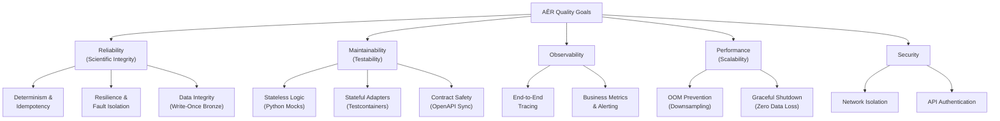

# 10. Quality Requirements

## 10.1 Quality Tree

### Reliability (Scientific Integrity)

This is the highest-priority quality goal. AĒR exists to produce scientifically valid metrics — any distortion of data is a system failure.

**Determinism & Idempotency:** Data must flow through the system exactly once. Duplicate NATS events (at-least-once delivery) must not produce duplicate analytical outputs. Timestamps used for ClickHouse inserts must be deterministic (derived from MinIO event metadata, never from the system clock).

**Resilience & Fault Isolation:** Malformed unstructured web data must never crash the pipeline. It must be caught by the Silver Contract (Pydantic validation) and routed to the Dead Letter Queue (`bronze-quarantine`) for manual inspection. The worker continues processing subsequent events without interruption.

**Data Integrity:** Raw data in the Bronze layer is immutable (write-once). No service may modify or delete objects in the `bronze` bucket. Transformations produce new objects in the `silver` bucket.

### Maintainability (Testability)

**Stateless Logic (Python):** Data transformation and validation logic must be 100% unit-testable using mocked infrastructure. Tests must run in milliseconds and focus purely on business logic correctness.

**Stateful Adapters (Go):** Database adapters (PostgreSQL, MinIO, ClickHouse) must be tested against real database instances using ephemeral Testcontainers. Image tags for test containers are dynamically parsed from `compose.yaml` (SSoT enforcement).

**Contract Safety:** The generated Go server code (`generated.go`) must always be in sync with the OpenAPI specification. The CI pipeline enforces this by re-running `oapi-codegen` and failing on `git diff`.

### Observability

**End-to-End Tracing:** Every dataset entering the system must be fully traceable from the Gold layer back to its original HTTP request via OpenTelemetry trace IDs. Trace context must propagate across the NATS message boundary via headers.

**Business Metrics & Alerting:** The analysis worker must export pipeline health metrics (throughput, DLQ size, processing latency) via Prometheus. Alerting rules must trigger on threshold violations.

### Performance (Scalability)

**OOM Prevention:** The BFF API must never return unbounded result sets from ClickHouse. All queries must use server-side aggregation (downsampling) and hard row limits.

**Graceful Shutdown:** Stopping a service must not corrupt in-flight data. The worker must drain its NATS connection and finish processing current events before exiting.

### Security

**Network Isolation:** Databases and internal services must be unreachable from the internet-facing network. Only the BFF API and Grafana may bridge the frontend and backend networks.

**API Authentication:** All data-serving endpoints on the BFF API must require authentication. Health probes must remain unauthenticated for infrastructure tooling.

## 10.2 Quality Scenarios

Quality scenarios make the abstract goals measurable. Each scenario follows the Arc42 stimulus/response format and is backed by a concrete implementation in the codebase.

### Reliability Scenarios

| ID | Stimulus | Response | Implementation |
| :--- | :--- | :--- | :--- |
| QS-R1 | A NATS JetStream event is delivered twice due to a network partition or consumer restart. | The analysis worker detects the duplicate via PostgreSQL status lookup (`processed` or `quarantined`), acknowledges the event, and skips processing. No duplicate metric is inserted into ClickHouse. | `processor.py`: `_get_document_status()` check before processing. Deterministic timestamps prevent duplicate rows even if the check is bypassed. |
| QS-R2 | A crawler submits a JSON document missing the mandatory `raw_text` field. | The Silver Contract (Pydantic) raises a `ValidationError`. The worker catches it, routes the raw document to `bronze-quarantine`, updates the PostgreSQL status to `quarantined`, increments `events_quarantined_total`, and continues processing the next event. The pipeline does not crash. | `processor.py`: try/except around `SilverRecord(**harmonized_data)`. `_move_to_quarantine()` handles DLQ routing. |
| QS-R3 | The MinIO upload (Bronze) succeeds but the PostgreSQL metadata insert fails mid-transaction. | The document remains in MinIO but has no metadata entry ("Dark Data"). The `pending` status was written before the upload — on retry, the document can be reconciled. | `service.go`: `LogDocument()` with status `pending` before `PutObject()`, `UpdateDocumentStatus()` to `uploaded` after success. |
| QS-R4 | The ClickHouse insert (Gold) fails after the Silver upload has already succeeded. | The NATS event is NAK'd, triggering redelivery. On the next attempt, the Silver upload is idempotently overwritten, and the ClickHouse insert is retried. The PostgreSQL status remains `uploaded` (not `processed`) until both steps succeed. | `processor.py`: ClickHouse insert after Silver upload. Exception propagates to `worker_task()`, which calls `msg.nak()`. |
| QS-R5 | A consumer requests entities with `label=ORG` for a time range containing both ORG and LOC entities. | The BFF API returns only entities with label `ORG`. The response includes aggregated counts and distinct source lists. Entities outside the time range or with different labels are excluded. | `handler.go`: `GetEntities()` passes label filter to storage. `clickhouse.go`: `GetEntities()` with `AND entity_label = $N` clause. Integration test in `clickhouse_test.go`. |

### Maintainability Scenarios

| ID | Stimulus | Response | Implementation |
| :--- | :--- | :--- | :--- |
| QS-M1 | A developer modifies the OpenAPI specification (`openapi.yaml`) but forgets to run `make codegen`. | The CI pipeline re-generates `generated.go` from the spec and runs `git diff --exit-code`. The build fails, blocking the PR. | `.github/workflows/ci.yml`: `make codegen && git diff --exit-code services/bff-api/internal/handler/generated.go`. |
| QS-M2 | A new ClickHouse version changes SQL behavior for the BFF's aggregation query. | The Go integration test (`clickhouse_test.go`) runs against a real ClickHouse container (tag from `compose.yaml`) and detects the regression. The test fails before the change reaches `main`. | `testcontainers-go` with `GetImageFromCompose("clickhouse")`. |
| QS-M3 | A developer pushes code with a linting violation. | The pre-push Git hook runs `make lint` (golangci-lint + ruff) and blocks the push. If bypassed locally, the CI pipeline catches it. | `scripts/hooks/pre-push` and `ci.yml` lint jobs. |

### Observability Scenarios

| ID | Stimulus | Response | Implementation |
| :--- | :--- | :--- | :--- |
| QS-O1 | The analysis worker process crashes or becomes unreachable. | Prometheus detects the scrape target failure. The `WorkerDown` alert fires after 1 minute of continuous unavailability (severity: critical). | `alert.rules.yml`: `up{job="analysis-worker"} == 0` for 1m. |
| QS-O2 | A sustained influx of malformed data causes the DLQ to accumulate more than 50 objects. | The `DLQOverflow` alert fires after 5 minutes above threshold (severity: warning). The operator investigates via the Grafana dashboard. | `alert.rules.yml`: `dlq_size > 50` for 5m. `metrics.py`: `dlq_size` Gauge. |
| QS-O3 | The 95th percentile event processing duration exceeds 5 seconds. | The `HighEventProcessingLatency` alert fires after 5 minutes above threshold (severity: warning). | `alert.rules.yml`: `histogram_quantile(0.95, rate(event_processing_duration_seconds_bucket[5m])) > 5` for 5m. |
| QS-O4 | An analyst observes an anomaly in the Gold layer metrics and wants to inspect the original source document. | The analyst queries the BFF for the time range, identifies the data point, resolves the `trace_id` via the PostgreSQL Metadata Index, and retrieves the original raw JSON from the MinIO Bronze bucket. The full trace is visible in Grafana Tempo. | PostgreSQL `documents` table links `bronze_object_key` ↔ `trace_id`. Tempo stores the end-to-end trace. |

### Performance Scenarios

| ID | Stimulus | Response | Implementation |
| :--- | :--- | :--- | :--- |
| QS-P1 | A consumer requests metrics for a 365-day time range via `GET /api/v1/metrics`. | The BFF API downsamples the data to 5-minute intervals using `toStartOfFiveMinute()` and `avg()` in the ClickHouse query, grouped by source and metric_name. A hard row limit is applied. The response fits in memory and is returned within the 30-second request timeout. | `clickhouse.go`: `GetMetrics()` with downsampling SQL, `GROUP BY TS, Source, MetricName`, and `LIMIT`. `chi` timeout middleware (30s). |
| QS-P4 | A consumer requests metrics with `metricName=word_count` while the Gold layer contains `word_count`, `sentiment_score`, and `entity_count` data. | The BFF API returns only `word_count` data points. Each response item includes the `source` and `metricName` fields, enabling the consumer to distinguish data dimensions without additional queries. | `clickhouse.go`: `GetMetrics()` with `AND metric_name = $N` filter. Response schema includes `source` and `metricName` fields (Phase 43 extension). |
| QS-P2 | The operator sends `SIGTERM` to the analysis worker while 3 events are being processed concurrently. | The worker stops accepting new NATS messages, pushes `None` sentinels to each worker task, and waits for all in-flight tasks to finish. NATS is drained cleanly. No database connections are torn mid-transaction. | `main.py`: `shutdown_signal()` sets `stop_event`, sentinel `None` per worker, `asyncio.gather(*workers)`, `nc.drain()`. |
| QS-P3 | The PostgreSQL container starts 10 seconds after the Ingestion API container. | The Ingestion API retries the connection using exponential backoff (1s, 2s, 4s, ...) up to 30 seconds. Once PostgreSQL becomes healthy, the connection succeeds and the service starts serving requests. No crash, no manual restart. | `postgres.go`: `backoff.Retry()` with `backoff.NewExponentialBackOff()` and `WithMaxElapsedTime(30s)`. Docker: `depends_on: condition: service_healthy`. |
| QS-P5 | A slow-loris client opens a TCP connection to `POST /api/v1/ingest` and dribbles out one header byte per second. | The server closes the connection after `ReadHeaderTimeout = 5s` without ever handing the request to the handler. The full request body is bounded by `ReadTimeout = 60s` and `MaxHeaderBytes = 1 MiB`; a response is bounded by `WriteTimeout = 60s`; keep-alive connections are recycled via `IdleTimeout = 120s`. No handler goroutine is held open indefinitely. | `ingestion-api/cmd/api/main.go` and `bff-api/cmd/server/main.go`: explicit `http.Server{ReadHeaderTimeout, ReadTimeout, WriteTimeout, IdleTimeout, MaxHeaderBytes}` fields (Phase 82). `.env.example` documents the same values. |
| QS-P6 | A compromised crawler submits a 500 MiB JSON blob to `POST /api/v1/ingest` to try to exhaust worker memory. | `http.MaxBytesReader` rejects the request with `413 Payload Too Large` *before* the decoder runs. The ceiling is `INGESTION_MAX_BODY_BYTES` (default 16 MiB) and can be lowered at any time via `.env` without a code change. | `ingestion-api/internal/handler/handler.go`: `http.MaxBytesReader(w, r.Body, maxBodyBytes)` wrapping the request body (Phase 82). |

### Security Scenarios

| ID | Stimulus | Response | Implementation |
| :--- | :--- | :--- | :--- |
| QS-S1 | An unauthenticated HTTP request is sent to `GET /api/v1/metrics`. | The BFF API responds with `401 Unauthorized` (`{"error":"unauthorized"}`). No data is returned. | `main.go`: `apiKeyAuth()` middleware checks `X-API-Key` / `Authorization: Bearer`. |
| QS-S2 | An attacker with network access to the Traefik container attempts to connect directly to PostgreSQL on port 5432. | The connection is refused. PostgreSQL is exclusively on the `aer-backend` network. Traefik is exclusively on `aer-frontend`. There is no route between them. | `compose.yaml`: `postgres` → `aer-backend` only. `traefik` → `aer-frontend` only. |
| QS-S3 | A new dependency in `requirements.txt` introduces a known HIGH-severity CVE. | The `dependency-audit` CI job runs `pip-audit` and fails the build, blocking the merge. | `ci.yml`: `pip-audit -r requirements.txt`. Trivy scans the built container image for `HIGH,CRITICAL`. |
| QS-S4 | A consumer calls `GET /api/v1/metrics` without providing `startDate` or `endDate` query parameters. | The BFF API returns `400 Bad Request` immediately. No ClickHouse query is issued. The framework-generated routing code enforces both parameters as required before the handler is reached. | `generated.go`: `RequiredParamError` on missing `startDate`/`endDate`. OpenAPI spec `required: true` on both parameters (Phase 47). |
| QS-S5 | A consumer calls `GET /api/v1/entities` with `limit=0` or `limit=5000`. | The BFF API returns `400 Bad Request` with the message `"limit must be between 1 and 1000"`. The `limit` validation is enforced in the handler layer, not the storage layer. The storage layer receives only pre-validated values. | `handler.go`: `GetEntities()` bounds check `limit < 1 \|\| limit > 1000 → 400`. Same pattern in `GetLanguages()` (Phase 47). |