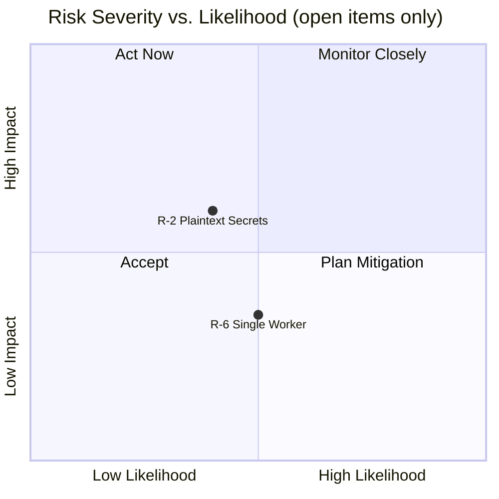

# 11. Risks and Technical Debts

This chapter documents known architectural risks and consciously accepted technical debts. Each entry is classified by severity and linked to the affected components. Items are ordered by priority within their category.

## 11.1 Architectural Risks

### R-1: ~~No Rate Limiting on the BFF API~~ — Resolved

| Property | Value |
| :--- | :--- |
| **Severity** | High |
| **Affected Component** | `bff-api` |
| **Status** | Resolved (Phase 16) |

A token-bucket rate limiter (`golang.org/x/time/rate`) has been implemented as `chi` middleware on the BFF API, configurable via environment variables. A distributed (Redis-backed) rate limiter is deferred until horizontal scaling requires it — adding Redis for a single-instance deployment would violate Occam's Razor.

---

### R-2: Secrets Managed via Plaintext `.env` File

| Property | Value |
| :--- | :--- |
| **Severity** | Medium |
| **Affected Component** | All services, `compose.yaml` |
| **Status** | Accepted (for current deployment model) |

All credentials (database passwords, API keys, MinIO secrets, Grafana admin credentials, ACME email) are stored in a plaintext `.env` file at the repository root. The file is excluded from version control via `.gitignore`, but it resides unencrypted on disk. This is acceptable for a single-operator VPS/homelab deployment but becomes a security liability in multi-user, team, or cloud environments.

**Mitigation plan:** For future scaling, migrate to Docker Secrets (Swarm), HashiCorp Vault, or SOPS-encrypted `.env` files. The current architecture is prepared for this — all services consume credentials via environment variables, making the switch transparent.

---

### R-3: Silver Layer Has No Retention Policy

| Property | Value |
| :--- | :--- |
| **Severity** | Medium |
| **Affected Component** | MinIO (`silver` bucket) |
| **Status** | Resolved (Phase 32) |

The Bronze layer expires after 90 days and the Quarantine after 30 days (via MinIO ILM). However, the Silver bucket has no expiration policy. By design, it serves as the persistent re-evaluation baseline — but this means it will grow unboundedly over time. With hundreds of crawlers active, this could become a storage concern.

**Resolution (Phase 32):** A 365-day ILM expiration rule (`ExpireOldSilverData`) was applied to the `silver` bucket in `infra/minio/setup.sh`. The Gold layer (ClickHouse `aer_gold.metrics`) retains all derived metrics independently under its own 365-day TTL, making this safe. The TTL was set as a conservative default prior to long-term growth measurement; it should be revisited once a full quarter of production crawl data is available. See `docs/arc42/08_concepts.md` §8.8 for the full rationale.

---

### R-4: Bronze Data Irrecoverably Lost After 90 Days

| Property | Value |
| :--- | :--- |
| **Severity** | Low |
| **Affected Component** | MinIO (`bronze` bucket), Data Lake |
| **Status** | Accepted (see ADR-007) |

The Bronze ILM policy permanently deletes raw data after 90 days. If a bug in the harmonization logic is discovered after this window, the original documents cannot be retroactively re-parsed — they must be re-crawled from the source. This is a conscious tradeoff documented in ADR-007, accepting data loss in exchange for predictable storage costs.

**Mitigation:** Re-crawling from external sources is possible for most public data. The Silver layer retains the harmonized version indefinitely, which suffices for most re-analysis scenarios.

---

### R-5: ~~Ingestion API Has No Authentication~~ — Resolved

| Property | Value |
| :--- | :--- |
| **Severity** | Low (current deployment) / High (if exposed) |
| **Affected Component** | `ingestion-api` |
| **Status** | Resolved (Phase 33) |

The Ingestion API now requires a valid API key on all routes except `/api/v1/healthz` and `/api/v1/readyz`. The middleware is shared with the BFF API via `pkg/middleware/apikey.go` (DRY). The key is configured via the `INGESTION_API_KEY` environment variable and accepted via the `X-API-Key` header or `Authorization: Bearer <key>`.

---

### R-6: Single Worker Instance — No Horizontal Scaling

| Property | Value |
| :--- | :--- |
| **Severity** | Low (current load) / Medium (at scale) |
| **Affected Component** | `analysis-worker` |
| **Status** | Accepted |

The `compose.yaml` defines a single `analysis-worker` container. While the worker uses an internal `asyncio.Queue` with configurable `WORKER_COUNT` for concurrent processing, there is only one OS-level process subscribing to NATS. Under high ingestion volume (hundreds of crawlers), this could become a bottleneck. NATS JetStream's durable consumer model natively supports horizontal scaling by adding additional consumer instances — the architecture is prepared for this, but it is not yet configured.

**Mitigation plan:** Add `deploy.replicas` to the `analysis-worker` service in `compose.yaml` when throughput demands it. No code changes are required — the durable NATS subscription handles message distribution across consumers automatically.

---

### ~~R-8: 100% Trace Sampling Does Not Scale~~ — Resolved (Phase 36)

| Property | Value |
| :--- | :--- |
| **Severity** | Low |
| **Affected Component** | `pkg/telemetry`, `ingestion-api`, `bff-api` |
| **Status** | Resolved (Phase 36) |

`sdktrace.AlwaysSample()` emits a span for every request. At single-crawler development throughput this is fine, but with many concurrent crawlers it creates unbounded storage growth in Tempo and processing overhead in the OTel Collector.

**Resolution:** `InitProvider` in `pkg/telemetry/otel.go` now accepts a `sampleRate float64` parameter. The sampler is `sdktrace.ParentBased(sdktrace.TraceIDRatioBased(rate))` — `ParentBased` ensures child spans inherit the parent's sampling decision, preventing orphaned trace fragments. The rate is read from `OTEL_TRACE_SAMPLE_RATE` (default `1.0`, preserving current development behavior). Set to `0.1` in production for 10% sampling.

---

### ~~R-7: Tempo Trace Storage Is Ephemeral~~ — Resolved (Phase 34)

| Property | Value |
| :--- | :--- |
| **Severity** | Low |
| **Affected Component** | Grafana Tempo |
| **Status** | Resolved (Phase 34) |

Tempo stores trace data under `/tmp/tempo/` inside the container with a 1-hour block retention (`block_retention: 1h`). There is no persistent Docker volume mounted. Restarting the Tempo container permanently loses all stored traces. This is acceptable for development and short-term debugging but insufficient for long-term audit trails.

**Resolution:** A named Docker volume `tempo_data` is now mounted at `/var/tempo` inside the Tempo container. WAL and block paths in `infra/observability/tempo.yaml` were updated accordingly (`/var/tempo/wal`, `/var/tempo/blocks`). Block retention was increased to `72h` (development baseline; raise to `720h` for production audit requirements).

---

## 11.2 Technical Debts

### D-1: ~~Image Pinning Violations (Prometheus, Grafana)~~ — Resolved

| Property | Value |
| :--- | :--- |
| **Severity** | High |
| **Affected Component** | `compose.yaml` |
| **Status** | Resolved (Phase 24) |

Both images have been pinned to exact patch-level releases in `compose.yaml`. All images in the stack now comply with the hard-pinning policy (ADR-009).

---

### D-2: ~~`psycopg2-binary` Used in Production Dockerfile~~ — Resolved

| Property | Value |
| :--- | :--- |
| **Severity** | Medium |
| **Affected Component** | `analysis-worker`, `requirements.txt` |
| **Status** | Resolved (Phase 31) |

The Python worker used `psycopg2-binary` for PostgreSQL connectivity. This package bundles a statically linked `libpq` and is explicitly not recommended for production by the `psycopg2` maintainers — it may have SSL/TLS incompatibilities and is not built against the system's OpenSSL.

**Resolution:** The production `Dockerfile` builder stage now installs `gcc`, `libpq-dev`, and `python3-dev` to compile `psycopg2` from source against the system `libpq`. `requirements.txt` references `psycopg2==2.9.11`; `requirements-dev.txt` overrides with `psycopg2-binary==2.9.11` to avoid native compilation overhead in local and CI environments.

---

### D-3: ~~No Database Migration Tooling~~ — Resolved

| Property | Value |
| :--- | :--- |
| **Severity** | Medium |
| **Affected Component** | PostgreSQL, ClickHouse |
| **Status** | Resolved (Phase 29) |

Database schemas were initialized via `init.sql` scripts mounted into the `docker-entrypoint-initdb.d/` directories of PostgreSQL and ClickHouse. These scripts ran only on first container creation (empty volume). There was no migration framework — schema changes required either manually altering the running database or wiping the volume and re-initializing.

**Resolution:** `golang-migrate` runs on ingestion-api startup for PostgreSQL. ClickHouse uses a shell-based migration runner in a dedicated `clickhouse-init` container. Versioned migration files live in `infra/postgres/migrations/` and `infra/clickhouse/migrations/`. See ADR-014 for details.

---

### D-4: ~~E2E Smoke Test Not Integrated Into CI~~ — Resolved

| Property | Value |
| :--- | :--- |
| **Severity** | Low |
| **Affected Component** | `scripts/e2e_smoke_test.sh`, CI pipeline |
| **Status** | Resolved (Phase 27) |

A dedicated `e2e-smoke` CI job has been added to `ci.yml`. It runs on pushes to `main` (not on PRs to avoid long CI times) using `docker compose up --build --wait` and executes the full smoke test script.

---

### D-5: ~~Hardcoded Dummy Source in PostgreSQL Init Script~~ — Resolved

| Property | Value |
| :--- | :--- |
| **Severity** | Low |
| **Affected Component** | `infra/postgres/init.sql` |
| **Status** | Resolved (Phase 29) |

The PostgreSQL init script inserted a dummy source record (`'AER Dummy Generator', 'internal_test'`) via `ON CONFLICT DO NOTHING`. The Wikipedia crawler assumed `source_id=1` by default, coupling it to this hardcoded entry.

**Resolution:** The dummy insert was replaced by a proper seed migration (`000002_seed_wikipedia_source.up.sql`) that registers the `wikipedia` source with its actual API URL. The Wikipedia crawler now resolves its `source_id` dynamically via `GET /api/v1/sources?name=wikipedia`. The explicit `-source-id` flag is retained for backward compatibility.

---

### D-6: ~~Missing Architecture Decision Records~~ — Resolved

| Property | Value |
| :--- | :--- |
| **Severity** | Low |
| **Affected Component** | `docs/arc42/09_architecture_decisions.md` |
| **Status** | Resolved (Phase 22) |

ADRs 008–013 have been written and added to `docs/arc42/09_architecture_decisions.md`: Docker Network Segmentation (008), Hard-Pinning Policy & SSoT (009), External Crawler Architecture (010), BFF API Authentication (011), TLS Termination via Traefik (012), Network Zero-Trust & Port Hardening (013).

---

### ~~D-8: CI/Production Python Version Mismatch~~ — Resolved (Phase 35)

| Property | Value |
| :--- | :--- |
| **Severity** | Medium |
| **Affected Component** | `.github/workflows/ci.yml`, `services/analysis-worker/Dockerfile` |
| **Status** | Resolved (Phase 35) |

The `python-pipeline` and `dependency-audit` CI jobs used `python-version: '3.12'` while the production Dockerfile is based on `python:3.14.3-slim-bookworm`. This violated the SSoT principle — a test passing on 3.12 does not guarantee correctness on 3.14, particularly for the async-heavy analysis worker.

**Resolution:** Both CI jobs now set `python-version: '3.14'` to match the production base image. All dependencies in `requirements.txt` and `requirements-dev.txt` were verified to install cleanly on Python 3.14.

---

### D-7: ClickHouse Metrics Schema Is Minimal

| Property | Value |
| :--- | :--- |
| **Severity** | Low |
| **Affected Component** | `infra/clickhouse/migrations/`, `aer_gold.metrics` |
| **Status** | Resolved (Phase 30) |

Migration `000002_extend_metrics_schema.sql` added `source String`, `metric_name String`, and `article_id Nullable(String)` columns to `aer_gold.metrics`. The analysis worker now populates all dimensions on insert, and the BFF API supports optional `source` and `metricName` query filters. Integration tests cover the extended schema in both Go and Python.

---

## 11.3 Risk Matrix Overview

