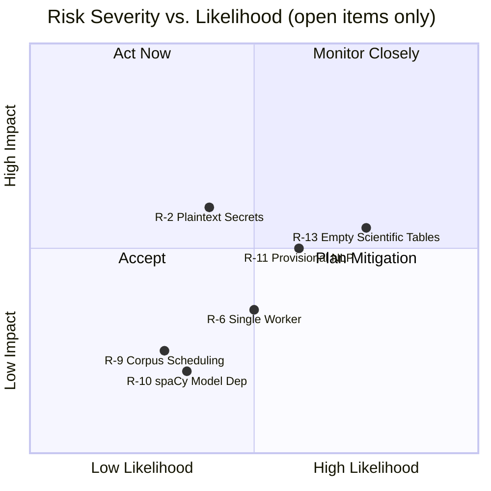

# 11. Risks and Technical Debts

This chapter documents known architectural risks and consciously accepted technical debts. Each entry is classified by severity and linked to the affected components. Items are ordered by priority within their category.

## 11.1 Architectural Risks

### R-1: ~~No Rate Limiting on the BFF API~~ — Resolved

| Property | Value |
| :--- | :--- |
| **Severity** | High |
| **Affected Component** | `bff-api` |
| **Status** | Resolved (Phase 16) |

A token-bucket rate limiter (`golang.org/x/time/rate`) has been implemented as `chi` middleware on the BFF API, configurable via environment variables. The limiter is **global** — a single token bucket shared across all callers, not per API key — because the system currently has exactly one consumer (the operator). Per-key rate limiting becomes meaningful once a second consumer exists; until then, a single bucket is the simplest correct shape. A distributed (Redis-backed) rate limiter is deferred until horizontal scaling requires it — adding Redis for a single-instance deployment would violate Occam's Razor.

---

### R-2: Secrets Managed via Plaintext `.env` File

| Property | Value |
| :--- | :--- |
| **Severity** | Medium |
| **Affected Component** | All services, `compose.yaml` |
| **Status** | Accepted (for current deployment model) |

All credentials (database passwords, API keys, MinIO secrets, Grafana admin credentials, ACME email) are stored in a plaintext `.env` file at the repository root. The file is excluded from version control via `.gitignore`, but it resides unencrypted on disk. This is acceptable for a single-operator VPS/homelab deployment but becomes a security liability in multi-user, team, or cloud environments.

**Mitigation plan:** For future scaling, migrate to Docker Secrets (Swarm), HashiCorp Vault, or SOPS-encrypted `.env` files. The current architecture is prepared for this — all services consume credentials via environment variables, making the switch transparent.

---

### R-3: Silver Layer Has No Retention Policy

| Property | Value |
| :--- | :--- |
| **Severity** | Medium |
| **Affected Component** | MinIO (`silver` bucket) |
| **Status** | Resolved (Phase 32) |

The Bronze layer expires after 90 days and the Quarantine after 30 days (via MinIO ILM). However, the Silver bucket has no expiration policy. By design, it serves as the persistent re-evaluation baseline — but this means it will grow unboundedly over time. With hundreds of crawlers active, this could become a storage concern.

**Resolution (Phase 32):** A 365-day ILM expiration rule (`ExpireOldSilverData`) was applied to the `silver` bucket in `infra/minio/setup.sh`. The Gold layer (ClickHouse `aer_gold.metrics`) retains all derived metrics independently under its own 365-day TTL, making this safe. The TTL was set as a conservative default prior to long-term growth measurement; it should be revisited once a full quarter of production crawl data is available. See `docs/arc42/08_concepts.md` §8.8 for the full rationale.

---

### R-4: Bronze Data Irrecoverably Lost After 90 Days

| Property | Value |
| :--- | :--- |
| **Severity** | Low |
| **Affected Component** | MinIO (`bronze` bucket), Data Lake |
| **Status** | Accepted (see ADR-007) |

The Bronze ILM policy permanently deletes raw data after 90 days. If a bug in the harmonization logic is discovered after this window, the original documents cannot be retroactively re-parsed — they must be re-crawled from the source. This is a conscious tradeoff documented in ADR-007, accepting data loss in exchange for predictable storage costs.

**Mitigation:** Re-crawling from external sources is possible for most public data. The Silver layer retains the harmonized version indefinitely, which suffices for most re-analysis scenarios.

---

### R-5: ~~Ingestion API Has No Authentication~~ — Resolved

| Property | Value |
| :--- | :--- |
| **Severity** | Low (current deployment) / High (if exposed) |
| **Affected Component** | `ingestion-api` |
| **Status** | Resolved (Phase 33) |

The Ingestion API now requires a valid API key on all routes except `/api/v1/healthz` and `/api/v1/readyz`. The middleware is shared with the BFF API via `pkg/middleware/apikey.go` (DRY). The key is configured via the `INGESTION_API_KEY` environment variable and accepted via the `X-API-Key` header or `Authorization: Bearer <key>`.

---

### R-6: Single Worker Instance — No Horizontal Scaling

| Property | Value |
| :--- | :--- |
| **Severity** | Low (current load) / Medium (at scale) |
| **Affected Component** | `analysis-worker` |
| **Status** | Accepted |

The `compose.yaml` defines a single `analysis-worker` container. While the worker uses an internal `asyncio.Queue` with configurable `WORKER_COUNT` for concurrent processing, there is only one OS-level process subscribing to NATS. Under high ingestion volume (hundreds of crawlers), this could become a bottleneck. NATS JetStream's durable consumer model natively supports horizontal scaling by adding additional consumer instances — the architecture is prepared for this, but it is not yet configured.

**Mitigation plan:** Add `deploy.replicas` to the `analysis-worker` service in `compose.yaml` when throughput demands it. No code changes are required — the durable NATS subscription handles message distribution across consumers automatically.

---

### ~~R-8: 100% Trace Sampling Does Not Scale~~ — Resolved (Phase 36)

| Property | Value |
| :--- | :--- |
| **Severity** | Low |
| **Affected Component** | `pkg/telemetry`, `ingestion-api`, `bff-api` |
| **Status** | Resolved (Phase 36) |

`sdktrace.AlwaysSample()` emits a span for every request. At single-crawler development throughput this is fine, but with many concurrent crawlers it creates unbounded storage growth in Tempo and processing overhead in the OTel Collector.

**Resolution:** `InitProvider` in `pkg/telemetry/otel.go` now accepts a `sampleRate float64` parameter. The sampler is `sdktrace.ParentBased(sdktrace.TraceIDRatioBased(rate))` — `ParentBased` ensures child spans inherit the parent's sampling decision, preventing orphaned trace fragments. The rate is read from `OTEL_TRACE_SAMPLE_RATE` (default `1.0`, preserving current development behavior). Set to `0.1` in production for 10% sampling.

---

### ~~R-7: Tempo Trace Storage Is Ephemeral~~ — Resolved (Phase 34)

| Property | Value |
| :--- | :--- |
| **Severity** | Low |
| **Affected Component** | Grafana Tempo |
| **Status** | Resolved (Phase 34) |

Tempo stores trace data under `/tmp/tempo/` inside the container with a 1-hour block retention (`block_retention: 1h`). There is no persistent Docker volume mounted. Restarting the Tempo container permanently loses all stored traces. This is acceptable for development and short-term debugging but insufficient for long-term audit trails.

**Resolution:** A named Docker volume `tempo_data` is now mounted at `/var/tempo` inside the Tempo container. WAL and block paths in `infra/observability/tempo.yaml` were updated accordingly (`/var/tempo/wal`, `/var/tempo/blocks`). Block retention was increased to `72h` (development baseline; raise to `720h` for production audit requirements).

---

### R-9: Corpus-Level Extraction Requires Scheduling Mechanism

| Property | Value |
| :--- | :--- |
| **Severity** | Low (no corpus extractors exist yet) |
| **Affected Component** | `analysis-worker`, Extractor Pipeline |
| **Status** | Accepted (architecturally anticipated) |

The `CorpusExtractor` protocol is defined in `extractors/base.py` for future methods that operate on accumulated Silver data across time windows (TF-IDF, LDA, co-occurrence networks). These cannot run in the current per-document NATS event loop — they require a batch scheduling mechanism (cron job, NATS-triggered batch, or a dedicated batch worker). Until this mechanism is built, only per-document `MetricExtractor` implementations can be registered. The protocol exists to ensure the per-document pipeline does not architecturally preclude corpus-level analysis.

**Mitigation plan:** Implement a lightweight cron or NATS-triggered batch job that queries Silver data from MinIO within a time window, deserializes `SilverCore` records, and passes them to registered `CorpusExtractor` instances. This is a scheduling concern, not an extraction concern — the extraction logic itself is ready to be implemented against the existing protocol.

---

### R-10: spaCy Model Dependency (~500MB Download)

| Property | Value |
| :--- | :--- |
| **Severity** | Low |
| **Affected Component** | `analysis-worker`, Docker image, `requirements.txt` |
| **Status** | Accepted (Phase 42), Refined (Phase 116) |

The Named Entity Extractor depends on `de_core_news_lg` (~500MB), a statistical NLP model downloaded from GitHub Releases during `pip install` in the Docker build stage. This introduces three risks: (1) Docker images are significantly larger (~700MB+ total), increasing pull times and storage costs. (2) The model URL on `github.com/explosion/spacy-models` may become unavailable or rate-limited during builds. (3) The model is pinned to version `3.8.0` — spaCy major version upgrades may require model migration.

**Mitigation plan:** Consider caching the model in a named Docker volume or a private artifact registry. Pin the exact model version in `requirements.txt` (currently `de_core_news_lg-3.8.0`). If the GitHub URL becomes unreliable, mirror the wheel to the project's own infrastructure. The model is loaded with `disable=["tagger", "parser", "lemmatizer"]` to minimize memory footprint (NER pipeline only).

**Phase 116 refinement — language routing and the absence-not-wrong guarantee.** Before Phase 116 the German model was applied to every document irrespective of its detected language, producing phantom entity spans on English RSS articles in Probe 0 and contaminating the Gold layer with statistically meaningless data. The Named Entity Extractor now carries a `{language_code: spacy_model_name}` constructor map and skips extraction (no `entity_count` metric, no `aer_gold.entities` rows, structured warning log) for any `core.language` not present in the map. Adding a new probe language is one model entry in `requirements.txt` plus one map entry — no extractor code change. The legacy adapter tag `und` and empty values still resolve to the default model (German) so pre-Phase-116 documents keep their NER coverage. This converts the implicit "process everything with the German model" assumption into an explicit, testable contract: documents in unsupported languages produce **genuine absence** in the Gold layer — distinguishable from "the entity count was zero". This is what the methodologically defensible cross-language aggregates downstream of WP-002 require.

---

### R-11: Provisional NLP Methods Require Scientific Validation

| Property | Value |
| :--- | :--- |
| **Severity** | Medium |
| **Affected Component** | `analysis-worker`, Extractor Pipeline |
| **Status** | Accepted (Phase 42 — PoC) |

All Phase 42 NLP extractors (language detection, SentiWS sentiment, spaCy NER) are explicitly provisional. The specific lexicons, models, and parameters are engineering defaults, not scientifically validated choices. Results from these extractors should not be interpreted as validated measurements of sentiment, language, or entity presence. They serve as proof-of-concept implementations that validate the extractor pipeline architecture with real NLP operations. Scientific validation requires interdisciplinary collaboration (§13.5).

**Mitigation plan:** Each extractor documents its provisional status and limitations in its docstring and in Chapter 13 (§13.3.1). The extractors will be revisited, replaced, or recalibrated when CSS/NLP researchers provide methodological grounding.

---

### R-12: Authenticity Extractors Not Yet Implemented

| Property | Value |
| :--- | :--- |
| **Severity** | Low |
| **Affected Component** | `analysis-worker`, Extractor Pipeline |
| **Status** | Accepted (Phase 64) |

WP-003 section 8.2 proposes authenticity extractors (bot detection, coordination detection) for platforms where non-human actors are present. These are not implemented because (1) the current Probe 0 sources are editorially controlled RSS feeds where non-human actor detection is not applicable, and (2) coordination detection requires the `CorpusExtractor` path (R-9) which operates on accumulated data across time windows rather than individual documents. The `BiasContext` metadata model (Phase 64) documents the absence of this capability per source platform.

**Mitigation plan:** Authenticity extractors will be implemented when social media or forum adapters are introduced, at which point the `CorpusExtractor` infrastructure will also be required. The "document, don't filter" principle (WP-003) ensures that non-human content is annotated rather than excluded.

---

### R-13: Scientific Infrastructure Tables Are Empty

| Property | Value |
| :--- | :--- |
| **Severity** | Medium |
| **Affected Component** | ClickHouse (`metric_validity`, `metric_equivalence`, `metric_baselines`), PostgreSQL (`source_classifications`), `bff-api` |
| **Status** | Accepted (Phases 62–65) |

Phases 62–65 added four scientific infrastructure tables — `source_classifications` (Postgres, WP-001), `aer_gold.metric_validity` (WP-002 / ADR-016), `aer_gold.metric_baselines` and `aer_gold.metric_equivalence` (WP-004) — plus the `metric_provenance.yaml` config (WP-006 / ADR-017). The schemas, query paths, and validation gates are all implemented and exercised by tests. **The tables themselves are either empty or populated only with provisional engineering defaults.** Probe 0 source classifications carry `review_status = 'provisional_engineering'` with `function_weights = NULL`. `metric_validity` and `metric_equivalence` are entirely empty. `metric_baselines` is populated only if `scripts/compute_baselines.py` has been run against a non-trivial corpus.

The architectural risk: from a consumer's perspective the BFF API looks *validation-ready* — `validationStatus`, `eticConstruct`, `equivalenceLevel`, `minMeaningfulResolution`, and `/provenance` endpoints all exist and return well-formed JSON. A naive consumer could interpret the presence of this surface as evidence that the metrics have been validated, when in fact every current metric reports `unvalidated` and every equivalence check fails closed. The Hybrid Tier Architecture (ADR-016) and the Reflexive Architecture principles (ADR-017) are designed to make this visible rather than hide it, but they only work if consumers actually read the surfaced metadata.

**Status update (Phase 70).** Probe 0 now has a complete dossier under `docs/probes/probe-0-de-institutional-rss/` covering WP-001 classification, WP-003 bias assessment, WP-005 temporal profile, and WP-006 observer-effect assessment. The documentation gap that this risk previously named is closed: a consumer following `documentation_url` from `GET /api/v1/sources` lands on a directory that explains the calibration status, exit criteria, and the WP coverage matrix in full.

**Status update (Phase 71).** The [Scientific Operations Guide](../operations/scientific_operations_guide.md) is now published. It documents each manual workflow end-to-end (Workflows 1–6: probe classification, validation studies, equivalence establishment, baseline computation, bias assessment, cultural calendar maintenance), each with a concrete Probe 0 walkthrough showing current status, executable commands, and outstanding collaborator dependencies. The *underlying* risk — that the scientific tables are populated only with provisional engineering defaults and that no validation study has been performed — remains until those workflows have been executed against Probe 0 by interdisciplinary collaborators.

**Mitigation plan:** The mitigation is not code — it is the interdisciplinary workflow that populates the tables, and it lives outside the codebase. The validation-gate pattern on `?normalization=zscore` (HTTP 400 without an equivalence entry) is the only hard enforcement currently in place; all other gates are informational. The bridge document that names the responsible roles, the trigger conditions, and the produced outputs for each workflow is the [Scientific Operations Guide](../operations/scientific_operations_guide.md).

---

### R-15: ~~Unbounded Task Queue OOM Under Burst Load~~ — Resolved (Phase 83)

| Property | Value |
| :--- | :--- |
| **Severity** | High |
| **Affected Component** | `analysis-worker` (`main.py` NATS consumer, `asyncio.Queue`) |
| **Status** | Resolved (Phase 83) |

Before Phase 83 the analysis worker's `asyncio.Queue` was constructed without a `maxsize`. The NATS message handler called `queue.put_nowait(msg)` for every delivered message, regardless of whether the worker pool was keeping up. Under a burst of Bronze events — for example after a crawler catch-up or a ClickHouse latency spike — the queue grew unboundedly until the container hit its memory limit and was OOM-killed, taking the in-flight work with it. The NATS consumer did not apply backpressure because JetStream cannot see into the application's own async buffers.

**Resolution (Phase 83).** The queue is now bounded: `asyncio.Queue(maxsize = WORKER_COUNT * 4)`. The JetStream subscription is configured with `max_ack_pending = queue_max_size`, so NATS delivers at most `queue_max_size` un-ack'd messages and then stops — backpressure is visible end-to-end from the worker all the way back to the broker. When the queue is full, `queue.put()` blocks the message handler, which in turn pauses NATS delivery; when the worker drains, delivery resumes. The two limits are derived from the same variable in `main.py`, so editing one without the other is a compile-time-visible break.

The poison-pill handler (R-paired with this fix, see §8.16.2) guarantees that a deterministically-failing message cannot occupy a queue slot forever — it is ack'd to `bronze-quarantine` on the final allowed delivery attempt.

---

### R-14: ~~Triple-Insert Duplication on NATS Redelivery~~ — Resolved

| Property | Value |
| :--- | :--- |
| **Severity** | High |
| **Affected Component** | `analysis-worker`, ClickHouse (`aer_gold.metrics`, `aer_gold.entities`, `aer_gold.language_detections`) |
| **Status** | Resolved (Phase 74) |

Before Phase 74 the analysis worker wrote sequentially to three ClickHouse tables — `aer_gold.metrics`, `aer_gold.entities`, and `aer_gold.language_detections` — and only then marked the document as `processed` in PostgreSQL. If the worker crashed or the NATS JetStream consumer redelivered a message after a partial insert, the already-landed rows would be written a second time. The tables were plain `MergeTree`, which does not deduplicate, so every redelivery produced duplicate rows and silently inflated downstream metric aggregates — a correctness risk invisible to callers and to test suites that did not replay events.

**Resolution (Phase 74).** Migration `000010_replacing_merge_tree.sql` rebuilt all three Gold tables as `ReplacingMergeTree(ingestion_version)` ordered by their natural dedup key (`(article_id, metric_name)` for metrics, span identity for entities, rank for language detections). The processor now stamps a monotone `ingestion_version` (event-time Unix nanoseconds) on every row it writes, so redelivered messages produce rows that `ReplacingMergeTree` collapses on merge (or on demand via `SELECT ... FINAL` / `OPTIMIZE TABLE ... FINAL`). A Testcontainers integration test replays the same NATS event twice and asserts that after `OPTIMIZE TABLE ... FINAL` exactly one row per dedup key remains in each of the three tables.

**Why this matters.** With deduplication pushed down into the storage engine, at-least-once delivery from NATS JetStream is safe for the Gold layer without introducing a distributed idempotency table. The fix is a pure schema and write-path change — no changes were required to the BFF query layer, because any stale duplicate rows remaining between background merges are resolved by the `FINAL` modifier on read paths that require it (none currently do; counting queries tolerate transient duplicates until the next merge).

---

## 11.2 Technical Debts

### D-1: ~~Image Pinning Violations (Prometheus, Grafana)~~ — Resolved

| Property | Value |
| :--- | :--- |
| **Severity** | High |
| **Affected Component** | `compose.yaml` |
| **Status** | Resolved (Phase 24) |

Both images have been pinned to exact patch-level releases in `compose.yaml`. All images in the stack now comply with the hard-pinning policy (ADR-009).

---

### D-2: ~~`psycopg2-binary` Used in Production Dockerfile~~ — Resolved

| Property | Value |
| :--- | :--- |
| **Severity** | Medium |
| **Affected Component** | `analysis-worker`, `requirements.txt` |
| **Status** | Resolved (Phase 31) |

The Python worker used `psycopg2-binary` for PostgreSQL connectivity. This package bundles a statically linked `libpq` and is explicitly not recommended for production by the `psycopg2` maintainers — it may have SSL/TLS incompatibilities and is not built against the system's OpenSSL.

**Resolution:** The production `Dockerfile` builder stage now installs `gcc`, `libpq-dev`, and `python3-dev` to compile `psycopg2` from source against the system `libpq`. `requirements.txt` references `psycopg2==2.9.11`; `requirements-dev.txt` overrides with `psycopg2-binary==2.9.11` to avoid native compilation overhead in local and CI environments.

---

### D-3: ~~No Database Migration Tooling~~ — Resolved

| Property | Value |
| :--- | :--- |
| **Severity** | Medium |
| **Affected Component** | PostgreSQL, ClickHouse |
| **Status** | Resolved (Phase 29) |

Database schemas were initialized via `init.sql` scripts mounted into the `docker-entrypoint-initdb.d/` directories of PostgreSQL and ClickHouse. These scripts ran only on first container creation (empty volume). There was no migration framework — schema changes required either manually altering the running database or wiping the volume and re-initializing.

**Resolution:** `golang-migrate` runs on ingestion-api startup for PostgreSQL. ClickHouse uses a shell-based migration runner in a dedicated `clickhouse-init` container. Versioned migration files live in `infra/postgres/migrations/` and `infra/clickhouse/migrations/`. See ADR-014 for details.

---

### D-4: ~~E2E Smoke Test Not Integrated Into CI~~ — Resolved

| Property | Value |
| :--- | :--- |
| **Severity** | Low |
| **Affected Component** | `scripts/e2e_smoke_test.sh`, CI pipeline |
| **Status** | Resolved (Phase 27) |

A dedicated `e2e-smoke` CI job has been added to `ci.yml`. It runs on pushes to `main` (not on PRs to avoid long CI times) using `docker compose up --build --wait` and executes the full smoke test script.

---

### D-5: ~~Hardcoded Dummy Source in PostgreSQL Init Script~~ — Resolved

| Property | Value |
| :--- | :--- |
| **Severity** | Low |
| **Affected Component** | `infra/postgres/init.sql` |
| **Status** | Resolved (Phase 29) |

The PostgreSQL init script inserted a dummy source record (`'AER Dummy Generator', 'internal_test'`) via `ON CONFLICT DO NOTHING`. The Wikipedia crawler assumed `source_id=1` by default, coupling it to this hardcoded entry.

**Resolution:** The dummy insert was replaced by a proper seed migration (`000002_seed_wikipedia_source.up.sql`) that registers the `wikipedia` source with its actual API URL. The Wikipedia crawler now resolves its `source_id` dynamically via `GET /api/v1/sources?name=wikipedia`. The explicit `-source-id` flag is retained for backward compatibility.

---

### D-6: ~~Missing Architecture Decision Records~~ — Resolved

| Property | Value |
| :--- | :--- |
| **Severity** | Low |
| **Affected Component** | `docs/arc42/09_architecture_decisions.md` |
| **Status** | Resolved (Phase 22) |

ADRs 008–013 have been written and added to `docs/arc42/09_architecture_decisions.md`: Docker Network Segmentation (008), Hard-Pinning Policy & SSoT (009), External Crawler Architecture (010), BFF API Authentication (011), TLS Termination via Traefik (012), Network Zero-Trust & Port Hardening (013).

---

### ~~D-8: CI/Production Python Version Mismatch~~ — Resolved (Phase 35)

| Property | Value |
| :--- | :--- |
| **Severity** | Medium |
| **Affected Component** | `.github/workflows/ci.yml`, `services/analysis-worker/Dockerfile` |
| **Status** | Resolved (Phase 35) |

The `python-pipeline` and `dependency-audit` CI jobs used `python-version: '3.12'` while the production Dockerfile is based on `python:3.14.3-slim-bookworm`. This violated the SSoT principle — a test passing on 3.12 does not guarantee correctness on 3.14, particularly for the async-heavy analysis worker.

**Resolution:** Both CI jobs now set `python-version: '3.14'` to match the production base image. All dependencies in `requirements.txt` and `requirements-dev.txt` were verified to install cleanly on Python 3.14.

---

### D-9: ~~Ingestion API Source Lookup Endpoint Unverified~~ — Resolved (Phase 37)

| Property | Value |
| :--- | :--- |
| **Severity** | Low |
| **Affected Component** | `ingestion-api`, Crawler Development |
| **Status** | Resolved (Phase 37) |

ADR-014 and Phase 29 specified a `GET /api/v1/sources?name=<n>` endpoint for dynamic `source_id` resolution by crawlers. The PostgreSQL adapter (`GetSourceByName`) existed, but the HTTP route had not been explicitly verified.

**Resolution:** The handler (`GetSources`), route registration (`r.Get("/api/v1/sources", h.GetSources)`), and core service method (`LookupSource`) were verified to be fully implemented and wired. The endpoint returns `{"id": <int>, "name": "<string>"}` on success and `404` when the source is not found. The BFF ClickHouse query row limit was also made configurable via `BFF_QUERY_ROW_LIMIT` (default `10000`) during this verification pass.

---

### D-7: ClickHouse Metrics Schema Is Minimal

| Property | Value |
| :--- | :--- |
| **Severity** | Low |
| **Affected Component** | `infra/clickhouse/migrations/`, `aer_gold.metrics` |
| **Status** | Resolved (Phase 30) |

Migration `000002_extend_metrics_schema.sql` added `source String`, `metric_name String`, and `article_id Nullable(String)` columns to `aer_gold.metrics`. The analysis worker now populates all dimensions on insert, and the BFF API supports optional `source` and `metricName` query filters. Integration tests cover the extended schema in both Go and Python.

---

### ~~D-10: PostgreSQL Metadata Tables Have No Retention Policy~~ — Resolved (Phase 52)

| Property | Value |
| :--- | :--- |
| **Severity** | Medium |
| **Affected Component** | PostgreSQL (`documents`, `ingestion_jobs`), `ingestion-api` |
| **Status** | Resolved (Phase 52) |

The `documents` and `ingestion_jobs` tables in PostgreSQL had no retention policy and would grow indefinitely. Unlike ClickHouse (365-day TTL) and MinIO (90-day ILM), PostgreSQL metadata accumulated without bound.

**Resolution (Phase 52):** An application-level retention goroutine (`startRetentionCleanup` in `cmd/api/main.go`) runs every 24 hours, deleting records older than 90 days — matching the MinIO bronze bucket ILM policy. Documents are deleted first (respecting the FK constraint), then orphaned completed/failed ingestion jobs. Migration `000004` adds indexes on `ingested_at` and `started_at` to support efficient time-based DELETE queries. `pg_cron` and table partitioning were evaluated and rejected: `pg_cron` requires an external extension; partitioning would require retroactive table recreation for marginal benefit at current scale. See `docs/operations_playbook.md` for monitoring guidance.

---

### ~~D-11: isinstance() Chains in Extractor Dispatch Layer~~ — Resolved (Phase 52)

| Property | Value |
| :--- | :--- |
| **Severity** | Low |
| **Affected Component** | `analysis-worker`, Extractor Pipeline |
| **Status** | Resolved (Phase 52) |

The `DataProcessor` dispatch loop used `isinstance()` checks against `LanguageDetectionPersistExtractor` and `EntityExtractor` sub-protocols to route to different `extract_all()` return types. Each new extractor type producing novel output (future: relations, provenance records, corpus annotations) would have required adding a new protocol and a new isinstance branch.

**Resolution (Phase 52):** The `ExtractionResult` dataclass unifies all extractor outputs into a single structure (`metrics`, `entities`, `language_detections`). The `MetricExtractor` protocol now requires a single `extract_all() -> ExtractionResult` method. The `EntityExtractor` and `LanguageDetectionPersistExtractor` sub-protocols are removed. The processor dispatch loop is now three lines — no isinstance checks. New extractor types that produce novel output simply populate the relevant `ExtractionResult` field without touching the dispatch layer.

---

## 11.3 Risk Matrix Overview

