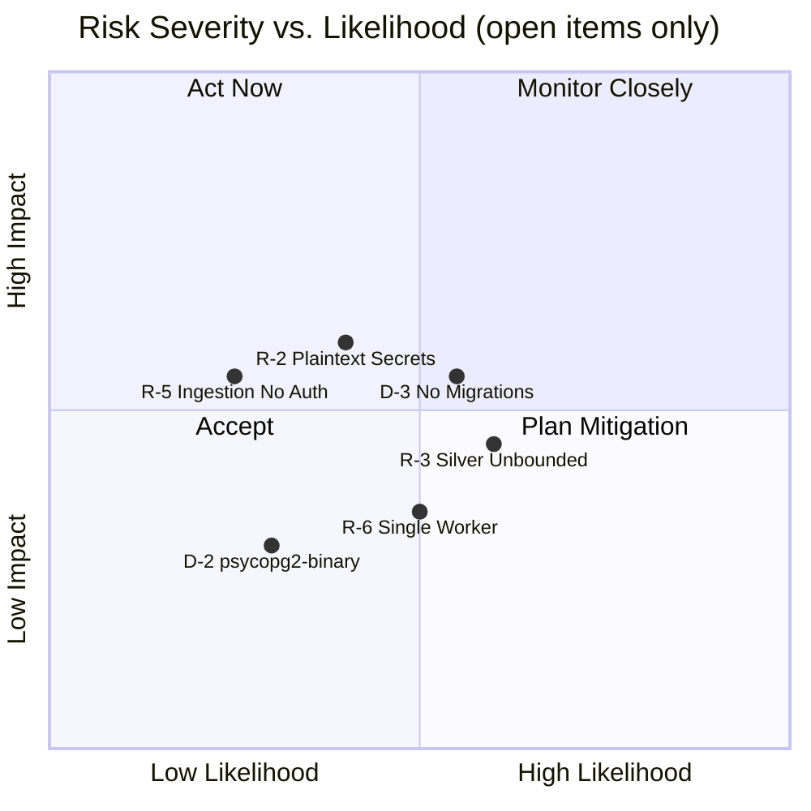

# 11. Risks and Technical Debts

This chapter documents known architectural risks and consciously accepted technical debts. Each entry is classified by severity and linked to the affected components. Items are ordered by priority within their category.

## 11.1 Architectural Risks

### R-1: ~~No Rate Limiting on the BFF API~~ — Resolved

| Property | Value |
| :--- | :--- |
| **Severity** | High |
| **Affected Component** | `bff-api` |
| **Status** | Resolved (Phase 16) |

A token-bucket rate limiter (`golang.org/x/time/rate`) has been implemented as `chi` middleware on the BFF API, configurable via environment variables. A distributed (Redis-backed) rate limiter is deferred until horizontal scaling requires it — adding Redis for a single-instance deployment would violate Occam's Razor.

---

### R-2: Secrets Managed via Plaintext `.env` File

| Property | Value |
| :--- | :--- |
| **Severity** | Medium |
| **Affected Component** | All services, `compose.yaml` |
| **Status** | Accepted (for current deployment model) |

All credentials (database passwords, API keys, MinIO secrets, Grafana admin credentials, ACME email) are stored in a plaintext `.env` file at the repository root. The file is excluded from version control via `.gitignore`, but it resides unencrypted on disk. This is acceptable for a single-operator VPS/homelab deployment but becomes a security liability in multi-user, team, or cloud environments.

**Mitigation plan:** For future scaling, migrate to Docker Secrets (Swarm), HashiCorp Vault, or SOPS-encrypted `.env` files. The current architecture is prepared for this — all services consume credentials via environment variables, making the switch transparent.

---

### R-3: Silver Layer Has No Retention Policy

| Property | Value |
| :--- | :--- |
| **Severity** | Medium |
| **Affected Component** | MinIO (`silver` bucket) |
| **Status** | Open |

The Bronze layer expires after 90 days and the Quarantine after 30 days (via MinIO ILM). However, the Silver bucket has no expiration policy. By design, it serves as the persistent re-evaluation baseline — but this means it will grow unboundedly over time. With hundreds of crawlers active, this could become a storage concern.

**Mitigation plan:** Define a Silver ILM policy once the actual growth rate is measurable. A conservative 180-day or 365-day TTL could be appropriate, since the Gold layer (ClickHouse) retains the derived metrics independently.

---

### R-4: Bronze Data Irrecoverably Lost After 90 Days

| Property | Value |
| :--- | :--- |
| **Severity** | Low |
| **Affected Component** | MinIO (`bronze` bucket), Data Lake |
| **Status** | Accepted (see ADR-007) |

The Bronze ILM policy permanently deletes raw data after 90 days. If a bug in the harmonization logic is discovered after this window, the original documents cannot be retroactively re-parsed — they must be re-crawled from the source. This is a conscious tradeoff documented in ADR-007, accepting data loss in exchange for predictable storage costs.

**Mitigation:** Re-crawling from external sources is possible for most public data. The Silver layer retains the harmonized version indefinitely, which suffices for most re-analysis scenarios.

---

### R-5: Ingestion API Has No Authentication

| Property | Value |
| :--- | :--- |
| **Severity** | Low (current deployment) / High (if exposed) |
| **Affected Component** | `ingestion-api` |
| **Status** | Accepted (mitigated by network segmentation) |

The Ingestion API (`POST /api/v1/ingest`) does not require authentication. Any client with network access to port `8081` can inject arbitrary data into the Bronze layer. This is currently mitigated by network segmentation: the `ingestion-api` exists exclusively on the `aer-backend` Docker network and is not exposed through Traefik. Crawlers access it via the host network on `localhost:8081` during local development.

**Mitigation plan:** If the Ingestion API is ever exposed beyond localhost (e.g., for remote crawlers), an API-key middleware identical to the BFF's must be added.

---

### R-6: Single Worker Instance — No Horizontal Scaling

| Property | Value |
| :--- | :--- |
| **Severity** | Low (current load) / Medium (at scale) |
| **Affected Component** | `analysis-worker` |
| **Status** | Accepted |

The `compose.yaml` defines a single `analysis-worker` container. While the worker uses an internal `asyncio.Queue` with configurable `WORKER_COUNT` for concurrent processing, there is only one OS-level process subscribing to NATS. Under high ingestion volume (hundreds of crawlers), this could become a bottleneck. NATS JetStream's durable consumer model natively supports horizontal scaling by adding additional consumer instances — the architecture is prepared for this, but it is not yet configured.

**Mitigation plan:** Add `deploy.replicas` to the `analysis-worker` service in `compose.yaml` when throughput demands it. No code changes are required — the durable NATS subscription handles message distribution across consumers automatically.

---

### R-7: Tempo Trace Storage Is Ephemeral

| Property | Value |
| :--- | :--- |
| **Severity** | Low |
| **Affected Component** | Grafana Tempo |
| **Status** | Accepted |

Tempo stores trace data under `/tmp/tempo/` inside the container with a 1-hour block retention (`block_retention: 1h`). There is no persistent Docker volume mounted. Restarting the Tempo container permanently loses all stored traces. This is acceptable for development and short-term debugging but insufficient for long-term audit trails.

**Mitigation plan:** Mount a persistent volume for Tempo's WAL and block storage when long-term trace retention becomes a requirement.

---

## 11.2 Technical Debts

### D-1: ~~Image Pinning Violations (Prometheus, Grafana)~~ — Resolved

| Property | Value |
| :--- | :--- |
| **Severity** | High |
| **Affected Component** | `compose.yaml` |
| **Status** | Resolved (Phase 24) |

Both images have been pinned to exact patch-level releases in `compose.yaml`. All images in the stack now comply with the hard-pinning policy (ADR-009).

---

### D-2: `psycopg2-binary` Used in Production Dockerfile

| Property | Value |
| :--- | :--- |
| **Severity** | Medium |
| **Affected Component** | `analysis-worker`, `requirements.txt` |
| **Status** | Documented |

The Python worker uses `psycopg2-binary` for PostgreSQL connectivity. This package bundles a statically linked `libpq` and is explicitly not recommended for production by the `psycopg2` maintainers — it may have SSL/TLS incompatibilities and is not built against the system's OpenSSL. The `requirements.txt` contains a comment documenting this tradeoff.

**Fix:** Switch to `psycopg2` (source build) in the production Dockerfile and install `libpq-dev` in the builder stage. Keep `psycopg2-binary` for local development and CI to avoid native compilation overhead.

---

### D-3: No Database Migration Tooling

| Property | Value |
| :--- | :--- |
| **Severity** | Medium |
| **Affected Component** | PostgreSQL, ClickHouse |
| **Status** | Open |

Database schemas are initialized via `init.sql` scripts mounted into the `docker-entrypoint-initdb.d/` directories of PostgreSQL and ClickHouse. These scripts run only on first container creation (empty volume). There is no migration framework — schema changes require either manually altering the running database or wiping the volume and re-initializing. This becomes increasingly risky as the system accumulates real production data.

**Fix:** Introduce a migration tool (e.g., `golang-migrate` for PostgreSQL, versioned SQL scripts for ClickHouse) and integrate it into the init-container workflow or a dedicated migration container.

---

### D-4: ~~E2E Smoke Test Not Integrated Into CI~~ — Resolved

| Property | Value |
| :--- | :--- |
| **Severity** | Low |
| **Affected Component** | `scripts/e2e_smoke_test.sh`, CI pipeline |
| **Status** | Resolved (Phase 27) |

A dedicated `e2e-smoke` CI job has been added to `ci.yml`. It runs on pushes to `main` (not on PRs to avoid long CI times) using `docker compose up --build --wait` and executes the full smoke test script.

---

### D-5: Hardcoded Dummy Source in PostgreSQL Init Script

| Property | Value |
| :--- | :--- |
| **Severity** | Low |
| **Affected Component** | `infra/postgres/init.sql` |
| **Status** | Open |

The PostgreSQL init script inserts a dummy source record (`'AER Dummy Generator', 'internal_test'`) via `ON CONFLICT DO NOTHING`. This was necessary for the initial PoC but should be removed or replaced with a proper seeding mechanism. The Wikipedia crawler currently assumes `source_id=1` by default, coupling it to this hardcoded entry.

**Fix:** Remove the dummy insert from `init.sql`. Implement a source registration mechanism (e.g., an admin endpoint on the Ingestion API, or a dedicated seed script).

---

### D-6: ~~Missing Architecture Decision Records~~ — Resolved

| Property | Value |
| :--- | :--- |
| **Severity** | Low |
| **Affected Component** | `docs/arc42/09_architecture_decisions.md` |
| **Status** | Resolved (Phase 22) |

ADRs 008–013 have been written and added to `docs/arc42/09_architecture_decisions.md`: Docker Network Segmentation (008), Hard-Pinning Policy & SSoT (009), External Crawler Architecture (010), BFF API Authentication (011), TLS Termination via Traefik (012), Network Zero-Trust & Port Hardening (013).

---

### D-7: ClickHouse Metrics Schema Is Minimal

| Property | Value |
| :--- | :--- |
| **Severity** | Low |
| **Affected Component** | `infra/clickhouse/init.sql`, `aer_gold.metrics` |
| **Status** | Accepted (for current phase) |

The Gold layer table (`aer_gold.metrics`) has only two columns: `timestamp` and `value`. There are no dimensions (e.g., `source`, `metric_type`, `article_id`). This was sufficient for the initial PoC but will need to evolve as more crawlers and diverse metric types are introduced. Adding dimensions later requires a schema migration (see D-3).

**Fix:** Extend the schema with dimension columns when the second metric type or second crawler is introduced. Coordinate with the migration tooling effort (D-3).

---

## 11.3 Risk Matrix Overview

